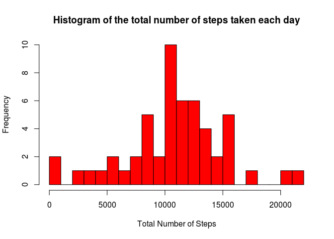
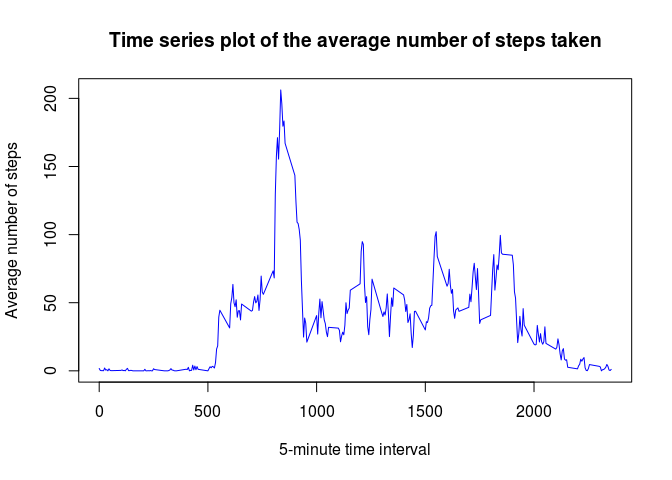
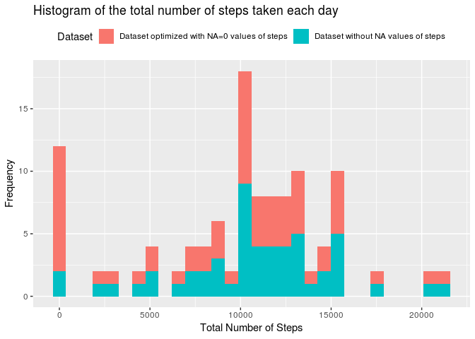
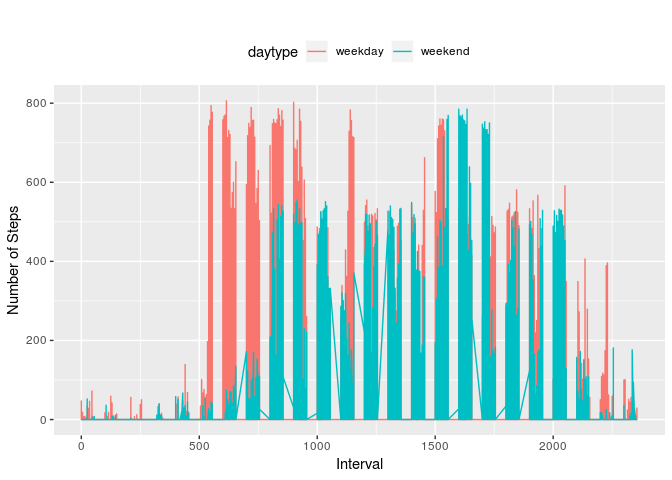

## 1. Code for reading in the dataset and/or processing the data

### Global settings and working directory


```r
#Global options
knitr::opts_chunk$set(echo = TRUE, message=FALSE) 
#set the working directory (pathwd must be customized)
pathwd<-"/home/superuser/Dropbox/R/Coursera/Reproducible Research/week2/RepData_PeerAssessment1"
setwd(pathwd)
```

### Loading and preprocessing the data

```r
file<-"activity.zip"
unzip(file)
csv<-"activity.csv"
act <- read.csv(csv)
library(dplyr)
actvalid<-act %>% filter(is.na(steps)==FALSE) 
```

## 2. Histogram of the total number of steps taken each day

### Calculate the total number of steps taken per day

```r
step_by_day<-actvalid %>% select(steps,date) %>% 
        rename(tot_steps = steps) %>% 
        group_by(date) %>% 
        summarise_all(sum)
```

### Histogram of the total number of steps taken each day

```r
hist(step_by_day$tot_steps, 
     breaks = 20,
     main = 'Histogram of the total number of steps taken each day',
     xlab = 'Total Number of Steps', 
     col = 'red'
     )
```

<!-- -->

## 3. Mean and median number of steps taken each day

### Calculation and reporting the mean and median of the total number of steps taken per day

```r
library(dplyr)
mean_step_by_day<-actvalid %>% select(steps,date) %>% 
        rename(mean_steps = steps) %>% 
        group_by(date) %>% 
        summarise_all(mean)
median_step_by_day<-actvalid %>% select(steps,date) %>% 
        rename(median_steps = steps) %>% 
        group_by(date) %>% 
        summarise_all(median)
mm_step_by_day<-inner_join(mean_step_by_day,median_step_by_day,
                           by=c("date"="date")) %>% 
        select(date,mean_steps,median_steps) 
library(xtable)
xt<-xtable(mm_step_by_day)
print(xt,type="html")
```

<!-- html table generated in R 3.2.3 by xtable 1.8-3 package -->
<!-- Fri Jan  4 23:29:39 2019 -->
<table border=1>
<tr> <th>  </th> <th> date </th> <th> mean_steps </th> <th> median_steps </th>  </tr>
  <tr> <td align="right"> 1 </td> <td> 2012-10-02 </td> <td align="right"> 0.44 </td> <td align="right"> 0.00 </td> </tr>
  <tr> <td align="right"> 2 </td> <td> 2012-10-03 </td> <td align="right"> 39.42 </td> <td align="right"> 0.00 </td> </tr>
  <tr> <td align="right"> 3 </td> <td> 2012-10-04 </td> <td align="right"> 42.07 </td> <td align="right"> 0.00 </td> </tr>
  <tr> <td align="right"> 4 </td> <td> 2012-10-05 </td> <td align="right"> 46.16 </td> <td align="right"> 0.00 </td> </tr>
  <tr> <td align="right"> 5 </td> <td> 2012-10-06 </td> <td align="right"> 53.54 </td> <td align="right"> 0.00 </td> </tr>
  <tr> <td align="right"> 6 </td> <td> 2012-10-07 </td> <td align="right"> 38.25 </td> <td align="right"> 0.00 </td> </tr>
  <tr> <td align="right"> 7 </td> <td> 2012-10-09 </td> <td align="right"> 44.48 </td> <td align="right"> 0.00 </td> </tr>
  <tr> <td align="right"> 8 </td> <td> 2012-10-10 </td> <td align="right"> 34.38 </td> <td align="right"> 0.00 </td> </tr>
  <tr> <td align="right"> 9 </td> <td> 2012-10-11 </td> <td align="right"> 35.78 </td> <td align="right"> 0.00 </td> </tr>
  <tr> <td align="right"> 10 </td> <td> 2012-10-12 </td> <td align="right"> 60.35 </td> <td align="right"> 0.00 </td> </tr>
  <tr> <td align="right"> 11 </td> <td> 2012-10-13 </td> <td align="right"> 43.15 </td> <td align="right"> 0.00 </td> </tr>
  <tr> <td align="right"> 12 </td> <td> 2012-10-14 </td> <td align="right"> 52.42 </td> <td align="right"> 0.00 </td> </tr>
  <tr> <td align="right"> 13 </td> <td> 2012-10-15 </td> <td align="right"> 35.20 </td> <td align="right"> 0.00 </td> </tr>
  <tr> <td align="right"> 14 </td> <td> 2012-10-16 </td> <td align="right"> 52.38 </td> <td align="right"> 0.00 </td> </tr>
  <tr> <td align="right"> 15 </td> <td> 2012-10-17 </td> <td align="right"> 46.71 </td> <td align="right"> 0.00 </td> </tr>
  <tr> <td align="right"> 16 </td> <td> 2012-10-18 </td> <td align="right"> 34.92 </td> <td align="right"> 0.00 </td> </tr>
  <tr> <td align="right"> 17 </td> <td> 2012-10-19 </td> <td align="right"> 41.07 </td> <td align="right"> 0.00 </td> </tr>
  <tr> <td align="right"> 18 </td> <td> 2012-10-20 </td> <td align="right"> 36.09 </td> <td align="right"> 0.00 </td> </tr>
  <tr> <td align="right"> 19 </td> <td> 2012-10-21 </td> <td align="right"> 30.63 </td> <td align="right"> 0.00 </td> </tr>
  <tr> <td align="right"> 20 </td> <td> 2012-10-22 </td> <td align="right"> 46.74 </td> <td align="right"> 0.00 </td> </tr>
  <tr> <td align="right"> 21 </td> <td> 2012-10-23 </td> <td align="right"> 30.97 </td> <td align="right"> 0.00 </td> </tr>
  <tr> <td align="right"> 22 </td> <td> 2012-10-24 </td> <td align="right"> 29.01 </td> <td align="right"> 0.00 </td> </tr>
  <tr> <td align="right"> 23 </td> <td> 2012-10-25 </td> <td align="right"> 8.65 </td> <td align="right"> 0.00 </td> </tr>
  <tr> <td align="right"> 24 </td> <td> 2012-10-26 </td> <td align="right"> 23.53 </td> <td align="right"> 0.00 </td> </tr>
  <tr> <td align="right"> 25 </td> <td> 2012-10-27 </td> <td align="right"> 35.14 </td> <td align="right"> 0.00 </td> </tr>
  <tr> <td align="right"> 26 </td> <td> 2012-10-28 </td> <td align="right"> 39.78 </td> <td align="right"> 0.00 </td> </tr>
  <tr> <td align="right"> 27 </td> <td> 2012-10-29 </td> <td align="right"> 17.42 </td> <td align="right"> 0.00 </td> </tr>
  <tr> <td align="right"> 28 </td> <td> 2012-10-30 </td> <td align="right"> 34.09 </td> <td align="right"> 0.00 </td> </tr>
  <tr> <td align="right"> 29 </td> <td> 2012-10-31 </td> <td align="right"> 53.52 </td> <td align="right"> 0.00 </td> </tr>
  <tr> <td align="right"> 30 </td> <td> 2012-11-02 </td> <td align="right"> 36.81 </td> <td align="right"> 0.00 </td> </tr>
  <tr> <td align="right"> 31 </td> <td> 2012-11-03 </td> <td align="right"> 36.70 </td> <td align="right"> 0.00 </td> </tr>
  <tr> <td align="right"> 32 </td> <td> 2012-11-05 </td> <td align="right"> 36.25 </td> <td align="right"> 0.00 </td> </tr>
  <tr> <td align="right"> 33 </td> <td> 2012-11-06 </td> <td align="right"> 28.94 </td> <td align="right"> 0.00 </td> </tr>
  <tr> <td align="right"> 34 </td> <td> 2012-11-07 </td> <td align="right"> 44.73 </td> <td align="right"> 0.00 </td> </tr>
  <tr> <td align="right"> 35 </td> <td> 2012-11-08 </td> <td align="right"> 11.18 </td> <td align="right"> 0.00 </td> </tr>
  <tr> <td align="right"> 36 </td> <td> 2012-11-11 </td> <td align="right"> 43.78 </td> <td align="right"> 0.00 </td> </tr>
  <tr> <td align="right"> 37 </td> <td> 2012-11-12 </td> <td align="right"> 37.38 </td> <td align="right"> 0.00 </td> </tr>
  <tr> <td align="right"> 38 </td> <td> 2012-11-13 </td> <td align="right"> 25.47 </td> <td align="right"> 0.00 </td> </tr>
  <tr> <td align="right"> 39 </td> <td> 2012-11-15 </td> <td align="right"> 0.14 </td> <td align="right"> 0.00 </td> </tr>
  <tr> <td align="right"> 40 </td> <td> 2012-11-16 </td> <td align="right"> 18.89 </td> <td align="right"> 0.00 </td> </tr>
  <tr> <td align="right"> 41 </td> <td> 2012-11-17 </td> <td align="right"> 49.79 </td> <td align="right"> 0.00 </td> </tr>
  <tr> <td align="right"> 42 </td> <td> 2012-11-18 </td> <td align="right"> 52.47 </td> <td align="right"> 0.00 </td> </tr>
  <tr> <td align="right"> 43 </td> <td> 2012-11-19 </td> <td align="right"> 30.70 </td> <td align="right"> 0.00 </td> </tr>
  <tr> <td align="right"> 44 </td> <td> 2012-11-20 </td> <td align="right"> 15.53 </td> <td align="right"> 0.00 </td> </tr>
  <tr> <td align="right"> 45 </td> <td> 2012-11-21 </td> <td align="right"> 44.40 </td> <td align="right"> 0.00 </td> </tr>
  <tr> <td align="right"> 46 </td> <td> 2012-11-22 </td> <td align="right"> 70.93 </td> <td align="right"> 0.00 </td> </tr>
  <tr> <td align="right"> 47 </td> <td> 2012-11-23 </td> <td align="right"> 73.59 </td> <td align="right"> 0.00 </td> </tr>
  <tr> <td align="right"> 48 </td> <td> 2012-11-24 </td> <td align="right"> 50.27 </td> <td align="right"> 0.00 </td> </tr>
  <tr> <td align="right"> 49 </td> <td> 2012-11-25 </td> <td align="right"> 41.09 </td> <td align="right"> 0.00 </td> </tr>
  <tr> <td align="right"> 50 </td> <td> 2012-11-26 </td> <td align="right"> 38.76 </td> <td align="right"> 0.00 </td> </tr>
  <tr> <td align="right"> 51 </td> <td> 2012-11-27 </td> <td align="right"> 47.38 </td> <td align="right"> 0.00 </td> </tr>
  <tr> <td align="right"> 52 </td> <td> 2012-11-28 </td> <td align="right"> 35.36 </td> <td align="right"> 0.00 </td> </tr>
  <tr> <td align="right"> 53 </td> <td> 2012-11-29 </td> <td align="right"> 24.47 </td> <td align="right"> 0.00 </td> </tr>
   </table>

## 4. Time series plot of the average number of steps taken

```r
library(dplyr)
mean_steps_by_interval<-actvalid %>% select(steps,interval) %>% 
        rename(mean_steps = steps) %>% 
        group_by(interval) %>% 
        summarise_all(mean)
with(mean_steps_by_interval,
     plot(x=interval,
          y=mean_steps,
          type="l",
          main = 'Time series plot of the average number of steps taken',
          xlab = '5-minute time interval', 
          ylab="Average number of steps",
          col = 'blue')
     )
```

<!-- -->

## 5. The 5-minute interval that, on average, contains the maximum number of steps

```r
max_steps<-mean_steps_by_interval[mean_steps_by_interval[,"mean_steps"] == max(mean_steps_by_interval$mean_steps),]
```
#### The max 5-minute interval is 835 with 206.1698113 average steps by all date.

## 6. Code to describe and show a strategy for imputing missing data
### Calculation and reporting the total number of missing values in the dataset 

```r
library(dplyr)
actna<-act %>% filter(is.na(steps)==TRUE)  %>% select(date,interval)
library(xtable)
xt<-xtable(actna)
print(xt,type="html")
```

<!-- html table generated in R 3.2.3 by xtable 1.8-3 package -->
<!-- Fri Jan  4 23:29:39 2019 -->
<table border=1>
<tr> <th>  </th> <th> date </th> <th> interval </th>  </tr>
  <tr> <td align="right"> 1 </td> <td> 2012-10-01 </td> <td align="right">   0 </td> </tr>
  <tr> <td align="right"> 2 </td> <td> 2012-10-01 </td> <td align="right">   5 </td> </tr>
  <tr> <td align="right"> 3 </td> <td> 2012-10-01 </td> <td align="right">  10 </td> </tr>
  <tr> <td align="right"> 4 </td> <td> 2012-10-01 </td> <td align="right">  15 </td> </tr>
  <tr> <td align="right"> 5 </td> <td> 2012-10-01 </td> <td align="right">  20 </td> </tr>
  <tr> <td align="right"> 6 </td> <td> 2012-10-01 </td> <td align="right">  25 </td> </tr>
  <tr> <td align="right"> 7 </td> <td> 2012-10-01 </td> <td align="right">  30 </td> </tr>
  <tr> <td align="right"> 8 </td> <td> 2012-10-01 </td> <td align="right">  35 </td> </tr>
  <tr> <td align="right"> 9 </td> <td> 2012-10-01 </td> <td align="right">  40 </td> </tr>
  <tr> <td align="right"> 10 </td> <td> 2012-10-01 </td> <td align="right">  45 </td> </tr>
  <tr> <td align="right"> 11 </td> <td> 2012-10-01 </td> <td align="right">  50 </td> </tr>
  <tr> <td align="right"> 12 </td> <td> 2012-10-01 </td> <td align="right">  55 </td> </tr>
  <tr> <td align="right"> 13 </td> <td> 2012-10-01 </td> <td align="right"> 100 </td> </tr>
  <tr> <td align="right"> 14 </td> <td> 2012-10-01 </td> <td align="right"> 105 </td> </tr>
  <tr> <td align="right"> 15 </td> <td> 2012-10-01 </td> <td align="right"> 110 </td> </tr>
  <tr> <td align="right"> 16 </td> <td> 2012-10-01 </td> <td align="right"> 115 </td> </tr>
  <tr> <td align="right"> 17 </td> <td> 2012-10-01 </td> <td align="right"> 120 </td> </tr>
  <tr> <td align="right"> 18 </td> <td> 2012-10-01 </td> <td align="right"> 125 </td> </tr>
  <tr> <td align="right"> 19 </td> <td> 2012-10-01 </td> <td align="right"> 130 </td> </tr>
  <tr> <td align="right"> 20 </td> <td> 2012-10-01 </td> <td align="right"> 135 </td> </tr>
  <tr> <td align="right"> 21 </td> <td> 2012-10-01 </td> <td align="right"> 140 </td> </tr>
  <tr> <td align="right"> 22 </td> <td> 2012-10-01 </td> <td align="right"> 145 </td> </tr>
  <tr> <td align="right"> 23 </td> <td> 2012-10-01 </td> <td align="right"> 150 </td> </tr>
  <tr> <td align="right"> 24 </td> <td> 2012-10-01 </td> <td align="right"> 155 </td> </tr>
  <tr> <td align="right"> 25 </td> <td> 2012-10-01 </td> <td align="right"> 200 </td> </tr>
  <tr> <td align="right"> 26 </td> <td> 2012-10-01 </td> <td align="right"> 205 </td> </tr>
  <tr> <td align="right"> 27 </td> <td> 2012-10-01 </td> <td align="right"> 210 </td> </tr>
  <tr> <td align="right"> 28 </td> <td> 2012-10-01 </td> <td align="right"> 215 </td> </tr>
  <tr> <td align="right"> 29 </td> <td> 2012-10-01 </td> <td align="right"> 220 </td> </tr>
  <tr> <td align="right"> 30 </td> <td> 2012-10-01 </td> <td align="right"> 225 </td> </tr>
  <tr> <td align="right"> 31 </td> <td> 2012-10-01 </td> <td align="right"> 230 </td> </tr>
  <tr> <td align="right"> 32 </td> <td> 2012-10-01 </td> <td align="right"> 235 </td> </tr>
  <tr> <td align="right"> 33 </td> <td> 2012-10-01 </td> <td align="right"> 240 </td> </tr>
  <tr> <td align="right"> 34 </td> <td> 2012-10-01 </td> <td align="right"> 245 </td> </tr>
  <tr> <td align="right"> 35 </td> <td> 2012-10-01 </td> <td align="right"> 250 </td> </tr>
  <tr> <td align="right"> 36 </td> <td> 2012-10-01 </td> <td align="right"> 255 </td> </tr>
  <tr> <td align="right"> 37 </td> <td> 2012-10-01 </td> <td align="right"> 300 </td> </tr>
  <tr> <td align="right"> 38 </td> <td> 2012-10-01 </td> <td align="right"> 305 </td> </tr>
  <tr> <td align="right"> 39 </td> <td> 2012-10-01 </td> <td align="right"> 310 </td> </tr>
  <tr> <td align="right"> 40 </td> <td> 2012-10-01 </td> <td align="right"> 315 </td> </tr>
  <tr> <td align="right"> 41 </td> <td> 2012-10-01 </td> <td align="right"> 320 </td> </tr>
  <tr> <td align="right"> 42 </td> <td> 2012-10-01 </td> <td align="right"> 325 </td> </tr>
  <tr> <td align="right"> 43 </td> <td> 2012-10-01 </td> <td align="right"> 330 </td> </tr>
  <tr> <td align="right"> 44 </td> <td> 2012-10-01 </td> <td align="right"> 335 </td> </tr>
  <tr> <td align="right"> 45 </td> <td> 2012-10-01 </td> <td align="right"> 340 </td> </tr>
  <tr> <td align="right"> 46 </td> <td> 2012-10-01 </td> <td align="right"> 345 </td> </tr>
  <tr> <td align="right"> 47 </td> <td> 2012-10-01 </td> <td align="right"> 350 </td> </tr>
  <tr> <td align="right"> 48 </td> <td> 2012-10-01 </td> <td align="right"> 355 </td> </tr>
  <tr> <td align="right"> 49 </td> <td> 2012-10-01 </td> <td align="right"> 400 </td> </tr>
  <tr> <td align="right"> 50 </td> <td> 2012-10-01 </td> <td align="right"> 405 </td> </tr>
  <tr> <td align="right"> 51 </td> <td> 2012-10-01 </td> <td align="right"> 410 </td> </tr>
  <tr> <td align="right"> 52 </td> <td> 2012-10-01 </td> <td align="right"> 415 </td> </tr>
  <tr> <td align="right"> 53 </td> <td> 2012-10-01 </td> <td align="right"> 420 </td> </tr>
  <tr> <td align="right"> 54 </td> <td> 2012-10-01 </td> <td align="right"> 425 </td> </tr>
  <tr> <td align="right"> 55 </td> <td> 2012-10-01 </td> <td align="right"> 430 </td> </tr>
  <tr> <td align="right"> 56 </td> <td> 2012-10-01 </td> <td align="right"> 435 </td> </tr>
  <tr> <td align="right"> 57 </td> <td> 2012-10-01 </td> <td align="right"> 440 </td> </tr>
  <tr> <td align="right"> 58 </td> <td> 2012-10-01 </td> <td align="right"> 445 </td> </tr>
  <tr> <td align="right"> 59 </td> <td> 2012-10-01 </td> <td align="right"> 450 </td> </tr>
  <tr> <td align="right"> 60 </td> <td> 2012-10-01 </td> <td align="right"> 455 </td> </tr>
  <tr> <td align="right"> 61 </td> <td> 2012-10-01 </td> <td align="right"> 500 </td> </tr>
  <tr> <td align="right"> 62 </td> <td> 2012-10-01 </td> <td align="right"> 505 </td> </tr>
  <tr> <td align="right"> 63 </td> <td> 2012-10-01 </td> <td align="right"> 510 </td> </tr>
  <tr> <td align="right"> 64 </td> <td> 2012-10-01 </td> <td align="right"> 515 </td> </tr>
  <tr> <td align="right"> 65 </td> <td> 2012-10-01 </td> <td align="right"> 520 </td> </tr>
  <tr> <td align="right"> 66 </td> <td> 2012-10-01 </td> <td align="right"> 525 </td> </tr>
  <tr> <td align="right"> 67 </td> <td> 2012-10-01 </td> <td align="right"> 530 </td> </tr>
  <tr> <td align="right"> 68 </td> <td> 2012-10-01 </td> <td align="right"> 535 </td> </tr>
  <tr> <td align="right"> 69 </td> <td> 2012-10-01 </td> <td align="right"> 540 </td> </tr>
  <tr> <td align="right"> 70 </td> <td> 2012-10-01 </td> <td align="right"> 545 </td> </tr>
  <tr> <td align="right"> 71 </td> <td> 2012-10-01 </td> <td align="right"> 550 </td> </tr>
  <tr> <td align="right"> 72 </td> <td> 2012-10-01 </td> <td align="right"> 555 </td> </tr>
  <tr> <td align="right"> 73 </td> <td> 2012-10-01 </td> <td align="right"> 600 </td> </tr>
  <tr> <td align="right"> 74 </td> <td> 2012-10-01 </td> <td align="right"> 605 </td> </tr>
  <tr> <td align="right"> 75 </td> <td> 2012-10-01 </td> <td align="right"> 610 </td> </tr>
  <tr> <td align="right"> 76 </td> <td> 2012-10-01 </td> <td align="right"> 615 </td> </tr>
  <tr> <td align="right"> 77 </td> <td> 2012-10-01 </td> <td align="right"> 620 </td> </tr>
  <tr> <td align="right"> 78 </td> <td> 2012-10-01 </td> <td align="right"> 625 </td> </tr>
  <tr> <td align="right"> 79 </td> <td> 2012-10-01 </td> <td align="right"> 630 </td> </tr>
  <tr> <td align="right"> 80 </td> <td> 2012-10-01 </td> <td align="right"> 635 </td> </tr>
  <tr> <td align="right"> 81 </td> <td> 2012-10-01 </td> <td align="right"> 640 </td> </tr>
  <tr> <td align="right"> 82 </td> <td> 2012-10-01 </td> <td align="right"> 645 </td> </tr>
  <tr> <td align="right"> 83 </td> <td> 2012-10-01 </td> <td align="right"> 650 </td> </tr>
  <tr> <td align="right"> 84 </td> <td> 2012-10-01 </td> <td align="right"> 655 </td> </tr>
  <tr> <td align="right"> 85 </td> <td> 2012-10-01 </td> <td align="right"> 700 </td> </tr>
  <tr> <td align="right"> 86 </td> <td> 2012-10-01 </td> <td align="right"> 705 </td> </tr>
  <tr> <td align="right"> 87 </td> <td> 2012-10-01 </td> <td align="right"> 710 </td> </tr>
  <tr> <td align="right"> 88 </td> <td> 2012-10-01 </td> <td align="right"> 715 </td> </tr>
  <tr> <td align="right"> 89 </td> <td> 2012-10-01 </td> <td align="right"> 720 </td> </tr>
  <tr> <td align="right"> 90 </td> <td> 2012-10-01 </td> <td align="right"> 725 </td> </tr>
  <tr> <td align="right"> 91 </td> <td> 2012-10-01 </td> <td align="right"> 730 </td> </tr>
  <tr> <td align="right"> 92 </td> <td> 2012-10-01 </td> <td align="right"> 735 </td> </tr>
  <tr> <td align="right"> 93 </td> <td> 2012-10-01 </td> <td align="right"> 740 </td> </tr>
  <tr> <td align="right"> 94 </td> <td> 2012-10-01 </td> <td align="right"> 745 </td> </tr>
  <tr> <td align="right"> 95 </td> <td> 2012-10-01 </td> <td align="right"> 750 </td> </tr>
  <tr> <td align="right"> 96 </td> <td> 2012-10-01 </td> <td align="right"> 755 </td> </tr>
  <tr> <td align="right"> 97 </td> <td> 2012-10-01 </td> <td align="right"> 800 </td> </tr>
  <tr> <td align="right"> 98 </td> <td> 2012-10-01 </td> <td align="right"> 805 </td> </tr>
  <tr> <td align="right"> 99 </td> <td> 2012-10-01 </td> <td align="right"> 810 </td> </tr>
  <tr> <td align="right"> 100 </td> <td> 2012-10-01 </td> <td align="right"> 815 </td> </tr>
  <tr> <td align="right"> 101 </td> <td> 2012-10-01 </td> <td align="right"> 820 </td> </tr>
  <tr> <td align="right"> 102 </td> <td> 2012-10-01 </td> <td align="right"> 825 </td> </tr>
  <tr> <td align="right"> 103 </td> <td> 2012-10-01 </td> <td align="right"> 830 </td> </tr>
  <tr> <td align="right"> 104 </td> <td> 2012-10-01 </td> <td align="right"> 835 </td> </tr>
  <tr> <td align="right"> 105 </td> <td> 2012-10-01 </td> <td align="right"> 840 </td> </tr>
  <tr> <td align="right"> 106 </td> <td> 2012-10-01 </td> <td align="right"> 845 </td> </tr>
  <tr> <td align="right"> 107 </td> <td> 2012-10-01 </td> <td align="right"> 850 </td> </tr>
  <tr> <td align="right"> 108 </td> <td> 2012-10-01 </td> <td align="right"> 855 </td> </tr>
  <tr> <td align="right"> 109 </td> <td> 2012-10-01 </td> <td align="right"> 900 </td> </tr>
  <tr> <td align="right"> 110 </td> <td> 2012-10-01 </td> <td align="right"> 905 </td> </tr>
  <tr> <td align="right"> 111 </td> <td> 2012-10-01 </td> <td align="right"> 910 </td> </tr>
  <tr> <td align="right"> 112 </td> <td> 2012-10-01 </td> <td align="right"> 915 </td> </tr>
  <tr> <td align="right"> 113 </td> <td> 2012-10-01 </td> <td align="right"> 920 </td> </tr>
  <tr> <td align="right"> 114 </td> <td> 2012-10-01 </td> <td align="right"> 925 </td> </tr>
  <tr> <td align="right"> 115 </td> <td> 2012-10-01 </td> <td align="right"> 930 </td> </tr>
  <tr> <td align="right"> 116 </td> <td> 2012-10-01 </td> <td align="right"> 935 </td> </tr>
  <tr> <td align="right"> 117 </td> <td> 2012-10-01 </td> <td align="right"> 940 </td> </tr>
  <tr> <td align="right"> 118 </td> <td> 2012-10-01 </td> <td align="right"> 945 </td> </tr>
  <tr> <td align="right"> 119 </td> <td> 2012-10-01 </td> <td align="right"> 950 </td> </tr>
  <tr> <td align="right"> 120 </td> <td> 2012-10-01 </td> <td align="right"> 955 </td> </tr>
  <tr> <td align="right"> 121 </td> <td> 2012-10-01 </td> <td align="right"> 1000 </td> </tr>
  <tr> <td align="right"> 122 </td> <td> 2012-10-01 </td> <td align="right"> 1005 </td> </tr>
  <tr> <td align="right"> 123 </td> <td> 2012-10-01 </td> <td align="right"> 1010 </td> </tr>
  <tr> <td align="right"> 124 </td> <td> 2012-10-01 </td> <td align="right"> 1015 </td> </tr>
  <tr> <td align="right"> 125 </td> <td> 2012-10-01 </td> <td align="right"> 1020 </td> </tr>
  <tr> <td align="right"> 126 </td> <td> 2012-10-01 </td> <td align="right"> 1025 </td> </tr>
  <tr> <td align="right"> 127 </td> <td> 2012-10-01 </td> <td align="right"> 1030 </td> </tr>
  <tr> <td align="right"> 128 </td> <td> 2012-10-01 </td> <td align="right"> 1035 </td> </tr>
  <tr> <td align="right"> 129 </td> <td> 2012-10-01 </td> <td align="right"> 1040 </td> </tr>
  <tr> <td align="right"> 130 </td> <td> 2012-10-01 </td> <td align="right"> 1045 </td> </tr>
  <tr> <td align="right"> 131 </td> <td> 2012-10-01 </td> <td align="right"> 1050 </td> </tr>
  <tr> <td align="right"> 132 </td> <td> 2012-10-01 </td> <td align="right"> 1055 </td> </tr>
  <tr> <td align="right"> 133 </td> <td> 2012-10-01 </td> <td align="right"> 1100 </td> </tr>
  <tr> <td align="right"> 134 </td> <td> 2012-10-01 </td> <td align="right"> 1105 </td> </tr>
  <tr> <td align="right"> 135 </td> <td> 2012-10-01 </td> <td align="right"> 1110 </td> </tr>
  <tr> <td align="right"> 136 </td> <td> 2012-10-01 </td> <td align="right"> 1115 </td> </tr>
  <tr> <td align="right"> 137 </td> <td> 2012-10-01 </td> <td align="right"> 1120 </td> </tr>
  <tr> <td align="right"> 138 </td> <td> 2012-10-01 </td> <td align="right"> 1125 </td> </tr>
  <tr> <td align="right"> 139 </td> <td> 2012-10-01 </td> <td align="right"> 1130 </td> </tr>
  <tr> <td align="right"> 140 </td> <td> 2012-10-01 </td> <td align="right"> 1135 </td> </tr>
  <tr> <td align="right"> 141 </td> <td> 2012-10-01 </td> <td align="right"> 1140 </td> </tr>
  <tr> <td align="right"> 142 </td> <td> 2012-10-01 </td> <td align="right"> 1145 </td> </tr>
  <tr> <td align="right"> 143 </td> <td> 2012-10-01 </td> <td align="right"> 1150 </td> </tr>
  <tr> <td align="right"> 144 </td> <td> 2012-10-01 </td> <td align="right"> 1155 </td> </tr>
  <tr> <td align="right"> 145 </td> <td> 2012-10-01 </td> <td align="right"> 1200 </td> </tr>
  <tr> <td align="right"> 146 </td> <td> 2012-10-01 </td> <td align="right"> 1205 </td> </tr>
  <tr> <td align="right"> 147 </td> <td> 2012-10-01 </td> <td align="right"> 1210 </td> </tr>
  <tr> <td align="right"> 148 </td> <td> 2012-10-01 </td> <td align="right"> 1215 </td> </tr>
  <tr> <td align="right"> 149 </td> <td> 2012-10-01 </td> <td align="right"> 1220 </td> </tr>
  <tr> <td align="right"> 150 </td> <td> 2012-10-01 </td> <td align="right"> 1225 </td> </tr>
  <tr> <td align="right"> 151 </td> <td> 2012-10-01 </td> <td align="right"> 1230 </td> </tr>
  <tr> <td align="right"> 152 </td> <td> 2012-10-01 </td> <td align="right"> 1235 </td> </tr>
  <tr> <td align="right"> 153 </td> <td> 2012-10-01 </td> <td align="right"> 1240 </td> </tr>
  <tr> <td align="right"> 154 </td> <td> 2012-10-01 </td> <td align="right"> 1245 </td> </tr>
  <tr> <td align="right"> 155 </td> <td> 2012-10-01 </td> <td align="right"> 1250 </td> </tr>
  <tr> <td align="right"> 156 </td> <td> 2012-10-01 </td> <td align="right"> 1255 </td> </tr>
  <tr> <td align="right"> 157 </td> <td> 2012-10-01 </td> <td align="right"> 1300 </td> </tr>
  <tr> <td align="right"> 158 </td> <td> 2012-10-01 </td> <td align="right"> 1305 </td> </tr>
  <tr> <td align="right"> 159 </td> <td> 2012-10-01 </td> <td align="right"> 1310 </td> </tr>
  <tr> <td align="right"> 160 </td> <td> 2012-10-01 </td> <td align="right"> 1315 </td> </tr>
  <tr> <td align="right"> 161 </td> <td> 2012-10-01 </td> <td align="right"> 1320 </td> </tr>
  <tr> <td align="right"> 162 </td> <td> 2012-10-01 </td> <td align="right"> 1325 </td> </tr>
  <tr> <td align="right"> 163 </td> <td> 2012-10-01 </td> <td align="right"> 1330 </td> </tr>
  <tr> <td align="right"> 164 </td> <td> 2012-10-01 </td> <td align="right"> 1335 </td> </tr>
  <tr> <td align="right"> 165 </td> <td> 2012-10-01 </td> <td align="right"> 1340 </td> </tr>
  <tr> <td align="right"> 166 </td> <td> 2012-10-01 </td> <td align="right"> 1345 </td> </tr>
  <tr> <td align="right"> 167 </td> <td> 2012-10-01 </td> <td align="right"> 1350 </td> </tr>
  <tr> <td align="right"> 168 </td> <td> 2012-10-01 </td> <td align="right"> 1355 </td> </tr>
  <tr> <td align="right"> 169 </td> <td> 2012-10-01 </td> <td align="right"> 1400 </td> </tr>
  <tr> <td align="right"> 170 </td> <td> 2012-10-01 </td> <td align="right"> 1405 </td> </tr>
  <tr> <td align="right"> 171 </td> <td> 2012-10-01 </td> <td align="right"> 1410 </td> </tr>
  <tr> <td align="right"> 172 </td> <td> 2012-10-01 </td> <td align="right"> 1415 </td> </tr>
  <tr> <td align="right"> 173 </td> <td> 2012-10-01 </td> <td align="right"> 1420 </td> </tr>
  <tr> <td align="right"> 174 </td> <td> 2012-10-01 </td> <td align="right"> 1425 </td> </tr>
  <tr> <td align="right"> 175 </td> <td> 2012-10-01 </td> <td align="right"> 1430 </td> </tr>
  <tr> <td align="right"> 176 </td> <td> 2012-10-01 </td> <td align="right"> 1435 </td> </tr>
  <tr> <td align="right"> 177 </td> <td> 2012-10-01 </td> <td align="right"> 1440 </td> </tr>
  <tr> <td align="right"> 178 </td> <td> 2012-10-01 </td> <td align="right"> 1445 </td> </tr>
  <tr> <td align="right"> 179 </td> <td> 2012-10-01 </td> <td align="right"> 1450 </td> </tr>
  <tr> <td align="right"> 180 </td> <td> 2012-10-01 </td> <td align="right"> 1455 </td> </tr>
  <tr> <td align="right"> 181 </td> <td> 2012-10-01 </td> <td align="right"> 1500 </td> </tr>
  <tr> <td align="right"> 182 </td> <td> 2012-10-01 </td> <td align="right"> 1505 </td> </tr>
  <tr> <td align="right"> 183 </td> <td> 2012-10-01 </td> <td align="right"> 1510 </td> </tr>
  <tr> <td align="right"> 184 </td> <td> 2012-10-01 </td> <td align="right"> 1515 </td> </tr>
  <tr> <td align="right"> 185 </td> <td> 2012-10-01 </td> <td align="right"> 1520 </td> </tr>
  <tr> <td align="right"> 186 </td> <td> 2012-10-01 </td> <td align="right"> 1525 </td> </tr>
  <tr> <td align="right"> 187 </td> <td> 2012-10-01 </td> <td align="right"> 1530 </td> </tr>
  <tr> <td align="right"> 188 </td> <td> 2012-10-01 </td> <td align="right"> 1535 </td> </tr>
  <tr> <td align="right"> 189 </td> <td> 2012-10-01 </td> <td align="right"> 1540 </td> </tr>
  <tr> <td align="right"> 190 </td> <td> 2012-10-01 </td> <td align="right"> 1545 </td> </tr>
  <tr> <td align="right"> 191 </td> <td> 2012-10-01 </td> <td align="right"> 1550 </td> </tr>
  <tr> <td align="right"> 192 </td> <td> 2012-10-01 </td> <td align="right"> 1555 </td> </tr>
  <tr> <td align="right"> 193 </td> <td> 2012-10-01 </td> <td align="right"> 1600 </td> </tr>
  <tr> <td align="right"> 194 </td> <td> 2012-10-01 </td> <td align="right"> 1605 </td> </tr>
  <tr> <td align="right"> 195 </td> <td> 2012-10-01 </td> <td align="right"> 1610 </td> </tr>
  <tr> <td align="right"> 196 </td> <td> 2012-10-01 </td> <td align="right"> 1615 </td> </tr>
  <tr> <td align="right"> 197 </td> <td> 2012-10-01 </td> <td align="right"> 1620 </td> </tr>
  <tr> <td align="right"> 198 </td> <td> 2012-10-01 </td> <td align="right"> 1625 </td> </tr>
  <tr> <td align="right"> 199 </td> <td> 2012-10-01 </td> <td align="right"> 1630 </td> </tr>
  <tr> <td align="right"> 200 </td> <td> 2012-10-01 </td> <td align="right"> 1635 </td> </tr>
  <tr> <td align="right"> 201 </td> <td> 2012-10-01 </td> <td align="right"> 1640 </td> </tr>
  <tr> <td align="right"> 202 </td> <td> 2012-10-01 </td> <td align="right"> 1645 </td> </tr>
  <tr> <td align="right"> 203 </td> <td> 2012-10-01 </td> <td align="right"> 1650 </td> </tr>
  <tr> <td align="right"> 204 </td> <td> 2012-10-01 </td> <td align="right"> 1655 </td> </tr>
  <tr> <td align="right"> 205 </td> <td> 2012-10-01 </td> <td align="right"> 1700 </td> </tr>
  <tr> <td align="right"> 206 </td> <td> 2012-10-01 </td> <td align="right"> 1705 </td> </tr>
  <tr> <td align="right"> 207 </td> <td> 2012-10-01 </td> <td align="right"> 1710 </td> </tr>
  <tr> <td align="right"> 208 </td> <td> 2012-10-01 </td> <td align="right"> 1715 </td> </tr>
  <tr> <td align="right"> 209 </td> <td> 2012-10-01 </td> <td align="right"> 1720 </td> </tr>
  <tr> <td align="right"> 210 </td> <td> 2012-10-01 </td> <td align="right"> 1725 </td> </tr>
  <tr> <td align="right"> 211 </td> <td> 2012-10-01 </td> <td align="right"> 1730 </td> </tr>
  <tr> <td align="right"> 212 </td> <td> 2012-10-01 </td> <td align="right"> 1735 </td> </tr>
  <tr> <td align="right"> 213 </td> <td> 2012-10-01 </td> <td align="right"> 1740 </td> </tr>
  <tr> <td align="right"> 214 </td> <td> 2012-10-01 </td> <td align="right"> 1745 </td> </tr>
  <tr> <td align="right"> 215 </td> <td> 2012-10-01 </td> <td align="right"> 1750 </td> </tr>
  <tr> <td align="right"> 216 </td> <td> 2012-10-01 </td> <td align="right"> 1755 </td> </tr>
  <tr> <td align="right"> 217 </td> <td> 2012-10-01 </td> <td align="right"> 1800 </td> </tr>
  <tr> <td align="right"> 218 </td> <td> 2012-10-01 </td> <td align="right"> 1805 </td> </tr>
  <tr> <td align="right"> 219 </td> <td> 2012-10-01 </td> <td align="right"> 1810 </td> </tr>
  <tr> <td align="right"> 220 </td> <td> 2012-10-01 </td> <td align="right"> 1815 </td> </tr>
  <tr> <td align="right"> 221 </td> <td> 2012-10-01 </td> <td align="right"> 1820 </td> </tr>
  <tr> <td align="right"> 222 </td> <td> 2012-10-01 </td> <td align="right"> 1825 </td> </tr>
  <tr> <td align="right"> 223 </td> <td> 2012-10-01 </td> <td align="right"> 1830 </td> </tr>
  <tr> <td align="right"> 224 </td> <td> 2012-10-01 </td> <td align="right"> 1835 </td> </tr>
  <tr> <td align="right"> 225 </td> <td> 2012-10-01 </td> <td align="right"> 1840 </td> </tr>
  <tr> <td align="right"> 226 </td> <td> 2012-10-01 </td> <td align="right"> 1845 </td> </tr>
  <tr> <td align="right"> 227 </td> <td> 2012-10-01 </td> <td align="right"> 1850 </td> </tr>
  <tr> <td align="right"> 228 </td> <td> 2012-10-01 </td> <td align="right"> 1855 </td> </tr>
  <tr> <td align="right"> 229 </td> <td> 2012-10-01 </td> <td align="right"> 1900 </td> </tr>
  <tr> <td align="right"> 230 </td> <td> 2012-10-01 </td> <td align="right"> 1905 </td> </tr>
  <tr> <td align="right"> 231 </td> <td> 2012-10-01 </td> <td align="right"> 1910 </td> </tr>
  <tr> <td align="right"> 232 </td> <td> 2012-10-01 </td> <td align="right"> 1915 </td> </tr>
  <tr> <td align="right"> 233 </td> <td> 2012-10-01 </td> <td align="right"> 1920 </td> </tr>
  <tr> <td align="right"> 234 </td> <td> 2012-10-01 </td> <td align="right"> 1925 </td> </tr>
  <tr> <td align="right"> 235 </td> <td> 2012-10-01 </td> <td align="right"> 1930 </td> </tr>
  <tr> <td align="right"> 236 </td> <td> 2012-10-01 </td> <td align="right"> 1935 </td> </tr>
  <tr> <td align="right"> 237 </td> <td> 2012-10-01 </td> <td align="right"> 1940 </td> </tr>
  <tr> <td align="right"> 238 </td> <td> 2012-10-01 </td> <td align="right"> 1945 </td> </tr>
  <tr> <td align="right"> 239 </td> <td> 2012-10-01 </td> <td align="right"> 1950 </td> </tr>
  <tr> <td align="right"> 240 </td> <td> 2012-10-01 </td> <td align="right"> 1955 </td> </tr>
  <tr> <td align="right"> 241 </td> <td> 2012-10-01 </td> <td align="right"> 2000 </td> </tr>
  <tr> <td align="right"> 242 </td> <td> 2012-10-01 </td> <td align="right"> 2005 </td> </tr>
  <tr> <td align="right"> 243 </td> <td> 2012-10-01 </td> <td align="right"> 2010 </td> </tr>
  <tr> <td align="right"> 244 </td> <td> 2012-10-01 </td> <td align="right"> 2015 </td> </tr>
  <tr> <td align="right"> 245 </td> <td> 2012-10-01 </td> <td align="right"> 2020 </td> </tr>
  <tr> <td align="right"> 246 </td> <td> 2012-10-01 </td> <td align="right"> 2025 </td> </tr>
  <tr> <td align="right"> 247 </td> <td> 2012-10-01 </td> <td align="right"> 2030 </td> </tr>
  <tr> <td align="right"> 248 </td> <td> 2012-10-01 </td> <td align="right"> 2035 </td> </tr>
  <tr> <td align="right"> 249 </td> <td> 2012-10-01 </td> <td align="right"> 2040 </td> </tr>
  <tr> <td align="right"> 250 </td> <td> 2012-10-01 </td> <td align="right"> 2045 </td> </tr>
  <tr> <td align="right"> 251 </td> <td> 2012-10-01 </td> <td align="right"> 2050 </td> </tr>
  <tr> <td align="right"> 252 </td> <td> 2012-10-01 </td> <td align="right"> 2055 </td> </tr>
  <tr> <td align="right"> 253 </td> <td> 2012-10-01 </td> <td align="right"> 2100 </td> </tr>
  <tr> <td align="right"> 254 </td> <td> 2012-10-01 </td> <td align="right"> 2105 </td> </tr>
  <tr> <td align="right"> 255 </td> <td> 2012-10-01 </td> <td align="right"> 2110 </td> </tr>
  <tr> <td align="right"> 256 </td> <td> 2012-10-01 </td> <td align="right"> 2115 </td> </tr>
  <tr> <td align="right"> 257 </td> <td> 2012-10-01 </td> <td align="right"> 2120 </td> </tr>
  <tr> <td align="right"> 258 </td> <td> 2012-10-01 </td> <td align="right"> 2125 </td> </tr>
  <tr> <td align="right"> 259 </td> <td> 2012-10-01 </td> <td align="right"> 2130 </td> </tr>
  <tr> <td align="right"> 260 </td> <td> 2012-10-01 </td> <td align="right"> 2135 </td> </tr>
  <tr> <td align="right"> 261 </td> <td> 2012-10-01 </td> <td align="right"> 2140 </td> </tr>
  <tr> <td align="right"> 262 </td> <td> 2012-10-01 </td> <td align="right"> 2145 </td> </tr>
  <tr> <td align="right"> 263 </td> <td> 2012-10-01 </td> <td align="right"> 2150 </td> </tr>
  <tr> <td align="right"> 264 </td> <td> 2012-10-01 </td> <td align="right"> 2155 </td> </tr>
  <tr> <td align="right"> 265 </td> <td> 2012-10-01 </td> <td align="right"> 2200 </td> </tr>
  <tr> <td align="right"> 266 </td> <td> 2012-10-01 </td> <td align="right"> 2205 </td> </tr>
  <tr> <td align="right"> 267 </td> <td> 2012-10-01 </td> <td align="right"> 2210 </td> </tr>
  <tr> <td align="right"> 268 </td> <td> 2012-10-01 </td> <td align="right"> 2215 </td> </tr>
  <tr> <td align="right"> 269 </td> <td> 2012-10-01 </td> <td align="right"> 2220 </td> </tr>
  <tr> <td align="right"> 270 </td> <td> 2012-10-01 </td> <td align="right"> 2225 </td> </tr>
  <tr> <td align="right"> 271 </td> <td> 2012-10-01 </td> <td align="right"> 2230 </td> </tr>
  <tr> <td align="right"> 272 </td> <td> 2012-10-01 </td> <td align="right"> 2235 </td> </tr>
  <tr> <td align="right"> 273 </td> <td> 2012-10-01 </td> <td align="right"> 2240 </td> </tr>
  <tr> <td align="right"> 274 </td> <td> 2012-10-01 </td> <td align="right"> 2245 </td> </tr>
  <tr> <td align="right"> 275 </td> <td> 2012-10-01 </td> <td align="right"> 2250 </td> </tr>
  <tr> <td align="right"> 276 </td> <td> 2012-10-01 </td> <td align="right"> 2255 </td> </tr>
  <tr> <td align="right"> 277 </td> <td> 2012-10-01 </td> <td align="right"> 2300 </td> </tr>
  <tr> <td align="right"> 278 </td> <td> 2012-10-01 </td> <td align="right"> 2305 </td> </tr>
  <tr> <td align="right"> 279 </td> <td> 2012-10-01 </td> <td align="right"> 2310 </td> </tr>
  <tr> <td align="right"> 280 </td> <td> 2012-10-01 </td> <td align="right"> 2315 </td> </tr>
  <tr> <td align="right"> 281 </td> <td> 2012-10-01 </td> <td align="right"> 2320 </td> </tr>
  <tr> <td align="right"> 282 </td> <td> 2012-10-01 </td> <td align="right"> 2325 </td> </tr>
  <tr> <td align="right"> 283 </td> <td> 2012-10-01 </td> <td align="right"> 2330 </td> </tr>
  <tr> <td align="right"> 284 </td> <td> 2012-10-01 </td> <td align="right"> 2335 </td> </tr>
  <tr> <td align="right"> 285 </td> <td> 2012-10-01 </td> <td align="right"> 2340 </td> </tr>
  <tr> <td align="right"> 286 </td> <td> 2012-10-01 </td> <td align="right"> 2345 </td> </tr>
  <tr> <td align="right"> 287 </td> <td> 2012-10-01 </td> <td align="right"> 2350 </td> </tr>
  <tr> <td align="right"> 288 </td> <td> 2012-10-01 </td> <td align="right"> 2355 </td> </tr>
  <tr> <td align="right"> 289 </td> <td> 2012-10-08 </td> <td align="right">   0 </td> </tr>
  <tr> <td align="right"> 290 </td> <td> 2012-10-08 </td> <td align="right">   5 </td> </tr>
  <tr> <td align="right"> 291 </td> <td> 2012-10-08 </td> <td align="right">  10 </td> </tr>
  <tr> <td align="right"> 292 </td> <td> 2012-10-08 </td> <td align="right">  15 </td> </tr>
  <tr> <td align="right"> 293 </td> <td> 2012-10-08 </td> <td align="right">  20 </td> </tr>
  <tr> <td align="right"> 294 </td> <td> 2012-10-08 </td> <td align="right">  25 </td> </tr>
  <tr> <td align="right"> 295 </td> <td> 2012-10-08 </td> <td align="right">  30 </td> </tr>
  <tr> <td align="right"> 296 </td> <td> 2012-10-08 </td> <td align="right">  35 </td> </tr>
  <tr> <td align="right"> 297 </td> <td> 2012-10-08 </td> <td align="right">  40 </td> </tr>
  <tr> <td align="right"> 298 </td> <td> 2012-10-08 </td> <td align="right">  45 </td> </tr>
  <tr> <td align="right"> 299 </td> <td> 2012-10-08 </td> <td align="right">  50 </td> </tr>
  <tr> <td align="right"> 300 </td> <td> 2012-10-08 </td> <td align="right">  55 </td> </tr>
  <tr> <td align="right"> 301 </td> <td> 2012-10-08 </td> <td align="right"> 100 </td> </tr>
  <tr> <td align="right"> 302 </td> <td> 2012-10-08 </td> <td align="right"> 105 </td> </tr>
  <tr> <td align="right"> 303 </td> <td> 2012-10-08 </td> <td align="right"> 110 </td> </tr>
  <tr> <td align="right"> 304 </td> <td> 2012-10-08 </td> <td align="right"> 115 </td> </tr>
  <tr> <td align="right"> 305 </td> <td> 2012-10-08 </td> <td align="right"> 120 </td> </tr>
  <tr> <td align="right"> 306 </td> <td> 2012-10-08 </td> <td align="right"> 125 </td> </tr>
  <tr> <td align="right"> 307 </td> <td> 2012-10-08 </td> <td align="right"> 130 </td> </tr>
  <tr> <td align="right"> 308 </td> <td> 2012-10-08 </td> <td align="right"> 135 </td> </tr>
  <tr> <td align="right"> 309 </td> <td> 2012-10-08 </td> <td align="right"> 140 </td> </tr>
  <tr> <td align="right"> 310 </td> <td> 2012-10-08 </td> <td align="right"> 145 </td> </tr>
  <tr> <td align="right"> 311 </td> <td> 2012-10-08 </td> <td align="right"> 150 </td> </tr>
  <tr> <td align="right"> 312 </td> <td> 2012-10-08 </td> <td align="right"> 155 </td> </tr>
  <tr> <td align="right"> 313 </td> <td> 2012-10-08 </td> <td align="right"> 200 </td> </tr>
  <tr> <td align="right"> 314 </td> <td> 2012-10-08 </td> <td align="right"> 205 </td> </tr>
  <tr> <td align="right"> 315 </td> <td> 2012-10-08 </td> <td align="right"> 210 </td> </tr>
  <tr> <td align="right"> 316 </td> <td> 2012-10-08 </td> <td align="right"> 215 </td> </tr>
  <tr> <td align="right"> 317 </td> <td> 2012-10-08 </td> <td align="right"> 220 </td> </tr>
  <tr> <td align="right"> 318 </td> <td> 2012-10-08 </td> <td align="right"> 225 </td> </tr>
  <tr> <td align="right"> 319 </td> <td> 2012-10-08 </td> <td align="right"> 230 </td> </tr>
  <tr> <td align="right"> 320 </td> <td> 2012-10-08 </td> <td align="right"> 235 </td> </tr>
  <tr> <td align="right"> 321 </td> <td> 2012-10-08 </td> <td align="right"> 240 </td> </tr>
  <tr> <td align="right"> 322 </td> <td> 2012-10-08 </td> <td align="right"> 245 </td> </tr>
  <tr> <td align="right"> 323 </td> <td> 2012-10-08 </td> <td align="right"> 250 </td> </tr>
  <tr> <td align="right"> 324 </td> <td> 2012-10-08 </td> <td align="right"> 255 </td> </tr>
  <tr> <td align="right"> 325 </td> <td> 2012-10-08 </td> <td align="right"> 300 </td> </tr>
  <tr> <td align="right"> 326 </td> <td> 2012-10-08 </td> <td align="right"> 305 </td> </tr>
  <tr> <td align="right"> 327 </td> <td> 2012-10-08 </td> <td align="right"> 310 </td> </tr>
  <tr> <td align="right"> 328 </td> <td> 2012-10-08 </td> <td align="right"> 315 </td> </tr>
  <tr> <td align="right"> 329 </td> <td> 2012-10-08 </td> <td align="right"> 320 </td> </tr>
  <tr> <td align="right"> 330 </td> <td> 2012-10-08 </td> <td align="right"> 325 </td> </tr>
  <tr> <td align="right"> 331 </td> <td> 2012-10-08 </td> <td align="right"> 330 </td> </tr>
  <tr> <td align="right"> 332 </td> <td> 2012-10-08 </td> <td align="right"> 335 </td> </tr>
  <tr> <td align="right"> 333 </td> <td> 2012-10-08 </td> <td align="right"> 340 </td> </tr>
  <tr> <td align="right"> 334 </td> <td> 2012-10-08 </td> <td align="right"> 345 </td> </tr>
  <tr> <td align="right"> 335 </td> <td> 2012-10-08 </td> <td align="right"> 350 </td> </tr>
  <tr> <td align="right"> 336 </td> <td> 2012-10-08 </td> <td align="right"> 355 </td> </tr>
  <tr> <td align="right"> 337 </td> <td> 2012-10-08 </td> <td align="right"> 400 </td> </tr>
  <tr> <td align="right"> 338 </td> <td> 2012-10-08 </td> <td align="right"> 405 </td> </tr>
  <tr> <td align="right"> 339 </td> <td> 2012-10-08 </td> <td align="right"> 410 </td> </tr>
  <tr> <td align="right"> 340 </td> <td> 2012-10-08 </td> <td align="right"> 415 </td> </tr>
  <tr> <td align="right"> 341 </td> <td> 2012-10-08 </td> <td align="right"> 420 </td> </tr>
  <tr> <td align="right"> 342 </td> <td> 2012-10-08 </td> <td align="right"> 425 </td> </tr>
  <tr> <td align="right"> 343 </td> <td> 2012-10-08 </td> <td align="right"> 430 </td> </tr>
  <tr> <td align="right"> 344 </td> <td> 2012-10-08 </td> <td align="right"> 435 </td> </tr>
  <tr> <td align="right"> 345 </td> <td> 2012-10-08 </td> <td align="right"> 440 </td> </tr>
  <tr> <td align="right"> 346 </td> <td> 2012-10-08 </td> <td align="right"> 445 </td> </tr>
  <tr> <td align="right"> 347 </td> <td> 2012-10-08 </td> <td align="right"> 450 </td> </tr>
  <tr> <td align="right"> 348 </td> <td> 2012-10-08 </td> <td align="right"> 455 </td> </tr>
  <tr> <td align="right"> 349 </td> <td> 2012-10-08 </td> <td align="right"> 500 </td> </tr>
  <tr> <td align="right"> 350 </td> <td> 2012-10-08 </td> <td align="right"> 505 </td> </tr>
  <tr> <td align="right"> 351 </td> <td> 2012-10-08 </td> <td align="right"> 510 </td> </tr>
  <tr> <td align="right"> 352 </td> <td> 2012-10-08 </td> <td align="right"> 515 </td> </tr>
  <tr> <td align="right"> 353 </td> <td> 2012-10-08 </td> <td align="right"> 520 </td> </tr>
  <tr> <td align="right"> 354 </td> <td> 2012-10-08 </td> <td align="right"> 525 </td> </tr>
  <tr> <td align="right"> 355 </td> <td> 2012-10-08 </td> <td align="right"> 530 </td> </tr>
  <tr> <td align="right"> 356 </td> <td> 2012-10-08 </td> <td align="right"> 535 </td> </tr>
  <tr> <td align="right"> 357 </td> <td> 2012-10-08 </td> <td align="right"> 540 </td> </tr>
  <tr> <td align="right"> 358 </td> <td> 2012-10-08 </td> <td align="right"> 545 </td> </tr>
  <tr> <td align="right"> 359 </td> <td> 2012-10-08 </td> <td align="right"> 550 </td> </tr>
  <tr> <td align="right"> 360 </td> <td> 2012-10-08 </td> <td align="right"> 555 </td> </tr>
  <tr> <td align="right"> 361 </td> <td> 2012-10-08 </td> <td align="right"> 600 </td> </tr>
  <tr> <td align="right"> 362 </td> <td> 2012-10-08 </td> <td align="right"> 605 </td> </tr>
  <tr> <td align="right"> 363 </td> <td> 2012-10-08 </td> <td align="right"> 610 </td> </tr>
  <tr> <td align="right"> 364 </td> <td> 2012-10-08 </td> <td align="right"> 615 </td> </tr>
  <tr> <td align="right"> 365 </td> <td> 2012-10-08 </td> <td align="right"> 620 </td> </tr>
  <tr> <td align="right"> 366 </td> <td> 2012-10-08 </td> <td align="right"> 625 </td> </tr>
  <tr> <td align="right"> 367 </td> <td> 2012-10-08 </td> <td align="right"> 630 </td> </tr>
  <tr> <td align="right"> 368 </td> <td> 2012-10-08 </td> <td align="right"> 635 </td> </tr>
  <tr> <td align="right"> 369 </td> <td> 2012-10-08 </td> <td align="right"> 640 </td> </tr>
  <tr> <td align="right"> 370 </td> <td> 2012-10-08 </td> <td align="right"> 645 </td> </tr>
  <tr> <td align="right"> 371 </td> <td> 2012-10-08 </td> <td align="right"> 650 </td> </tr>
  <tr> <td align="right"> 372 </td> <td> 2012-10-08 </td> <td align="right"> 655 </td> </tr>
  <tr> <td align="right"> 373 </td> <td> 2012-10-08 </td> <td align="right"> 700 </td> </tr>
  <tr> <td align="right"> 374 </td> <td> 2012-10-08 </td> <td align="right"> 705 </td> </tr>
  <tr> <td align="right"> 375 </td> <td> 2012-10-08 </td> <td align="right"> 710 </td> </tr>
  <tr> <td align="right"> 376 </td> <td> 2012-10-08 </td> <td align="right"> 715 </td> </tr>
  <tr> <td align="right"> 377 </td> <td> 2012-10-08 </td> <td align="right"> 720 </td> </tr>
  <tr> <td align="right"> 378 </td> <td> 2012-10-08 </td> <td align="right"> 725 </td> </tr>
  <tr> <td align="right"> 379 </td> <td> 2012-10-08 </td> <td align="right"> 730 </td> </tr>
  <tr> <td align="right"> 380 </td> <td> 2012-10-08 </td> <td align="right"> 735 </td> </tr>
  <tr> <td align="right"> 381 </td> <td> 2012-10-08 </td> <td align="right"> 740 </td> </tr>
  <tr> <td align="right"> 382 </td> <td> 2012-10-08 </td> <td align="right"> 745 </td> </tr>
  <tr> <td align="right"> 383 </td> <td> 2012-10-08 </td> <td align="right"> 750 </td> </tr>
  <tr> <td align="right"> 384 </td> <td> 2012-10-08 </td> <td align="right"> 755 </td> </tr>
  <tr> <td align="right"> 385 </td> <td> 2012-10-08 </td> <td align="right"> 800 </td> </tr>
  <tr> <td align="right"> 386 </td> <td> 2012-10-08 </td> <td align="right"> 805 </td> </tr>
  <tr> <td align="right"> 387 </td> <td> 2012-10-08 </td> <td align="right"> 810 </td> </tr>
  <tr> <td align="right"> 388 </td> <td> 2012-10-08 </td> <td align="right"> 815 </td> </tr>
  <tr> <td align="right"> 389 </td> <td> 2012-10-08 </td> <td align="right"> 820 </td> </tr>
  <tr> <td align="right"> 390 </td> <td> 2012-10-08 </td> <td align="right"> 825 </td> </tr>
  <tr> <td align="right"> 391 </td> <td> 2012-10-08 </td> <td align="right"> 830 </td> </tr>
  <tr> <td align="right"> 392 </td> <td> 2012-10-08 </td> <td align="right"> 835 </td> </tr>
  <tr> <td align="right"> 393 </td> <td> 2012-10-08 </td> <td align="right"> 840 </td> </tr>
  <tr> <td align="right"> 394 </td> <td> 2012-10-08 </td> <td align="right"> 845 </td> </tr>
  <tr> <td align="right"> 395 </td> <td> 2012-10-08 </td> <td align="right"> 850 </td> </tr>
  <tr> <td align="right"> 396 </td> <td> 2012-10-08 </td> <td align="right"> 855 </td> </tr>
  <tr> <td align="right"> 397 </td> <td> 2012-10-08 </td> <td align="right"> 900 </td> </tr>
  <tr> <td align="right"> 398 </td> <td> 2012-10-08 </td> <td align="right"> 905 </td> </tr>
  <tr> <td align="right"> 399 </td> <td> 2012-10-08 </td> <td align="right"> 910 </td> </tr>
  <tr> <td align="right"> 400 </td> <td> 2012-10-08 </td> <td align="right"> 915 </td> </tr>
  <tr> <td align="right"> 401 </td> <td> 2012-10-08 </td> <td align="right"> 920 </td> </tr>
  <tr> <td align="right"> 402 </td> <td> 2012-10-08 </td> <td align="right"> 925 </td> </tr>
  <tr> <td align="right"> 403 </td> <td> 2012-10-08 </td> <td align="right"> 930 </td> </tr>
  <tr> <td align="right"> 404 </td> <td> 2012-10-08 </td> <td align="right"> 935 </td> </tr>
  <tr> <td align="right"> 405 </td> <td> 2012-10-08 </td> <td align="right"> 940 </td> </tr>
  <tr> <td align="right"> 406 </td> <td> 2012-10-08 </td> <td align="right"> 945 </td> </tr>
  <tr> <td align="right"> 407 </td> <td> 2012-10-08 </td> <td align="right"> 950 </td> </tr>
  <tr> <td align="right"> 408 </td> <td> 2012-10-08 </td> <td align="right"> 955 </td> </tr>
  <tr> <td align="right"> 409 </td> <td> 2012-10-08 </td> <td align="right"> 1000 </td> </tr>
  <tr> <td align="right"> 410 </td> <td> 2012-10-08 </td> <td align="right"> 1005 </td> </tr>
  <tr> <td align="right"> 411 </td> <td> 2012-10-08 </td> <td align="right"> 1010 </td> </tr>
  <tr> <td align="right"> 412 </td> <td> 2012-10-08 </td> <td align="right"> 1015 </td> </tr>
  <tr> <td align="right"> 413 </td> <td> 2012-10-08 </td> <td align="right"> 1020 </td> </tr>
  <tr> <td align="right"> 414 </td> <td> 2012-10-08 </td> <td align="right"> 1025 </td> </tr>
  <tr> <td align="right"> 415 </td> <td> 2012-10-08 </td> <td align="right"> 1030 </td> </tr>
  <tr> <td align="right"> 416 </td> <td> 2012-10-08 </td> <td align="right"> 1035 </td> </tr>
  <tr> <td align="right"> 417 </td> <td> 2012-10-08 </td> <td align="right"> 1040 </td> </tr>
  <tr> <td align="right"> 418 </td> <td> 2012-10-08 </td> <td align="right"> 1045 </td> </tr>
  <tr> <td align="right"> 419 </td> <td> 2012-10-08 </td> <td align="right"> 1050 </td> </tr>
  <tr> <td align="right"> 420 </td> <td> 2012-10-08 </td> <td align="right"> 1055 </td> </tr>
  <tr> <td align="right"> 421 </td> <td> 2012-10-08 </td> <td align="right"> 1100 </td> </tr>
  <tr> <td align="right"> 422 </td> <td> 2012-10-08 </td> <td align="right"> 1105 </td> </tr>
  <tr> <td align="right"> 423 </td> <td> 2012-10-08 </td> <td align="right"> 1110 </td> </tr>
  <tr> <td align="right"> 424 </td> <td> 2012-10-08 </td> <td align="right"> 1115 </td> </tr>
  <tr> <td align="right"> 425 </td> <td> 2012-10-08 </td> <td align="right"> 1120 </td> </tr>
  <tr> <td align="right"> 426 </td> <td> 2012-10-08 </td> <td align="right"> 1125 </td> </tr>
  <tr> <td align="right"> 427 </td> <td> 2012-10-08 </td> <td align="right"> 1130 </td> </tr>
  <tr> <td align="right"> 428 </td> <td> 2012-10-08 </td> <td align="right"> 1135 </td> </tr>
  <tr> <td align="right"> 429 </td> <td> 2012-10-08 </td> <td align="right"> 1140 </td> </tr>
  <tr> <td align="right"> 430 </td> <td> 2012-10-08 </td> <td align="right"> 1145 </td> </tr>
  <tr> <td align="right"> 431 </td> <td> 2012-10-08 </td> <td align="right"> 1150 </td> </tr>
  <tr> <td align="right"> 432 </td> <td> 2012-10-08 </td> <td align="right"> 1155 </td> </tr>
  <tr> <td align="right"> 433 </td> <td> 2012-10-08 </td> <td align="right"> 1200 </td> </tr>
  <tr> <td align="right"> 434 </td> <td> 2012-10-08 </td> <td align="right"> 1205 </td> </tr>
  <tr> <td align="right"> 435 </td> <td> 2012-10-08 </td> <td align="right"> 1210 </td> </tr>
  <tr> <td align="right"> 436 </td> <td> 2012-10-08 </td> <td align="right"> 1215 </td> </tr>
  <tr> <td align="right"> 437 </td> <td> 2012-10-08 </td> <td align="right"> 1220 </td> </tr>
  <tr> <td align="right"> 438 </td> <td> 2012-10-08 </td> <td align="right"> 1225 </td> </tr>
  <tr> <td align="right"> 439 </td> <td> 2012-10-08 </td> <td align="right"> 1230 </td> </tr>
  <tr> <td align="right"> 440 </td> <td> 2012-10-08 </td> <td align="right"> 1235 </td> </tr>
  <tr> <td align="right"> 441 </td> <td> 2012-10-08 </td> <td align="right"> 1240 </td> </tr>
  <tr> <td align="right"> 442 </td> <td> 2012-10-08 </td> <td align="right"> 1245 </td> </tr>
  <tr> <td align="right"> 443 </td> <td> 2012-10-08 </td> <td align="right"> 1250 </td> </tr>
  <tr> <td align="right"> 444 </td> <td> 2012-10-08 </td> <td align="right"> 1255 </td> </tr>
  <tr> <td align="right"> 445 </td> <td> 2012-10-08 </td> <td align="right"> 1300 </td> </tr>
  <tr> <td align="right"> 446 </td> <td> 2012-10-08 </td> <td align="right"> 1305 </td> </tr>
  <tr> <td align="right"> 447 </td> <td> 2012-10-08 </td> <td align="right"> 1310 </td> </tr>
  <tr> <td align="right"> 448 </td> <td> 2012-10-08 </td> <td align="right"> 1315 </td> </tr>
  <tr> <td align="right"> 449 </td> <td> 2012-10-08 </td> <td align="right"> 1320 </td> </tr>
  <tr> <td align="right"> 450 </td> <td> 2012-10-08 </td> <td align="right"> 1325 </td> </tr>
  <tr> <td align="right"> 451 </td> <td> 2012-10-08 </td> <td align="right"> 1330 </td> </tr>
  <tr> <td align="right"> 452 </td> <td> 2012-10-08 </td> <td align="right"> 1335 </td> </tr>
  <tr> <td align="right"> 453 </td> <td> 2012-10-08 </td> <td align="right"> 1340 </td> </tr>
  <tr> <td align="right"> 454 </td> <td> 2012-10-08 </td> <td align="right"> 1345 </td> </tr>
  <tr> <td align="right"> 455 </td> <td> 2012-10-08 </td> <td align="right"> 1350 </td> </tr>
  <tr> <td align="right"> 456 </td> <td> 2012-10-08 </td> <td align="right"> 1355 </td> </tr>
  <tr> <td align="right"> 457 </td> <td> 2012-10-08 </td> <td align="right"> 1400 </td> </tr>
  <tr> <td align="right"> 458 </td> <td> 2012-10-08 </td> <td align="right"> 1405 </td> </tr>
  <tr> <td align="right"> 459 </td> <td> 2012-10-08 </td> <td align="right"> 1410 </td> </tr>
  <tr> <td align="right"> 460 </td> <td> 2012-10-08 </td> <td align="right"> 1415 </td> </tr>
  <tr> <td align="right"> 461 </td> <td> 2012-10-08 </td> <td align="right"> 1420 </td> </tr>
  <tr> <td align="right"> 462 </td> <td> 2012-10-08 </td> <td align="right"> 1425 </td> </tr>
  <tr> <td align="right"> 463 </td> <td> 2012-10-08 </td> <td align="right"> 1430 </td> </tr>
  <tr> <td align="right"> 464 </td> <td> 2012-10-08 </td> <td align="right"> 1435 </td> </tr>
  <tr> <td align="right"> 465 </td> <td> 2012-10-08 </td> <td align="right"> 1440 </td> </tr>
  <tr> <td align="right"> 466 </td> <td> 2012-10-08 </td> <td align="right"> 1445 </td> </tr>
  <tr> <td align="right"> 467 </td> <td> 2012-10-08 </td> <td align="right"> 1450 </td> </tr>
  <tr> <td align="right"> 468 </td> <td> 2012-10-08 </td> <td align="right"> 1455 </td> </tr>
  <tr> <td align="right"> 469 </td> <td> 2012-10-08 </td> <td align="right"> 1500 </td> </tr>
  <tr> <td align="right"> 470 </td> <td> 2012-10-08 </td> <td align="right"> 1505 </td> </tr>
  <tr> <td align="right"> 471 </td> <td> 2012-10-08 </td> <td align="right"> 1510 </td> </tr>
  <tr> <td align="right"> 472 </td> <td> 2012-10-08 </td> <td align="right"> 1515 </td> </tr>
  <tr> <td align="right"> 473 </td> <td> 2012-10-08 </td> <td align="right"> 1520 </td> </tr>
  <tr> <td align="right"> 474 </td> <td> 2012-10-08 </td> <td align="right"> 1525 </td> </tr>
  <tr> <td align="right"> 475 </td> <td> 2012-10-08 </td> <td align="right"> 1530 </td> </tr>
  <tr> <td align="right"> 476 </td> <td> 2012-10-08 </td> <td align="right"> 1535 </td> </tr>
  <tr> <td align="right"> 477 </td> <td> 2012-10-08 </td> <td align="right"> 1540 </td> </tr>
  <tr> <td align="right"> 478 </td> <td> 2012-10-08 </td> <td align="right"> 1545 </td> </tr>
  <tr> <td align="right"> 479 </td> <td> 2012-10-08 </td> <td align="right"> 1550 </td> </tr>
  <tr> <td align="right"> 480 </td> <td> 2012-10-08 </td> <td align="right"> 1555 </td> </tr>
  <tr> <td align="right"> 481 </td> <td> 2012-10-08 </td> <td align="right"> 1600 </td> </tr>
  <tr> <td align="right"> 482 </td> <td> 2012-10-08 </td> <td align="right"> 1605 </td> </tr>
  <tr> <td align="right"> 483 </td> <td> 2012-10-08 </td> <td align="right"> 1610 </td> </tr>
  <tr> <td align="right"> 484 </td> <td> 2012-10-08 </td> <td align="right"> 1615 </td> </tr>
  <tr> <td align="right"> 485 </td> <td> 2012-10-08 </td> <td align="right"> 1620 </td> </tr>
  <tr> <td align="right"> 486 </td> <td> 2012-10-08 </td> <td align="right"> 1625 </td> </tr>
  <tr> <td align="right"> 487 </td> <td> 2012-10-08 </td> <td align="right"> 1630 </td> </tr>
  <tr> <td align="right"> 488 </td> <td> 2012-10-08 </td> <td align="right"> 1635 </td> </tr>
  <tr> <td align="right"> 489 </td> <td> 2012-10-08 </td> <td align="right"> 1640 </td> </tr>
  <tr> <td align="right"> 490 </td> <td> 2012-10-08 </td> <td align="right"> 1645 </td> </tr>
  <tr> <td align="right"> 491 </td> <td> 2012-10-08 </td> <td align="right"> 1650 </td> </tr>
  <tr> <td align="right"> 492 </td> <td> 2012-10-08 </td> <td align="right"> 1655 </td> </tr>
  <tr> <td align="right"> 493 </td> <td> 2012-10-08 </td> <td align="right"> 1700 </td> </tr>
  <tr> <td align="right"> 494 </td> <td> 2012-10-08 </td> <td align="right"> 1705 </td> </tr>
  <tr> <td align="right"> 495 </td> <td> 2012-10-08 </td> <td align="right"> 1710 </td> </tr>
  <tr> <td align="right"> 496 </td> <td> 2012-10-08 </td> <td align="right"> 1715 </td> </tr>
  <tr> <td align="right"> 497 </td> <td> 2012-10-08 </td> <td align="right"> 1720 </td> </tr>
  <tr> <td align="right"> 498 </td> <td> 2012-10-08 </td> <td align="right"> 1725 </td> </tr>
  <tr> <td align="right"> 499 </td> <td> 2012-10-08 </td> <td align="right"> 1730 </td> </tr>
  <tr> <td align="right"> 500 </td> <td> 2012-10-08 </td> <td align="right"> 1735 </td> </tr>
  <tr> <td align="right"> 501 </td> <td> 2012-10-08 </td> <td align="right"> 1740 </td> </tr>
  <tr> <td align="right"> 502 </td> <td> 2012-10-08 </td> <td align="right"> 1745 </td> </tr>
  <tr> <td align="right"> 503 </td> <td> 2012-10-08 </td> <td align="right"> 1750 </td> </tr>
  <tr> <td align="right"> 504 </td> <td> 2012-10-08 </td> <td align="right"> 1755 </td> </tr>
  <tr> <td align="right"> 505 </td> <td> 2012-10-08 </td> <td align="right"> 1800 </td> </tr>
  <tr> <td align="right"> 506 </td> <td> 2012-10-08 </td> <td align="right"> 1805 </td> </tr>
  <tr> <td align="right"> 507 </td> <td> 2012-10-08 </td> <td align="right"> 1810 </td> </tr>
  <tr> <td align="right"> 508 </td> <td> 2012-10-08 </td> <td align="right"> 1815 </td> </tr>
  <tr> <td align="right"> 509 </td> <td> 2012-10-08 </td> <td align="right"> 1820 </td> </tr>
  <tr> <td align="right"> 510 </td> <td> 2012-10-08 </td> <td align="right"> 1825 </td> </tr>
  <tr> <td align="right"> 511 </td> <td> 2012-10-08 </td> <td align="right"> 1830 </td> </tr>
  <tr> <td align="right"> 512 </td> <td> 2012-10-08 </td> <td align="right"> 1835 </td> </tr>
  <tr> <td align="right"> 513 </td> <td> 2012-10-08 </td> <td align="right"> 1840 </td> </tr>
  <tr> <td align="right"> 514 </td> <td> 2012-10-08 </td> <td align="right"> 1845 </td> </tr>
  <tr> <td align="right"> 515 </td> <td> 2012-10-08 </td> <td align="right"> 1850 </td> </tr>
  <tr> <td align="right"> 516 </td> <td> 2012-10-08 </td> <td align="right"> 1855 </td> </tr>
  <tr> <td align="right"> 517 </td> <td> 2012-10-08 </td> <td align="right"> 1900 </td> </tr>
  <tr> <td align="right"> 518 </td> <td> 2012-10-08 </td> <td align="right"> 1905 </td> </tr>
  <tr> <td align="right"> 519 </td> <td> 2012-10-08 </td> <td align="right"> 1910 </td> </tr>
  <tr> <td align="right"> 520 </td> <td> 2012-10-08 </td> <td align="right"> 1915 </td> </tr>
  <tr> <td align="right"> 521 </td> <td> 2012-10-08 </td> <td align="right"> 1920 </td> </tr>
  <tr> <td align="right"> 522 </td> <td> 2012-10-08 </td> <td align="right"> 1925 </td> </tr>
  <tr> <td align="right"> 523 </td> <td> 2012-10-08 </td> <td align="right"> 1930 </td> </tr>
  <tr> <td align="right"> 524 </td> <td> 2012-10-08 </td> <td align="right"> 1935 </td> </tr>
  <tr> <td align="right"> 525 </td> <td> 2012-10-08 </td> <td align="right"> 1940 </td> </tr>
  <tr> <td align="right"> 526 </td> <td> 2012-10-08 </td> <td align="right"> 1945 </td> </tr>
  <tr> <td align="right"> 527 </td> <td> 2012-10-08 </td> <td align="right"> 1950 </td> </tr>
  <tr> <td align="right"> 528 </td> <td> 2012-10-08 </td> <td align="right"> 1955 </td> </tr>
  <tr> <td align="right"> 529 </td> <td> 2012-10-08 </td> <td align="right"> 2000 </td> </tr>
  <tr> <td align="right"> 530 </td> <td> 2012-10-08 </td> <td align="right"> 2005 </td> </tr>
  <tr> <td align="right"> 531 </td> <td> 2012-10-08 </td> <td align="right"> 2010 </td> </tr>
  <tr> <td align="right"> 532 </td> <td> 2012-10-08 </td> <td align="right"> 2015 </td> </tr>
  <tr> <td align="right"> 533 </td> <td> 2012-10-08 </td> <td align="right"> 2020 </td> </tr>
  <tr> <td align="right"> 534 </td> <td> 2012-10-08 </td> <td align="right"> 2025 </td> </tr>
  <tr> <td align="right"> 535 </td> <td> 2012-10-08 </td> <td align="right"> 2030 </td> </tr>
  <tr> <td align="right"> 536 </td> <td> 2012-10-08 </td> <td align="right"> 2035 </td> </tr>
  <tr> <td align="right"> 537 </td> <td> 2012-10-08 </td> <td align="right"> 2040 </td> </tr>
  <tr> <td align="right"> 538 </td> <td> 2012-10-08 </td> <td align="right"> 2045 </td> </tr>
  <tr> <td align="right"> 539 </td> <td> 2012-10-08 </td> <td align="right"> 2050 </td> </tr>
  <tr> <td align="right"> 540 </td> <td> 2012-10-08 </td> <td align="right"> 2055 </td> </tr>
  <tr> <td align="right"> 541 </td> <td> 2012-10-08 </td> <td align="right"> 2100 </td> </tr>
  <tr> <td align="right"> 542 </td> <td> 2012-10-08 </td> <td align="right"> 2105 </td> </tr>
  <tr> <td align="right"> 543 </td> <td> 2012-10-08 </td> <td align="right"> 2110 </td> </tr>
  <tr> <td align="right"> 544 </td> <td> 2012-10-08 </td> <td align="right"> 2115 </td> </tr>
  <tr> <td align="right"> 545 </td> <td> 2012-10-08 </td> <td align="right"> 2120 </td> </tr>
  <tr> <td align="right"> 546 </td> <td> 2012-10-08 </td> <td align="right"> 2125 </td> </tr>
  <tr> <td align="right"> 547 </td> <td> 2012-10-08 </td> <td align="right"> 2130 </td> </tr>
  <tr> <td align="right"> 548 </td> <td> 2012-10-08 </td> <td align="right"> 2135 </td> </tr>
  <tr> <td align="right"> 549 </td> <td> 2012-10-08 </td> <td align="right"> 2140 </td> </tr>
  <tr> <td align="right"> 550 </td> <td> 2012-10-08 </td> <td align="right"> 2145 </td> </tr>
  <tr> <td align="right"> 551 </td> <td> 2012-10-08 </td> <td align="right"> 2150 </td> </tr>
  <tr> <td align="right"> 552 </td> <td> 2012-10-08 </td> <td align="right"> 2155 </td> </tr>
  <tr> <td align="right"> 553 </td> <td> 2012-10-08 </td> <td align="right"> 2200 </td> </tr>
  <tr> <td align="right"> 554 </td> <td> 2012-10-08 </td> <td align="right"> 2205 </td> </tr>
  <tr> <td align="right"> 555 </td> <td> 2012-10-08 </td> <td align="right"> 2210 </td> </tr>
  <tr> <td align="right"> 556 </td> <td> 2012-10-08 </td> <td align="right"> 2215 </td> </tr>
  <tr> <td align="right"> 557 </td> <td> 2012-10-08 </td> <td align="right"> 2220 </td> </tr>
  <tr> <td align="right"> 558 </td> <td> 2012-10-08 </td> <td align="right"> 2225 </td> </tr>
  <tr> <td align="right"> 559 </td> <td> 2012-10-08 </td> <td align="right"> 2230 </td> </tr>
  <tr> <td align="right"> 560 </td> <td> 2012-10-08 </td> <td align="right"> 2235 </td> </tr>
  <tr> <td align="right"> 561 </td> <td> 2012-10-08 </td> <td align="right"> 2240 </td> </tr>
  <tr> <td align="right"> 562 </td> <td> 2012-10-08 </td> <td align="right"> 2245 </td> </tr>
  <tr> <td align="right"> 563 </td> <td> 2012-10-08 </td> <td align="right"> 2250 </td> </tr>
  <tr> <td align="right"> 564 </td> <td> 2012-10-08 </td> <td align="right"> 2255 </td> </tr>
  <tr> <td align="right"> 565 </td> <td> 2012-10-08 </td> <td align="right"> 2300 </td> </tr>
  <tr> <td align="right"> 566 </td> <td> 2012-10-08 </td> <td align="right"> 2305 </td> </tr>
  <tr> <td align="right"> 567 </td> <td> 2012-10-08 </td> <td align="right"> 2310 </td> </tr>
  <tr> <td align="right"> 568 </td> <td> 2012-10-08 </td> <td align="right"> 2315 </td> </tr>
  <tr> <td align="right"> 569 </td> <td> 2012-10-08 </td> <td align="right"> 2320 </td> </tr>
  <tr> <td align="right"> 570 </td> <td> 2012-10-08 </td> <td align="right"> 2325 </td> </tr>
  <tr> <td align="right"> 571 </td> <td> 2012-10-08 </td> <td align="right"> 2330 </td> </tr>
  <tr> <td align="right"> 572 </td> <td> 2012-10-08 </td> <td align="right"> 2335 </td> </tr>
  <tr> <td align="right"> 573 </td> <td> 2012-10-08 </td> <td align="right"> 2340 </td> </tr>
  <tr> <td align="right"> 574 </td> <td> 2012-10-08 </td> <td align="right"> 2345 </td> </tr>
  <tr> <td align="right"> 575 </td> <td> 2012-10-08 </td> <td align="right"> 2350 </td> </tr>
  <tr> <td align="right"> 576 </td> <td> 2012-10-08 </td> <td align="right"> 2355 </td> </tr>
  <tr> <td align="right"> 577 </td> <td> 2012-11-01 </td> <td align="right">   0 </td> </tr>
  <tr> <td align="right"> 578 </td> <td> 2012-11-01 </td> <td align="right">   5 </td> </tr>
  <tr> <td align="right"> 579 </td> <td> 2012-11-01 </td> <td align="right">  10 </td> </tr>
  <tr> <td align="right"> 580 </td> <td> 2012-11-01 </td> <td align="right">  15 </td> </tr>
  <tr> <td align="right"> 581 </td> <td> 2012-11-01 </td> <td align="right">  20 </td> </tr>
  <tr> <td align="right"> 582 </td> <td> 2012-11-01 </td> <td align="right">  25 </td> </tr>
  <tr> <td align="right"> 583 </td> <td> 2012-11-01 </td> <td align="right">  30 </td> </tr>
  <tr> <td align="right"> 584 </td> <td> 2012-11-01 </td> <td align="right">  35 </td> </tr>
  <tr> <td align="right"> 585 </td> <td> 2012-11-01 </td> <td align="right">  40 </td> </tr>
  <tr> <td align="right"> 586 </td> <td> 2012-11-01 </td> <td align="right">  45 </td> </tr>
  <tr> <td align="right"> 587 </td> <td> 2012-11-01 </td> <td align="right">  50 </td> </tr>
  <tr> <td align="right"> 588 </td> <td> 2012-11-01 </td> <td align="right">  55 </td> </tr>
  <tr> <td align="right"> 589 </td> <td> 2012-11-01 </td> <td align="right"> 100 </td> </tr>
  <tr> <td align="right"> 590 </td> <td> 2012-11-01 </td> <td align="right"> 105 </td> </tr>
  <tr> <td align="right"> 591 </td> <td> 2012-11-01 </td> <td align="right"> 110 </td> </tr>
  <tr> <td align="right"> 592 </td> <td> 2012-11-01 </td> <td align="right"> 115 </td> </tr>
  <tr> <td align="right"> 593 </td> <td> 2012-11-01 </td> <td align="right"> 120 </td> </tr>
  <tr> <td align="right"> 594 </td> <td> 2012-11-01 </td> <td align="right"> 125 </td> </tr>
  <tr> <td align="right"> 595 </td> <td> 2012-11-01 </td> <td align="right"> 130 </td> </tr>
  <tr> <td align="right"> 596 </td> <td> 2012-11-01 </td> <td align="right"> 135 </td> </tr>
  <tr> <td align="right"> 597 </td> <td> 2012-11-01 </td> <td align="right"> 140 </td> </tr>
  <tr> <td align="right"> 598 </td> <td> 2012-11-01 </td> <td align="right"> 145 </td> </tr>
  <tr> <td align="right"> 599 </td> <td> 2012-11-01 </td> <td align="right"> 150 </td> </tr>
  <tr> <td align="right"> 600 </td> <td> 2012-11-01 </td> <td align="right"> 155 </td> </tr>
  <tr> <td align="right"> 601 </td> <td> 2012-11-01 </td> <td align="right"> 200 </td> </tr>
  <tr> <td align="right"> 602 </td> <td> 2012-11-01 </td> <td align="right"> 205 </td> </tr>
  <tr> <td align="right"> 603 </td> <td> 2012-11-01 </td> <td align="right"> 210 </td> </tr>
  <tr> <td align="right"> 604 </td> <td> 2012-11-01 </td> <td align="right"> 215 </td> </tr>
  <tr> <td align="right"> 605 </td> <td> 2012-11-01 </td> <td align="right"> 220 </td> </tr>
  <tr> <td align="right"> 606 </td> <td> 2012-11-01 </td> <td align="right"> 225 </td> </tr>
  <tr> <td align="right"> 607 </td> <td> 2012-11-01 </td> <td align="right"> 230 </td> </tr>
  <tr> <td align="right"> 608 </td> <td> 2012-11-01 </td> <td align="right"> 235 </td> </tr>
  <tr> <td align="right"> 609 </td> <td> 2012-11-01 </td> <td align="right"> 240 </td> </tr>
  <tr> <td align="right"> 610 </td> <td> 2012-11-01 </td> <td align="right"> 245 </td> </tr>
  <tr> <td align="right"> 611 </td> <td> 2012-11-01 </td> <td align="right"> 250 </td> </tr>
  <tr> <td align="right"> 612 </td> <td> 2012-11-01 </td> <td align="right"> 255 </td> </tr>
  <tr> <td align="right"> 613 </td> <td> 2012-11-01 </td> <td align="right"> 300 </td> </tr>
  <tr> <td align="right"> 614 </td> <td> 2012-11-01 </td> <td align="right"> 305 </td> </tr>
  <tr> <td align="right"> 615 </td> <td> 2012-11-01 </td> <td align="right"> 310 </td> </tr>
  <tr> <td align="right"> 616 </td> <td> 2012-11-01 </td> <td align="right"> 315 </td> </tr>
  <tr> <td align="right"> 617 </td> <td> 2012-11-01 </td> <td align="right"> 320 </td> </tr>
  <tr> <td align="right"> 618 </td> <td> 2012-11-01 </td> <td align="right"> 325 </td> </tr>
  <tr> <td align="right"> 619 </td> <td> 2012-11-01 </td> <td align="right"> 330 </td> </tr>
  <tr> <td align="right"> 620 </td> <td> 2012-11-01 </td> <td align="right"> 335 </td> </tr>
  <tr> <td align="right"> 621 </td> <td> 2012-11-01 </td> <td align="right"> 340 </td> </tr>
  <tr> <td align="right"> 622 </td> <td> 2012-11-01 </td> <td align="right"> 345 </td> </tr>
  <tr> <td align="right"> 623 </td> <td> 2012-11-01 </td> <td align="right"> 350 </td> </tr>
  <tr> <td align="right"> 624 </td> <td> 2012-11-01 </td> <td align="right"> 355 </td> </tr>
  <tr> <td align="right"> 625 </td> <td> 2012-11-01 </td> <td align="right"> 400 </td> </tr>
  <tr> <td align="right"> 626 </td> <td> 2012-11-01 </td> <td align="right"> 405 </td> </tr>
  <tr> <td align="right"> 627 </td> <td> 2012-11-01 </td> <td align="right"> 410 </td> </tr>
  <tr> <td align="right"> 628 </td> <td> 2012-11-01 </td> <td align="right"> 415 </td> </tr>
  <tr> <td align="right"> 629 </td> <td> 2012-11-01 </td> <td align="right"> 420 </td> </tr>
  <tr> <td align="right"> 630 </td> <td> 2012-11-01 </td> <td align="right"> 425 </td> </tr>
  <tr> <td align="right"> 631 </td> <td> 2012-11-01 </td> <td align="right"> 430 </td> </tr>
  <tr> <td align="right"> 632 </td> <td> 2012-11-01 </td> <td align="right"> 435 </td> </tr>
  <tr> <td align="right"> 633 </td> <td> 2012-11-01 </td> <td align="right"> 440 </td> </tr>
  <tr> <td align="right"> 634 </td> <td> 2012-11-01 </td> <td align="right"> 445 </td> </tr>
  <tr> <td align="right"> 635 </td> <td> 2012-11-01 </td> <td align="right"> 450 </td> </tr>
  <tr> <td align="right"> 636 </td> <td> 2012-11-01 </td> <td align="right"> 455 </td> </tr>
  <tr> <td align="right"> 637 </td> <td> 2012-11-01 </td> <td align="right"> 500 </td> </tr>
  <tr> <td align="right"> 638 </td> <td> 2012-11-01 </td> <td align="right"> 505 </td> </tr>
  <tr> <td align="right"> 639 </td> <td> 2012-11-01 </td> <td align="right"> 510 </td> </tr>
  <tr> <td align="right"> 640 </td> <td> 2012-11-01 </td> <td align="right"> 515 </td> </tr>
  <tr> <td align="right"> 641 </td> <td> 2012-11-01 </td> <td align="right"> 520 </td> </tr>
  <tr> <td align="right"> 642 </td> <td> 2012-11-01 </td> <td align="right"> 525 </td> </tr>
  <tr> <td align="right"> 643 </td> <td> 2012-11-01 </td> <td align="right"> 530 </td> </tr>
  <tr> <td align="right"> 644 </td> <td> 2012-11-01 </td> <td align="right"> 535 </td> </tr>
  <tr> <td align="right"> 645 </td> <td> 2012-11-01 </td> <td align="right"> 540 </td> </tr>
  <tr> <td align="right"> 646 </td> <td> 2012-11-01 </td> <td align="right"> 545 </td> </tr>
  <tr> <td align="right"> 647 </td> <td> 2012-11-01 </td> <td align="right"> 550 </td> </tr>
  <tr> <td align="right"> 648 </td> <td> 2012-11-01 </td> <td align="right"> 555 </td> </tr>
  <tr> <td align="right"> 649 </td> <td> 2012-11-01 </td> <td align="right"> 600 </td> </tr>
  <tr> <td align="right"> 650 </td> <td> 2012-11-01 </td> <td align="right"> 605 </td> </tr>
  <tr> <td align="right"> 651 </td> <td> 2012-11-01 </td> <td align="right"> 610 </td> </tr>
  <tr> <td align="right"> 652 </td> <td> 2012-11-01 </td> <td align="right"> 615 </td> </tr>
  <tr> <td align="right"> 653 </td> <td> 2012-11-01 </td> <td align="right"> 620 </td> </tr>
  <tr> <td align="right"> 654 </td> <td> 2012-11-01 </td> <td align="right"> 625 </td> </tr>
  <tr> <td align="right"> 655 </td> <td> 2012-11-01 </td> <td align="right"> 630 </td> </tr>
  <tr> <td align="right"> 656 </td> <td> 2012-11-01 </td> <td align="right"> 635 </td> </tr>
  <tr> <td align="right"> 657 </td> <td> 2012-11-01 </td> <td align="right"> 640 </td> </tr>
  <tr> <td align="right"> 658 </td> <td> 2012-11-01 </td> <td align="right"> 645 </td> </tr>
  <tr> <td align="right"> 659 </td> <td> 2012-11-01 </td> <td align="right"> 650 </td> </tr>
  <tr> <td align="right"> 660 </td> <td> 2012-11-01 </td> <td align="right"> 655 </td> </tr>
  <tr> <td align="right"> 661 </td> <td> 2012-11-01 </td> <td align="right"> 700 </td> </tr>
  <tr> <td align="right"> 662 </td> <td> 2012-11-01 </td> <td align="right"> 705 </td> </tr>
  <tr> <td align="right"> 663 </td> <td> 2012-11-01 </td> <td align="right"> 710 </td> </tr>
  <tr> <td align="right"> 664 </td> <td> 2012-11-01 </td> <td align="right"> 715 </td> </tr>
  <tr> <td align="right"> 665 </td> <td> 2012-11-01 </td> <td align="right"> 720 </td> </tr>
  <tr> <td align="right"> 666 </td> <td> 2012-11-01 </td> <td align="right"> 725 </td> </tr>
  <tr> <td align="right"> 667 </td> <td> 2012-11-01 </td> <td align="right"> 730 </td> </tr>
  <tr> <td align="right"> 668 </td> <td> 2012-11-01 </td> <td align="right"> 735 </td> </tr>
  <tr> <td align="right"> 669 </td> <td> 2012-11-01 </td> <td align="right"> 740 </td> </tr>
  <tr> <td align="right"> 670 </td> <td> 2012-11-01 </td> <td align="right"> 745 </td> </tr>
  <tr> <td align="right"> 671 </td> <td> 2012-11-01 </td> <td align="right"> 750 </td> </tr>
  <tr> <td align="right"> 672 </td> <td> 2012-11-01 </td> <td align="right"> 755 </td> </tr>
  <tr> <td align="right"> 673 </td> <td> 2012-11-01 </td> <td align="right"> 800 </td> </tr>
  <tr> <td align="right"> 674 </td> <td> 2012-11-01 </td> <td align="right"> 805 </td> </tr>
  <tr> <td align="right"> 675 </td> <td> 2012-11-01 </td> <td align="right"> 810 </td> </tr>
  <tr> <td align="right"> 676 </td> <td> 2012-11-01 </td> <td align="right"> 815 </td> </tr>
  <tr> <td align="right"> 677 </td> <td> 2012-11-01 </td> <td align="right"> 820 </td> </tr>
  <tr> <td align="right"> 678 </td> <td> 2012-11-01 </td> <td align="right"> 825 </td> </tr>
  <tr> <td align="right"> 679 </td> <td> 2012-11-01 </td> <td align="right"> 830 </td> </tr>
  <tr> <td align="right"> 680 </td> <td> 2012-11-01 </td> <td align="right"> 835 </td> </tr>
  <tr> <td align="right"> 681 </td> <td> 2012-11-01 </td> <td align="right"> 840 </td> </tr>
  <tr> <td align="right"> 682 </td> <td> 2012-11-01 </td> <td align="right"> 845 </td> </tr>
  <tr> <td align="right"> 683 </td> <td> 2012-11-01 </td> <td align="right"> 850 </td> </tr>
  <tr> <td align="right"> 684 </td> <td> 2012-11-01 </td> <td align="right"> 855 </td> </tr>
  <tr> <td align="right"> 685 </td> <td> 2012-11-01 </td> <td align="right"> 900 </td> </tr>
  <tr> <td align="right"> 686 </td> <td> 2012-11-01 </td> <td align="right"> 905 </td> </tr>
  <tr> <td align="right"> 687 </td> <td> 2012-11-01 </td> <td align="right"> 910 </td> </tr>
  <tr> <td align="right"> 688 </td> <td> 2012-11-01 </td> <td align="right"> 915 </td> </tr>
  <tr> <td align="right"> 689 </td> <td> 2012-11-01 </td> <td align="right"> 920 </td> </tr>
  <tr> <td align="right"> 690 </td> <td> 2012-11-01 </td> <td align="right"> 925 </td> </tr>
  <tr> <td align="right"> 691 </td> <td> 2012-11-01 </td> <td align="right"> 930 </td> </tr>
  <tr> <td align="right"> 692 </td> <td> 2012-11-01 </td> <td align="right"> 935 </td> </tr>
  <tr> <td align="right"> 693 </td> <td> 2012-11-01 </td> <td align="right"> 940 </td> </tr>
  <tr> <td align="right"> 694 </td> <td> 2012-11-01 </td> <td align="right"> 945 </td> </tr>
  <tr> <td align="right"> 695 </td> <td> 2012-11-01 </td> <td align="right"> 950 </td> </tr>
  <tr> <td align="right"> 696 </td> <td> 2012-11-01 </td> <td align="right"> 955 </td> </tr>
  <tr> <td align="right"> 697 </td> <td> 2012-11-01 </td> <td align="right"> 1000 </td> </tr>
  <tr> <td align="right"> 698 </td> <td> 2012-11-01 </td> <td align="right"> 1005 </td> </tr>
  <tr> <td align="right"> 699 </td> <td> 2012-11-01 </td> <td align="right"> 1010 </td> </tr>
  <tr> <td align="right"> 700 </td> <td> 2012-11-01 </td> <td align="right"> 1015 </td> </tr>
  <tr> <td align="right"> 701 </td> <td> 2012-11-01 </td> <td align="right"> 1020 </td> </tr>
  <tr> <td align="right"> 702 </td> <td> 2012-11-01 </td> <td align="right"> 1025 </td> </tr>
  <tr> <td align="right"> 703 </td> <td> 2012-11-01 </td> <td align="right"> 1030 </td> </tr>
  <tr> <td align="right"> 704 </td> <td> 2012-11-01 </td> <td align="right"> 1035 </td> </tr>
  <tr> <td align="right"> 705 </td> <td> 2012-11-01 </td> <td align="right"> 1040 </td> </tr>
  <tr> <td align="right"> 706 </td> <td> 2012-11-01 </td> <td align="right"> 1045 </td> </tr>
  <tr> <td align="right"> 707 </td> <td> 2012-11-01 </td> <td align="right"> 1050 </td> </tr>
  <tr> <td align="right"> 708 </td> <td> 2012-11-01 </td> <td align="right"> 1055 </td> </tr>
  <tr> <td align="right"> 709 </td> <td> 2012-11-01 </td> <td align="right"> 1100 </td> </tr>
  <tr> <td align="right"> 710 </td> <td> 2012-11-01 </td> <td align="right"> 1105 </td> </tr>
  <tr> <td align="right"> 711 </td> <td> 2012-11-01 </td> <td align="right"> 1110 </td> </tr>
  <tr> <td align="right"> 712 </td> <td> 2012-11-01 </td> <td align="right"> 1115 </td> </tr>
  <tr> <td align="right"> 713 </td> <td> 2012-11-01 </td> <td align="right"> 1120 </td> </tr>
  <tr> <td align="right"> 714 </td> <td> 2012-11-01 </td> <td align="right"> 1125 </td> </tr>
  <tr> <td align="right"> 715 </td> <td> 2012-11-01 </td> <td align="right"> 1130 </td> </tr>
  <tr> <td align="right"> 716 </td> <td> 2012-11-01 </td> <td align="right"> 1135 </td> </tr>
  <tr> <td align="right"> 717 </td> <td> 2012-11-01 </td> <td align="right"> 1140 </td> </tr>
  <tr> <td align="right"> 718 </td> <td> 2012-11-01 </td> <td align="right"> 1145 </td> </tr>
  <tr> <td align="right"> 719 </td> <td> 2012-11-01 </td> <td align="right"> 1150 </td> </tr>
  <tr> <td align="right"> 720 </td> <td> 2012-11-01 </td> <td align="right"> 1155 </td> </tr>
  <tr> <td align="right"> 721 </td> <td> 2012-11-01 </td> <td align="right"> 1200 </td> </tr>
  <tr> <td align="right"> 722 </td> <td> 2012-11-01 </td> <td align="right"> 1205 </td> </tr>
  <tr> <td align="right"> 723 </td> <td> 2012-11-01 </td> <td align="right"> 1210 </td> </tr>
  <tr> <td align="right"> 724 </td> <td> 2012-11-01 </td> <td align="right"> 1215 </td> </tr>
  <tr> <td align="right"> 725 </td> <td> 2012-11-01 </td> <td align="right"> 1220 </td> </tr>
  <tr> <td align="right"> 726 </td> <td> 2012-11-01 </td> <td align="right"> 1225 </td> </tr>
  <tr> <td align="right"> 727 </td> <td> 2012-11-01 </td> <td align="right"> 1230 </td> </tr>
  <tr> <td align="right"> 728 </td> <td> 2012-11-01 </td> <td align="right"> 1235 </td> </tr>
  <tr> <td align="right"> 729 </td> <td> 2012-11-01 </td> <td align="right"> 1240 </td> </tr>
  <tr> <td align="right"> 730 </td> <td> 2012-11-01 </td> <td align="right"> 1245 </td> </tr>
  <tr> <td align="right"> 731 </td> <td> 2012-11-01 </td> <td align="right"> 1250 </td> </tr>
  <tr> <td align="right"> 732 </td> <td> 2012-11-01 </td> <td align="right"> 1255 </td> </tr>
  <tr> <td align="right"> 733 </td> <td> 2012-11-01 </td> <td align="right"> 1300 </td> </tr>
  <tr> <td align="right"> 734 </td> <td> 2012-11-01 </td> <td align="right"> 1305 </td> </tr>
  <tr> <td align="right"> 735 </td> <td> 2012-11-01 </td> <td align="right"> 1310 </td> </tr>
  <tr> <td align="right"> 736 </td> <td> 2012-11-01 </td> <td align="right"> 1315 </td> </tr>
  <tr> <td align="right"> 737 </td> <td> 2012-11-01 </td> <td align="right"> 1320 </td> </tr>
  <tr> <td align="right"> 738 </td> <td> 2012-11-01 </td> <td align="right"> 1325 </td> </tr>
  <tr> <td align="right"> 739 </td> <td> 2012-11-01 </td> <td align="right"> 1330 </td> </tr>
  <tr> <td align="right"> 740 </td> <td> 2012-11-01 </td> <td align="right"> 1335 </td> </tr>
  <tr> <td align="right"> 741 </td> <td> 2012-11-01 </td> <td align="right"> 1340 </td> </tr>
  <tr> <td align="right"> 742 </td> <td> 2012-11-01 </td> <td align="right"> 1345 </td> </tr>
  <tr> <td align="right"> 743 </td> <td> 2012-11-01 </td> <td align="right"> 1350 </td> </tr>
  <tr> <td align="right"> 744 </td> <td> 2012-11-01 </td> <td align="right"> 1355 </td> </tr>
  <tr> <td align="right"> 745 </td> <td> 2012-11-01 </td> <td align="right"> 1400 </td> </tr>
  <tr> <td align="right"> 746 </td> <td> 2012-11-01 </td> <td align="right"> 1405 </td> </tr>
  <tr> <td align="right"> 747 </td> <td> 2012-11-01 </td> <td align="right"> 1410 </td> </tr>
  <tr> <td align="right"> 748 </td> <td> 2012-11-01 </td> <td align="right"> 1415 </td> </tr>
  <tr> <td align="right"> 749 </td> <td> 2012-11-01 </td> <td align="right"> 1420 </td> </tr>
  <tr> <td align="right"> 750 </td> <td> 2012-11-01 </td> <td align="right"> 1425 </td> </tr>
  <tr> <td align="right"> 751 </td> <td> 2012-11-01 </td> <td align="right"> 1430 </td> </tr>
  <tr> <td align="right"> 752 </td> <td> 2012-11-01 </td> <td align="right"> 1435 </td> </tr>
  <tr> <td align="right"> 753 </td> <td> 2012-11-01 </td> <td align="right"> 1440 </td> </tr>
  <tr> <td align="right"> 754 </td> <td> 2012-11-01 </td> <td align="right"> 1445 </td> </tr>
  <tr> <td align="right"> 755 </td> <td> 2012-11-01 </td> <td align="right"> 1450 </td> </tr>
  <tr> <td align="right"> 756 </td> <td> 2012-11-01 </td> <td align="right"> 1455 </td> </tr>
  <tr> <td align="right"> 757 </td> <td> 2012-11-01 </td> <td align="right"> 1500 </td> </tr>
  <tr> <td align="right"> 758 </td> <td> 2012-11-01 </td> <td align="right"> 1505 </td> </tr>
  <tr> <td align="right"> 759 </td> <td> 2012-11-01 </td> <td align="right"> 1510 </td> </tr>
  <tr> <td align="right"> 760 </td> <td> 2012-11-01 </td> <td align="right"> 1515 </td> </tr>
  <tr> <td align="right"> 761 </td> <td> 2012-11-01 </td> <td align="right"> 1520 </td> </tr>
  <tr> <td align="right"> 762 </td> <td> 2012-11-01 </td> <td align="right"> 1525 </td> </tr>
  <tr> <td align="right"> 763 </td> <td> 2012-11-01 </td> <td align="right"> 1530 </td> </tr>
  <tr> <td align="right"> 764 </td> <td> 2012-11-01 </td> <td align="right"> 1535 </td> </tr>
  <tr> <td align="right"> 765 </td> <td> 2012-11-01 </td> <td align="right"> 1540 </td> </tr>
  <tr> <td align="right"> 766 </td> <td> 2012-11-01 </td> <td align="right"> 1545 </td> </tr>
  <tr> <td align="right"> 767 </td> <td> 2012-11-01 </td> <td align="right"> 1550 </td> </tr>
  <tr> <td align="right"> 768 </td> <td> 2012-11-01 </td> <td align="right"> 1555 </td> </tr>
  <tr> <td align="right"> 769 </td> <td> 2012-11-01 </td> <td align="right"> 1600 </td> </tr>
  <tr> <td align="right"> 770 </td> <td> 2012-11-01 </td> <td align="right"> 1605 </td> </tr>
  <tr> <td align="right"> 771 </td> <td> 2012-11-01 </td> <td align="right"> 1610 </td> </tr>
  <tr> <td align="right"> 772 </td> <td> 2012-11-01 </td> <td align="right"> 1615 </td> </tr>
  <tr> <td align="right"> 773 </td> <td> 2012-11-01 </td> <td align="right"> 1620 </td> </tr>
  <tr> <td align="right"> 774 </td> <td> 2012-11-01 </td> <td align="right"> 1625 </td> </tr>
  <tr> <td align="right"> 775 </td> <td> 2012-11-01 </td> <td align="right"> 1630 </td> </tr>
  <tr> <td align="right"> 776 </td> <td> 2012-11-01 </td> <td align="right"> 1635 </td> </tr>
  <tr> <td align="right"> 777 </td> <td> 2012-11-01 </td> <td align="right"> 1640 </td> </tr>
  <tr> <td align="right"> 778 </td> <td> 2012-11-01 </td> <td align="right"> 1645 </td> </tr>
  <tr> <td align="right"> 779 </td> <td> 2012-11-01 </td> <td align="right"> 1650 </td> </tr>
  <tr> <td align="right"> 780 </td> <td> 2012-11-01 </td> <td align="right"> 1655 </td> </tr>
  <tr> <td align="right"> 781 </td> <td> 2012-11-01 </td> <td align="right"> 1700 </td> </tr>
  <tr> <td align="right"> 782 </td> <td> 2012-11-01 </td> <td align="right"> 1705 </td> </tr>
  <tr> <td align="right"> 783 </td> <td> 2012-11-01 </td> <td align="right"> 1710 </td> </tr>
  <tr> <td align="right"> 784 </td> <td> 2012-11-01 </td> <td align="right"> 1715 </td> </tr>
  <tr> <td align="right"> 785 </td> <td> 2012-11-01 </td> <td align="right"> 1720 </td> </tr>
  <tr> <td align="right"> 786 </td> <td> 2012-11-01 </td> <td align="right"> 1725 </td> </tr>
  <tr> <td align="right"> 787 </td> <td> 2012-11-01 </td> <td align="right"> 1730 </td> </tr>
  <tr> <td align="right"> 788 </td> <td> 2012-11-01 </td> <td align="right"> 1735 </td> </tr>
  <tr> <td align="right"> 789 </td> <td> 2012-11-01 </td> <td align="right"> 1740 </td> </tr>
  <tr> <td align="right"> 790 </td> <td> 2012-11-01 </td> <td align="right"> 1745 </td> </tr>
  <tr> <td align="right"> 791 </td> <td> 2012-11-01 </td> <td align="right"> 1750 </td> </tr>
  <tr> <td align="right"> 792 </td> <td> 2012-11-01 </td> <td align="right"> 1755 </td> </tr>
  <tr> <td align="right"> 793 </td> <td> 2012-11-01 </td> <td align="right"> 1800 </td> </tr>
  <tr> <td align="right"> 794 </td> <td> 2012-11-01 </td> <td align="right"> 1805 </td> </tr>
  <tr> <td align="right"> 795 </td> <td> 2012-11-01 </td> <td align="right"> 1810 </td> </tr>
  <tr> <td align="right"> 796 </td> <td> 2012-11-01 </td> <td align="right"> 1815 </td> </tr>
  <tr> <td align="right"> 797 </td> <td> 2012-11-01 </td> <td align="right"> 1820 </td> </tr>
  <tr> <td align="right"> 798 </td> <td> 2012-11-01 </td> <td align="right"> 1825 </td> </tr>
  <tr> <td align="right"> 799 </td> <td> 2012-11-01 </td> <td align="right"> 1830 </td> </tr>
  <tr> <td align="right"> 800 </td> <td> 2012-11-01 </td> <td align="right"> 1835 </td> </tr>
  <tr> <td align="right"> 801 </td> <td> 2012-11-01 </td> <td align="right"> 1840 </td> </tr>
  <tr> <td align="right"> 802 </td> <td> 2012-11-01 </td> <td align="right"> 1845 </td> </tr>
  <tr> <td align="right"> 803 </td> <td> 2012-11-01 </td> <td align="right"> 1850 </td> </tr>
  <tr> <td align="right"> 804 </td> <td> 2012-11-01 </td> <td align="right"> 1855 </td> </tr>
  <tr> <td align="right"> 805 </td> <td> 2012-11-01 </td> <td align="right"> 1900 </td> </tr>
  <tr> <td align="right"> 806 </td> <td> 2012-11-01 </td> <td align="right"> 1905 </td> </tr>
  <tr> <td align="right"> 807 </td> <td> 2012-11-01 </td> <td align="right"> 1910 </td> </tr>
  <tr> <td align="right"> 808 </td> <td> 2012-11-01 </td> <td align="right"> 1915 </td> </tr>
  <tr> <td align="right"> 809 </td> <td> 2012-11-01 </td> <td align="right"> 1920 </td> </tr>
  <tr> <td align="right"> 810 </td> <td> 2012-11-01 </td> <td align="right"> 1925 </td> </tr>
  <tr> <td align="right"> 811 </td> <td> 2012-11-01 </td> <td align="right"> 1930 </td> </tr>
  <tr> <td align="right"> 812 </td> <td> 2012-11-01 </td> <td align="right"> 1935 </td> </tr>
  <tr> <td align="right"> 813 </td> <td> 2012-11-01 </td> <td align="right"> 1940 </td> </tr>
  <tr> <td align="right"> 814 </td> <td> 2012-11-01 </td> <td align="right"> 1945 </td> </tr>
  <tr> <td align="right"> 815 </td> <td> 2012-11-01 </td> <td align="right"> 1950 </td> </tr>
  <tr> <td align="right"> 816 </td> <td> 2012-11-01 </td> <td align="right"> 1955 </td> </tr>
  <tr> <td align="right"> 817 </td> <td> 2012-11-01 </td> <td align="right"> 2000 </td> </tr>
  <tr> <td align="right"> 818 </td> <td> 2012-11-01 </td> <td align="right"> 2005 </td> </tr>
  <tr> <td align="right"> 819 </td> <td> 2012-11-01 </td> <td align="right"> 2010 </td> </tr>
  <tr> <td align="right"> 820 </td> <td> 2012-11-01 </td> <td align="right"> 2015 </td> </tr>
  <tr> <td align="right"> 821 </td> <td> 2012-11-01 </td> <td align="right"> 2020 </td> </tr>
  <tr> <td align="right"> 822 </td> <td> 2012-11-01 </td> <td align="right"> 2025 </td> </tr>
  <tr> <td align="right"> 823 </td> <td> 2012-11-01 </td> <td align="right"> 2030 </td> </tr>
  <tr> <td align="right"> 824 </td> <td> 2012-11-01 </td> <td align="right"> 2035 </td> </tr>
  <tr> <td align="right"> 825 </td> <td> 2012-11-01 </td> <td align="right"> 2040 </td> </tr>
  <tr> <td align="right"> 826 </td> <td> 2012-11-01 </td> <td align="right"> 2045 </td> </tr>
  <tr> <td align="right"> 827 </td> <td> 2012-11-01 </td> <td align="right"> 2050 </td> </tr>
  <tr> <td align="right"> 828 </td> <td> 2012-11-01 </td> <td align="right"> 2055 </td> </tr>
  <tr> <td align="right"> 829 </td> <td> 2012-11-01 </td> <td align="right"> 2100 </td> </tr>
  <tr> <td align="right"> 830 </td> <td> 2012-11-01 </td> <td align="right"> 2105 </td> </tr>
  <tr> <td align="right"> 831 </td> <td> 2012-11-01 </td> <td align="right"> 2110 </td> </tr>
  <tr> <td align="right"> 832 </td> <td> 2012-11-01 </td> <td align="right"> 2115 </td> </tr>
  <tr> <td align="right"> 833 </td> <td> 2012-11-01 </td> <td align="right"> 2120 </td> </tr>
  <tr> <td align="right"> 834 </td> <td> 2012-11-01 </td> <td align="right"> 2125 </td> </tr>
  <tr> <td align="right"> 835 </td> <td> 2012-11-01 </td> <td align="right"> 2130 </td> </tr>
  <tr> <td align="right"> 836 </td> <td> 2012-11-01 </td> <td align="right"> 2135 </td> </tr>
  <tr> <td align="right"> 837 </td> <td> 2012-11-01 </td> <td align="right"> 2140 </td> </tr>
  <tr> <td align="right"> 838 </td> <td> 2012-11-01 </td> <td align="right"> 2145 </td> </tr>
  <tr> <td align="right"> 839 </td> <td> 2012-11-01 </td> <td align="right"> 2150 </td> </tr>
  <tr> <td align="right"> 840 </td> <td> 2012-11-01 </td> <td align="right"> 2155 </td> </tr>
  <tr> <td align="right"> 841 </td> <td> 2012-11-01 </td> <td align="right"> 2200 </td> </tr>
  <tr> <td align="right"> 842 </td> <td> 2012-11-01 </td> <td align="right"> 2205 </td> </tr>
  <tr> <td align="right"> 843 </td> <td> 2012-11-01 </td> <td align="right"> 2210 </td> </tr>
  <tr> <td align="right"> 844 </td> <td> 2012-11-01 </td> <td align="right"> 2215 </td> </tr>
  <tr> <td align="right"> 845 </td> <td> 2012-11-01 </td> <td align="right"> 2220 </td> </tr>
  <tr> <td align="right"> 846 </td> <td> 2012-11-01 </td> <td align="right"> 2225 </td> </tr>
  <tr> <td align="right"> 847 </td> <td> 2012-11-01 </td> <td align="right"> 2230 </td> </tr>
  <tr> <td align="right"> 848 </td> <td> 2012-11-01 </td> <td align="right"> 2235 </td> </tr>
  <tr> <td align="right"> 849 </td> <td> 2012-11-01 </td> <td align="right"> 2240 </td> </tr>
  <tr> <td align="right"> 850 </td> <td> 2012-11-01 </td> <td align="right"> 2245 </td> </tr>
  <tr> <td align="right"> 851 </td> <td> 2012-11-01 </td> <td align="right"> 2250 </td> </tr>
  <tr> <td align="right"> 852 </td> <td> 2012-11-01 </td> <td align="right"> 2255 </td> </tr>
  <tr> <td align="right"> 853 </td> <td> 2012-11-01 </td> <td align="right"> 2300 </td> </tr>
  <tr> <td align="right"> 854 </td> <td> 2012-11-01 </td> <td align="right"> 2305 </td> </tr>
  <tr> <td align="right"> 855 </td> <td> 2012-11-01 </td> <td align="right"> 2310 </td> </tr>
  <tr> <td align="right"> 856 </td> <td> 2012-11-01 </td> <td align="right"> 2315 </td> </tr>
  <tr> <td align="right"> 857 </td> <td> 2012-11-01 </td> <td align="right"> 2320 </td> </tr>
  <tr> <td align="right"> 858 </td> <td> 2012-11-01 </td> <td align="right"> 2325 </td> </tr>
  <tr> <td align="right"> 859 </td> <td> 2012-11-01 </td> <td align="right"> 2330 </td> </tr>
  <tr> <td align="right"> 860 </td> <td> 2012-11-01 </td> <td align="right"> 2335 </td> </tr>
  <tr> <td align="right"> 861 </td> <td> 2012-11-01 </td> <td align="right"> 2340 </td> </tr>
  <tr> <td align="right"> 862 </td> <td> 2012-11-01 </td> <td align="right"> 2345 </td> </tr>
  <tr> <td align="right"> 863 </td> <td> 2012-11-01 </td> <td align="right"> 2350 </td> </tr>
  <tr> <td align="right"> 864 </td> <td> 2012-11-01 </td> <td align="right"> 2355 </td> </tr>
  <tr> <td align="right"> 865 </td> <td> 2012-11-04 </td> <td align="right">   0 </td> </tr>
  <tr> <td align="right"> 866 </td> <td> 2012-11-04 </td> <td align="right">   5 </td> </tr>
  <tr> <td align="right"> 867 </td> <td> 2012-11-04 </td> <td align="right">  10 </td> </tr>
  <tr> <td align="right"> 868 </td> <td> 2012-11-04 </td> <td align="right">  15 </td> </tr>
  <tr> <td align="right"> 869 </td> <td> 2012-11-04 </td> <td align="right">  20 </td> </tr>
  <tr> <td align="right"> 870 </td> <td> 2012-11-04 </td> <td align="right">  25 </td> </tr>
  <tr> <td align="right"> 871 </td> <td> 2012-11-04 </td> <td align="right">  30 </td> </tr>
  <tr> <td align="right"> 872 </td> <td> 2012-11-04 </td> <td align="right">  35 </td> </tr>
  <tr> <td align="right"> 873 </td> <td> 2012-11-04 </td> <td align="right">  40 </td> </tr>
  <tr> <td align="right"> 874 </td> <td> 2012-11-04 </td> <td align="right">  45 </td> </tr>
  <tr> <td align="right"> 875 </td> <td> 2012-11-04 </td> <td align="right">  50 </td> </tr>
  <tr> <td align="right"> 876 </td> <td> 2012-11-04 </td> <td align="right">  55 </td> </tr>
  <tr> <td align="right"> 877 </td> <td> 2012-11-04 </td> <td align="right"> 100 </td> </tr>
  <tr> <td align="right"> 878 </td> <td> 2012-11-04 </td> <td align="right"> 105 </td> </tr>
  <tr> <td align="right"> 879 </td> <td> 2012-11-04 </td> <td align="right"> 110 </td> </tr>
  <tr> <td align="right"> 880 </td> <td> 2012-11-04 </td> <td align="right"> 115 </td> </tr>
  <tr> <td align="right"> 881 </td> <td> 2012-11-04 </td> <td align="right"> 120 </td> </tr>
  <tr> <td align="right"> 882 </td> <td> 2012-11-04 </td> <td align="right"> 125 </td> </tr>
  <tr> <td align="right"> 883 </td> <td> 2012-11-04 </td> <td align="right"> 130 </td> </tr>
  <tr> <td align="right"> 884 </td> <td> 2012-11-04 </td> <td align="right"> 135 </td> </tr>
  <tr> <td align="right"> 885 </td> <td> 2012-11-04 </td> <td align="right"> 140 </td> </tr>
  <tr> <td align="right"> 886 </td> <td> 2012-11-04 </td> <td align="right"> 145 </td> </tr>
  <tr> <td align="right"> 887 </td> <td> 2012-11-04 </td> <td align="right"> 150 </td> </tr>
  <tr> <td align="right"> 888 </td> <td> 2012-11-04 </td> <td align="right"> 155 </td> </tr>
  <tr> <td align="right"> 889 </td> <td> 2012-11-04 </td> <td align="right"> 200 </td> </tr>
  <tr> <td align="right"> 890 </td> <td> 2012-11-04 </td> <td align="right"> 205 </td> </tr>
  <tr> <td align="right"> 891 </td> <td> 2012-11-04 </td> <td align="right"> 210 </td> </tr>
  <tr> <td align="right"> 892 </td> <td> 2012-11-04 </td> <td align="right"> 215 </td> </tr>
  <tr> <td align="right"> 893 </td> <td> 2012-11-04 </td> <td align="right"> 220 </td> </tr>
  <tr> <td align="right"> 894 </td> <td> 2012-11-04 </td> <td align="right"> 225 </td> </tr>
  <tr> <td align="right"> 895 </td> <td> 2012-11-04 </td> <td align="right"> 230 </td> </tr>
  <tr> <td align="right"> 896 </td> <td> 2012-11-04 </td> <td align="right"> 235 </td> </tr>
  <tr> <td align="right"> 897 </td> <td> 2012-11-04 </td> <td align="right"> 240 </td> </tr>
  <tr> <td align="right"> 898 </td> <td> 2012-11-04 </td> <td align="right"> 245 </td> </tr>
  <tr> <td align="right"> 899 </td> <td> 2012-11-04 </td> <td align="right"> 250 </td> </tr>
  <tr> <td align="right"> 900 </td> <td> 2012-11-04 </td> <td align="right"> 255 </td> </tr>
  <tr> <td align="right"> 901 </td> <td> 2012-11-04 </td> <td align="right"> 300 </td> </tr>
  <tr> <td align="right"> 902 </td> <td> 2012-11-04 </td> <td align="right"> 305 </td> </tr>
  <tr> <td align="right"> 903 </td> <td> 2012-11-04 </td> <td align="right"> 310 </td> </tr>
  <tr> <td align="right"> 904 </td> <td> 2012-11-04 </td> <td align="right"> 315 </td> </tr>
  <tr> <td align="right"> 905 </td> <td> 2012-11-04 </td> <td align="right"> 320 </td> </tr>
  <tr> <td align="right"> 906 </td> <td> 2012-11-04 </td> <td align="right"> 325 </td> </tr>
  <tr> <td align="right"> 907 </td> <td> 2012-11-04 </td> <td align="right"> 330 </td> </tr>
  <tr> <td align="right"> 908 </td> <td> 2012-11-04 </td> <td align="right"> 335 </td> </tr>
  <tr> <td align="right"> 909 </td> <td> 2012-11-04 </td> <td align="right"> 340 </td> </tr>
  <tr> <td align="right"> 910 </td> <td> 2012-11-04 </td> <td align="right"> 345 </td> </tr>
  <tr> <td align="right"> 911 </td> <td> 2012-11-04 </td> <td align="right"> 350 </td> </tr>
  <tr> <td align="right"> 912 </td> <td> 2012-11-04 </td> <td align="right"> 355 </td> </tr>
  <tr> <td align="right"> 913 </td> <td> 2012-11-04 </td> <td align="right"> 400 </td> </tr>
  <tr> <td align="right"> 914 </td> <td> 2012-11-04 </td> <td align="right"> 405 </td> </tr>
  <tr> <td align="right"> 915 </td> <td> 2012-11-04 </td> <td align="right"> 410 </td> </tr>
  <tr> <td align="right"> 916 </td> <td> 2012-11-04 </td> <td align="right"> 415 </td> </tr>
  <tr> <td align="right"> 917 </td> <td> 2012-11-04 </td> <td align="right"> 420 </td> </tr>
  <tr> <td align="right"> 918 </td> <td> 2012-11-04 </td> <td align="right"> 425 </td> </tr>
  <tr> <td align="right"> 919 </td> <td> 2012-11-04 </td> <td align="right"> 430 </td> </tr>
  <tr> <td align="right"> 920 </td> <td> 2012-11-04 </td> <td align="right"> 435 </td> </tr>
  <tr> <td align="right"> 921 </td> <td> 2012-11-04 </td> <td align="right"> 440 </td> </tr>
  <tr> <td align="right"> 922 </td> <td> 2012-11-04 </td> <td align="right"> 445 </td> </tr>
  <tr> <td align="right"> 923 </td> <td> 2012-11-04 </td> <td align="right"> 450 </td> </tr>
  <tr> <td align="right"> 924 </td> <td> 2012-11-04 </td> <td align="right"> 455 </td> </tr>
  <tr> <td align="right"> 925 </td> <td> 2012-11-04 </td> <td align="right"> 500 </td> </tr>
  <tr> <td align="right"> 926 </td> <td> 2012-11-04 </td> <td align="right"> 505 </td> </tr>
  <tr> <td align="right"> 927 </td> <td> 2012-11-04 </td> <td align="right"> 510 </td> </tr>
  <tr> <td align="right"> 928 </td> <td> 2012-11-04 </td> <td align="right"> 515 </td> </tr>
  <tr> <td align="right"> 929 </td> <td> 2012-11-04 </td> <td align="right"> 520 </td> </tr>
  <tr> <td align="right"> 930 </td> <td> 2012-11-04 </td> <td align="right"> 525 </td> </tr>
  <tr> <td align="right"> 931 </td> <td> 2012-11-04 </td> <td align="right"> 530 </td> </tr>
  <tr> <td align="right"> 932 </td> <td> 2012-11-04 </td> <td align="right"> 535 </td> </tr>
  <tr> <td align="right"> 933 </td> <td> 2012-11-04 </td> <td align="right"> 540 </td> </tr>
  <tr> <td align="right"> 934 </td> <td> 2012-11-04 </td> <td align="right"> 545 </td> </tr>
  <tr> <td align="right"> 935 </td> <td> 2012-11-04 </td> <td align="right"> 550 </td> </tr>
  <tr> <td align="right"> 936 </td> <td> 2012-11-04 </td> <td align="right"> 555 </td> </tr>
  <tr> <td align="right"> 937 </td> <td> 2012-11-04 </td> <td align="right"> 600 </td> </tr>
  <tr> <td align="right"> 938 </td> <td> 2012-11-04 </td> <td align="right"> 605 </td> </tr>
  <tr> <td align="right"> 939 </td> <td> 2012-11-04 </td> <td align="right"> 610 </td> </tr>
  <tr> <td align="right"> 940 </td> <td> 2012-11-04 </td> <td align="right"> 615 </td> </tr>
  <tr> <td align="right"> 941 </td> <td> 2012-11-04 </td> <td align="right"> 620 </td> </tr>
  <tr> <td align="right"> 942 </td> <td> 2012-11-04 </td> <td align="right"> 625 </td> </tr>
  <tr> <td align="right"> 943 </td> <td> 2012-11-04 </td> <td align="right"> 630 </td> </tr>
  <tr> <td align="right"> 944 </td> <td> 2012-11-04 </td> <td align="right"> 635 </td> </tr>
  <tr> <td align="right"> 945 </td> <td> 2012-11-04 </td> <td align="right"> 640 </td> </tr>
  <tr> <td align="right"> 946 </td> <td> 2012-11-04 </td> <td align="right"> 645 </td> </tr>
  <tr> <td align="right"> 947 </td> <td> 2012-11-04 </td> <td align="right"> 650 </td> </tr>
  <tr> <td align="right"> 948 </td> <td> 2012-11-04 </td> <td align="right"> 655 </td> </tr>
  <tr> <td align="right"> 949 </td> <td> 2012-11-04 </td> <td align="right"> 700 </td> </tr>
  <tr> <td align="right"> 950 </td> <td> 2012-11-04 </td> <td align="right"> 705 </td> </tr>
  <tr> <td align="right"> 951 </td> <td> 2012-11-04 </td> <td align="right"> 710 </td> </tr>
  <tr> <td align="right"> 952 </td> <td> 2012-11-04 </td> <td align="right"> 715 </td> </tr>
  <tr> <td align="right"> 953 </td> <td> 2012-11-04 </td> <td align="right"> 720 </td> </tr>
  <tr> <td align="right"> 954 </td> <td> 2012-11-04 </td> <td align="right"> 725 </td> </tr>
  <tr> <td align="right"> 955 </td> <td> 2012-11-04 </td> <td align="right"> 730 </td> </tr>
  <tr> <td align="right"> 956 </td> <td> 2012-11-04 </td> <td align="right"> 735 </td> </tr>
  <tr> <td align="right"> 957 </td> <td> 2012-11-04 </td> <td align="right"> 740 </td> </tr>
  <tr> <td align="right"> 958 </td> <td> 2012-11-04 </td> <td align="right"> 745 </td> </tr>
  <tr> <td align="right"> 959 </td> <td> 2012-11-04 </td> <td align="right"> 750 </td> </tr>
  <tr> <td align="right"> 960 </td> <td> 2012-11-04 </td> <td align="right"> 755 </td> </tr>
  <tr> <td align="right"> 961 </td> <td> 2012-11-04 </td> <td align="right"> 800 </td> </tr>
  <tr> <td align="right"> 962 </td> <td> 2012-11-04 </td> <td align="right"> 805 </td> </tr>
  <tr> <td align="right"> 963 </td> <td> 2012-11-04 </td> <td align="right"> 810 </td> </tr>
  <tr> <td align="right"> 964 </td> <td> 2012-11-04 </td> <td align="right"> 815 </td> </tr>
  <tr> <td align="right"> 965 </td> <td> 2012-11-04 </td> <td align="right"> 820 </td> </tr>
  <tr> <td align="right"> 966 </td> <td> 2012-11-04 </td> <td align="right"> 825 </td> </tr>
  <tr> <td align="right"> 967 </td> <td> 2012-11-04 </td> <td align="right"> 830 </td> </tr>
  <tr> <td align="right"> 968 </td> <td> 2012-11-04 </td> <td align="right"> 835 </td> </tr>
  <tr> <td align="right"> 969 </td> <td> 2012-11-04 </td> <td align="right"> 840 </td> </tr>
  <tr> <td align="right"> 970 </td> <td> 2012-11-04 </td> <td align="right"> 845 </td> </tr>
  <tr> <td align="right"> 971 </td> <td> 2012-11-04 </td> <td align="right"> 850 </td> </tr>
  <tr> <td align="right"> 972 </td> <td> 2012-11-04 </td> <td align="right"> 855 </td> </tr>
  <tr> <td align="right"> 973 </td> <td> 2012-11-04 </td> <td align="right"> 900 </td> </tr>
  <tr> <td align="right"> 974 </td> <td> 2012-11-04 </td> <td align="right"> 905 </td> </tr>
  <tr> <td align="right"> 975 </td> <td> 2012-11-04 </td> <td align="right"> 910 </td> </tr>
  <tr> <td align="right"> 976 </td> <td> 2012-11-04 </td> <td align="right"> 915 </td> </tr>
  <tr> <td align="right"> 977 </td> <td> 2012-11-04 </td> <td align="right"> 920 </td> </tr>
  <tr> <td align="right"> 978 </td> <td> 2012-11-04 </td> <td align="right"> 925 </td> </tr>
  <tr> <td align="right"> 979 </td> <td> 2012-11-04 </td> <td align="right"> 930 </td> </tr>
  <tr> <td align="right"> 980 </td> <td> 2012-11-04 </td> <td align="right"> 935 </td> </tr>
  <tr> <td align="right"> 981 </td> <td> 2012-11-04 </td> <td align="right"> 940 </td> </tr>
  <tr> <td align="right"> 982 </td> <td> 2012-11-04 </td> <td align="right"> 945 </td> </tr>
  <tr> <td align="right"> 983 </td> <td> 2012-11-04 </td> <td align="right"> 950 </td> </tr>
  <tr> <td align="right"> 984 </td> <td> 2012-11-04 </td> <td align="right"> 955 </td> </tr>
  <tr> <td align="right"> 985 </td> <td> 2012-11-04 </td> <td align="right"> 1000 </td> </tr>
  <tr> <td align="right"> 986 </td> <td> 2012-11-04 </td> <td align="right"> 1005 </td> </tr>
  <tr> <td align="right"> 987 </td> <td> 2012-11-04 </td> <td align="right"> 1010 </td> </tr>
  <tr> <td align="right"> 988 </td> <td> 2012-11-04 </td> <td align="right"> 1015 </td> </tr>
  <tr> <td align="right"> 989 </td> <td> 2012-11-04 </td> <td align="right"> 1020 </td> </tr>
  <tr> <td align="right"> 990 </td> <td> 2012-11-04 </td> <td align="right"> 1025 </td> </tr>
  <tr> <td align="right"> 991 </td> <td> 2012-11-04 </td> <td align="right"> 1030 </td> </tr>
  <tr> <td align="right"> 992 </td> <td> 2012-11-04 </td> <td align="right"> 1035 </td> </tr>
  <tr> <td align="right"> 993 </td> <td> 2012-11-04 </td> <td align="right"> 1040 </td> </tr>
  <tr> <td align="right"> 994 </td> <td> 2012-11-04 </td> <td align="right"> 1045 </td> </tr>
  <tr> <td align="right"> 995 </td> <td> 2012-11-04 </td> <td align="right"> 1050 </td> </tr>
  <tr> <td align="right"> 996 </td> <td> 2012-11-04 </td> <td align="right"> 1055 </td> </tr>
  <tr> <td align="right"> 997 </td> <td> 2012-11-04 </td> <td align="right"> 1100 </td> </tr>
  <tr> <td align="right"> 998 </td> <td> 2012-11-04 </td> <td align="right"> 1105 </td> </tr>
  <tr> <td align="right"> 999 </td> <td> 2012-11-04 </td> <td align="right"> 1110 </td> </tr>
  <tr> <td align="right"> 1000 </td> <td> 2012-11-04 </td> <td align="right"> 1115 </td> </tr>
  <tr> <td align="right"> 1001 </td> <td> 2012-11-04 </td> <td align="right"> 1120 </td> </tr>
  <tr> <td align="right"> 1002 </td> <td> 2012-11-04 </td> <td align="right"> 1125 </td> </tr>
  <tr> <td align="right"> 1003 </td> <td> 2012-11-04 </td> <td align="right"> 1130 </td> </tr>
  <tr> <td align="right"> 1004 </td> <td> 2012-11-04 </td> <td align="right"> 1135 </td> </tr>
  <tr> <td align="right"> 1005 </td> <td> 2012-11-04 </td> <td align="right"> 1140 </td> </tr>
  <tr> <td align="right"> 1006 </td> <td> 2012-11-04 </td> <td align="right"> 1145 </td> </tr>
  <tr> <td align="right"> 1007 </td> <td> 2012-11-04 </td> <td align="right"> 1150 </td> </tr>
  <tr> <td align="right"> 1008 </td> <td> 2012-11-04 </td> <td align="right"> 1155 </td> </tr>
  <tr> <td align="right"> 1009 </td> <td> 2012-11-04 </td> <td align="right"> 1200 </td> </tr>
  <tr> <td align="right"> 1010 </td> <td> 2012-11-04 </td> <td align="right"> 1205 </td> </tr>
  <tr> <td align="right"> 1011 </td> <td> 2012-11-04 </td> <td align="right"> 1210 </td> </tr>
  <tr> <td align="right"> 1012 </td> <td> 2012-11-04 </td> <td align="right"> 1215 </td> </tr>
  <tr> <td align="right"> 1013 </td> <td> 2012-11-04 </td> <td align="right"> 1220 </td> </tr>
  <tr> <td align="right"> 1014 </td> <td> 2012-11-04 </td> <td align="right"> 1225 </td> </tr>
  <tr> <td align="right"> 1015 </td> <td> 2012-11-04 </td> <td align="right"> 1230 </td> </tr>
  <tr> <td align="right"> 1016 </td> <td> 2012-11-04 </td> <td align="right"> 1235 </td> </tr>
  <tr> <td align="right"> 1017 </td> <td> 2012-11-04 </td> <td align="right"> 1240 </td> </tr>
  <tr> <td align="right"> 1018 </td> <td> 2012-11-04 </td> <td align="right"> 1245 </td> </tr>
  <tr> <td align="right"> 1019 </td> <td> 2012-11-04 </td> <td align="right"> 1250 </td> </tr>
  <tr> <td align="right"> 1020 </td> <td> 2012-11-04 </td> <td align="right"> 1255 </td> </tr>
  <tr> <td align="right"> 1021 </td> <td> 2012-11-04 </td> <td align="right"> 1300 </td> </tr>
  <tr> <td align="right"> 1022 </td> <td> 2012-11-04 </td> <td align="right"> 1305 </td> </tr>
  <tr> <td align="right"> 1023 </td> <td> 2012-11-04 </td> <td align="right"> 1310 </td> </tr>
  <tr> <td align="right"> 1024 </td> <td> 2012-11-04 </td> <td align="right"> 1315 </td> </tr>
  <tr> <td align="right"> 1025 </td> <td> 2012-11-04 </td> <td align="right"> 1320 </td> </tr>
  <tr> <td align="right"> 1026 </td> <td> 2012-11-04 </td> <td align="right"> 1325 </td> </tr>
  <tr> <td align="right"> 1027 </td> <td> 2012-11-04 </td> <td align="right"> 1330 </td> </tr>
  <tr> <td align="right"> 1028 </td> <td> 2012-11-04 </td> <td align="right"> 1335 </td> </tr>
  <tr> <td align="right"> 1029 </td> <td> 2012-11-04 </td> <td align="right"> 1340 </td> </tr>
  <tr> <td align="right"> 1030 </td> <td> 2012-11-04 </td> <td align="right"> 1345 </td> </tr>
  <tr> <td align="right"> 1031 </td> <td> 2012-11-04 </td> <td align="right"> 1350 </td> </tr>
  <tr> <td align="right"> 1032 </td> <td> 2012-11-04 </td> <td align="right"> 1355 </td> </tr>
  <tr> <td align="right"> 1033 </td> <td> 2012-11-04 </td> <td align="right"> 1400 </td> </tr>
  <tr> <td align="right"> 1034 </td> <td> 2012-11-04 </td> <td align="right"> 1405 </td> </tr>
  <tr> <td align="right"> 1035 </td> <td> 2012-11-04 </td> <td align="right"> 1410 </td> </tr>
  <tr> <td align="right"> 1036 </td> <td> 2012-11-04 </td> <td align="right"> 1415 </td> </tr>
  <tr> <td align="right"> 1037 </td> <td> 2012-11-04 </td> <td align="right"> 1420 </td> </tr>
  <tr> <td align="right"> 1038 </td> <td> 2012-11-04 </td> <td align="right"> 1425 </td> </tr>
  <tr> <td align="right"> 1039 </td> <td> 2012-11-04 </td> <td align="right"> 1430 </td> </tr>
  <tr> <td align="right"> 1040 </td> <td> 2012-11-04 </td> <td align="right"> 1435 </td> </tr>
  <tr> <td align="right"> 1041 </td> <td> 2012-11-04 </td> <td align="right"> 1440 </td> </tr>
  <tr> <td align="right"> 1042 </td> <td> 2012-11-04 </td> <td align="right"> 1445 </td> </tr>
  <tr> <td align="right"> 1043 </td> <td> 2012-11-04 </td> <td align="right"> 1450 </td> </tr>
  <tr> <td align="right"> 1044 </td> <td> 2012-11-04 </td> <td align="right"> 1455 </td> </tr>
  <tr> <td align="right"> 1045 </td> <td> 2012-11-04 </td> <td align="right"> 1500 </td> </tr>
  <tr> <td align="right"> 1046 </td> <td> 2012-11-04 </td> <td align="right"> 1505 </td> </tr>
  <tr> <td align="right"> 1047 </td> <td> 2012-11-04 </td> <td align="right"> 1510 </td> </tr>
  <tr> <td align="right"> 1048 </td> <td> 2012-11-04 </td> <td align="right"> 1515 </td> </tr>
  <tr> <td align="right"> 1049 </td> <td> 2012-11-04 </td> <td align="right"> 1520 </td> </tr>
  <tr> <td align="right"> 1050 </td> <td> 2012-11-04 </td> <td align="right"> 1525 </td> </tr>
  <tr> <td align="right"> 1051 </td> <td> 2012-11-04 </td> <td align="right"> 1530 </td> </tr>
  <tr> <td align="right"> 1052 </td> <td> 2012-11-04 </td> <td align="right"> 1535 </td> </tr>
  <tr> <td align="right"> 1053 </td> <td> 2012-11-04 </td> <td align="right"> 1540 </td> </tr>
  <tr> <td align="right"> 1054 </td> <td> 2012-11-04 </td> <td align="right"> 1545 </td> </tr>
  <tr> <td align="right"> 1055 </td> <td> 2012-11-04 </td> <td align="right"> 1550 </td> </tr>
  <tr> <td align="right"> 1056 </td> <td> 2012-11-04 </td> <td align="right"> 1555 </td> </tr>
  <tr> <td align="right"> 1057 </td> <td> 2012-11-04 </td> <td align="right"> 1600 </td> </tr>
  <tr> <td align="right"> 1058 </td> <td> 2012-11-04 </td> <td align="right"> 1605 </td> </tr>
  <tr> <td align="right"> 1059 </td> <td> 2012-11-04 </td> <td align="right"> 1610 </td> </tr>
  <tr> <td align="right"> 1060 </td> <td> 2012-11-04 </td> <td align="right"> 1615 </td> </tr>
  <tr> <td align="right"> 1061 </td> <td> 2012-11-04 </td> <td align="right"> 1620 </td> </tr>
  <tr> <td align="right"> 1062 </td> <td> 2012-11-04 </td> <td align="right"> 1625 </td> </tr>
  <tr> <td align="right"> 1063 </td> <td> 2012-11-04 </td> <td align="right"> 1630 </td> </tr>
  <tr> <td align="right"> 1064 </td> <td> 2012-11-04 </td> <td align="right"> 1635 </td> </tr>
  <tr> <td align="right"> 1065 </td> <td> 2012-11-04 </td> <td align="right"> 1640 </td> </tr>
  <tr> <td align="right"> 1066 </td> <td> 2012-11-04 </td> <td align="right"> 1645 </td> </tr>
  <tr> <td align="right"> 1067 </td> <td> 2012-11-04 </td> <td align="right"> 1650 </td> </tr>
  <tr> <td align="right"> 1068 </td> <td> 2012-11-04 </td> <td align="right"> 1655 </td> </tr>
  <tr> <td align="right"> 1069 </td> <td> 2012-11-04 </td> <td align="right"> 1700 </td> </tr>
  <tr> <td align="right"> 1070 </td> <td> 2012-11-04 </td> <td align="right"> 1705 </td> </tr>
  <tr> <td align="right"> 1071 </td> <td> 2012-11-04 </td> <td align="right"> 1710 </td> </tr>
  <tr> <td align="right"> 1072 </td> <td> 2012-11-04 </td> <td align="right"> 1715 </td> </tr>
  <tr> <td align="right"> 1073 </td> <td> 2012-11-04 </td> <td align="right"> 1720 </td> </tr>
  <tr> <td align="right"> 1074 </td> <td> 2012-11-04 </td> <td align="right"> 1725 </td> </tr>
  <tr> <td align="right"> 1075 </td> <td> 2012-11-04 </td> <td align="right"> 1730 </td> </tr>
  <tr> <td align="right"> 1076 </td> <td> 2012-11-04 </td> <td align="right"> 1735 </td> </tr>
  <tr> <td align="right"> 1077 </td> <td> 2012-11-04 </td> <td align="right"> 1740 </td> </tr>
  <tr> <td align="right"> 1078 </td> <td> 2012-11-04 </td> <td align="right"> 1745 </td> </tr>
  <tr> <td align="right"> 1079 </td> <td> 2012-11-04 </td> <td align="right"> 1750 </td> </tr>
  <tr> <td align="right"> 1080 </td> <td> 2012-11-04 </td> <td align="right"> 1755 </td> </tr>
  <tr> <td align="right"> 1081 </td> <td> 2012-11-04 </td> <td align="right"> 1800 </td> </tr>
  <tr> <td align="right"> 1082 </td> <td> 2012-11-04 </td> <td align="right"> 1805 </td> </tr>
  <tr> <td align="right"> 1083 </td> <td> 2012-11-04 </td> <td align="right"> 1810 </td> </tr>
  <tr> <td align="right"> 1084 </td> <td> 2012-11-04 </td> <td align="right"> 1815 </td> </tr>
  <tr> <td align="right"> 1085 </td> <td> 2012-11-04 </td> <td align="right"> 1820 </td> </tr>
  <tr> <td align="right"> 1086 </td> <td> 2012-11-04 </td> <td align="right"> 1825 </td> </tr>
  <tr> <td align="right"> 1087 </td> <td> 2012-11-04 </td> <td align="right"> 1830 </td> </tr>
  <tr> <td align="right"> 1088 </td> <td> 2012-11-04 </td> <td align="right"> 1835 </td> </tr>
  <tr> <td align="right"> 1089 </td> <td> 2012-11-04 </td> <td align="right"> 1840 </td> </tr>
  <tr> <td align="right"> 1090 </td> <td> 2012-11-04 </td> <td align="right"> 1845 </td> </tr>
  <tr> <td align="right"> 1091 </td> <td> 2012-11-04 </td> <td align="right"> 1850 </td> </tr>
  <tr> <td align="right"> 1092 </td> <td> 2012-11-04 </td> <td align="right"> 1855 </td> </tr>
  <tr> <td align="right"> 1093 </td> <td> 2012-11-04 </td> <td align="right"> 1900 </td> </tr>
  <tr> <td align="right"> 1094 </td> <td> 2012-11-04 </td> <td align="right"> 1905 </td> </tr>
  <tr> <td align="right"> 1095 </td> <td> 2012-11-04 </td> <td align="right"> 1910 </td> </tr>
  <tr> <td align="right"> 1096 </td> <td> 2012-11-04 </td> <td align="right"> 1915 </td> </tr>
  <tr> <td align="right"> 1097 </td> <td> 2012-11-04 </td> <td align="right"> 1920 </td> </tr>
  <tr> <td align="right"> 1098 </td> <td> 2012-11-04 </td> <td align="right"> 1925 </td> </tr>
  <tr> <td align="right"> 1099 </td> <td> 2012-11-04 </td> <td align="right"> 1930 </td> </tr>
  <tr> <td align="right"> 1100 </td> <td> 2012-11-04 </td> <td align="right"> 1935 </td> </tr>
  <tr> <td align="right"> 1101 </td> <td> 2012-11-04 </td> <td align="right"> 1940 </td> </tr>
  <tr> <td align="right"> 1102 </td> <td> 2012-11-04 </td> <td align="right"> 1945 </td> </tr>
  <tr> <td align="right"> 1103 </td> <td> 2012-11-04 </td> <td align="right"> 1950 </td> </tr>
  <tr> <td align="right"> 1104 </td> <td> 2012-11-04 </td> <td align="right"> 1955 </td> </tr>
  <tr> <td align="right"> 1105 </td> <td> 2012-11-04 </td> <td align="right"> 2000 </td> </tr>
  <tr> <td align="right"> 1106 </td> <td> 2012-11-04 </td> <td align="right"> 2005 </td> </tr>
  <tr> <td align="right"> 1107 </td> <td> 2012-11-04 </td> <td align="right"> 2010 </td> </tr>
  <tr> <td align="right"> 1108 </td> <td> 2012-11-04 </td> <td align="right"> 2015 </td> </tr>
  <tr> <td align="right"> 1109 </td> <td> 2012-11-04 </td> <td align="right"> 2020 </td> </tr>
  <tr> <td align="right"> 1110 </td> <td> 2012-11-04 </td> <td align="right"> 2025 </td> </tr>
  <tr> <td align="right"> 1111 </td> <td> 2012-11-04 </td> <td align="right"> 2030 </td> </tr>
  <tr> <td align="right"> 1112 </td> <td> 2012-11-04 </td> <td align="right"> 2035 </td> </tr>
  <tr> <td align="right"> 1113 </td> <td> 2012-11-04 </td> <td align="right"> 2040 </td> </tr>
  <tr> <td align="right"> 1114 </td> <td> 2012-11-04 </td> <td align="right"> 2045 </td> </tr>
  <tr> <td align="right"> 1115 </td> <td> 2012-11-04 </td> <td align="right"> 2050 </td> </tr>
  <tr> <td align="right"> 1116 </td> <td> 2012-11-04 </td> <td align="right"> 2055 </td> </tr>
  <tr> <td align="right"> 1117 </td> <td> 2012-11-04 </td> <td align="right"> 2100 </td> </tr>
  <tr> <td align="right"> 1118 </td> <td> 2012-11-04 </td> <td align="right"> 2105 </td> </tr>
  <tr> <td align="right"> 1119 </td> <td> 2012-11-04 </td> <td align="right"> 2110 </td> </tr>
  <tr> <td align="right"> 1120 </td> <td> 2012-11-04 </td> <td align="right"> 2115 </td> </tr>
  <tr> <td align="right"> 1121 </td> <td> 2012-11-04 </td> <td align="right"> 2120 </td> </tr>
  <tr> <td align="right"> 1122 </td> <td> 2012-11-04 </td> <td align="right"> 2125 </td> </tr>
  <tr> <td align="right"> 1123 </td> <td> 2012-11-04 </td> <td align="right"> 2130 </td> </tr>
  <tr> <td align="right"> 1124 </td> <td> 2012-11-04 </td> <td align="right"> 2135 </td> </tr>
  <tr> <td align="right"> 1125 </td> <td> 2012-11-04 </td> <td align="right"> 2140 </td> </tr>
  <tr> <td align="right"> 1126 </td> <td> 2012-11-04 </td> <td align="right"> 2145 </td> </tr>
  <tr> <td align="right"> 1127 </td> <td> 2012-11-04 </td> <td align="right"> 2150 </td> </tr>
  <tr> <td align="right"> 1128 </td> <td> 2012-11-04 </td> <td align="right"> 2155 </td> </tr>
  <tr> <td align="right"> 1129 </td> <td> 2012-11-04 </td> <td align="right"> 2200 </td> </tr>
  <tr> <td align="right"> 1130 </td> <td> 2012-11-04 </td> <td align="right"> 2205 </td> </tr>
  <tr> <td align="right"> 1131 </td> <td> 2012-11-04 </td> <td align="right"> 2210 </td> </tr>
  <tr> <td align="right"> 1132 </td> <td> 2012-11-04 </td> <td align="right"> 2215 </td> </tr>
  <tr> <td align="right"> 1133 </td> <td> 2012-11-04 </td> <td align="right"> 2220 </td> </tr>
  <tr> <td align="right"> 1134 </td> <td> 2012-11-04 </td> <td align="right"> 2225 </td> </tr>
  <tr> <td align="right"> 1135 </td> <td> 2012-11-04 </td> <td align="right"> 2230 </td> </tr>
  <tr> <td align="right"> 1136 </td> <td> 2012-11-04 </td> <td align="right"> 2235 </td> </tr>
  <tr> <td align="right"> 1137 </td> <td> 2012-11-04 </td> <td align="right"> 2240 </td> </tr>
  <tr> <td align="right"> 1138 </td> <td> 2012-11-04 </td> <td align="right"> 2245 </td> </tr>
  <tr> <td align="right"> 1139 </td> <td> 2012-11-04 </td> <td align="right"> 2250 </td> </tr>
  <tr> <td align="right"> 1140 </td> <td> 2012-11-04 </td> <td align="right"> 2255 </td> </tr>
  <tr> <td align="right"> 1141 </td> <td> 2012-11-04 </td> <td align="right"> 2300 </td> </tr>
  <tr> <td align="right"> 1142 </td> <td> 2012-11-04 </td> <td align="right"> 2305 </td> </tr>
  <tr> <td align="right"> 1143 </td> <td> 2012-11-04 </td> <td align="right"> 2310 </td> </tr>
  <tr> <td align="right"> 1144 </td> <td> 2012-11-04 </td> <td align="right"> 2315 </td> </tr>
  <tr> <td align="right"> 1145 </td> <td> 2012-11-04 </td> <td align="right"> 2320 </td> </tr>
  <tr> <td align="right"> 1146 </td> <td> 2012-11-04 </td> <td align="right"> 2325 </td> </tr>
  <tr> <td align="right"> 1147 </td> <td> 2012-11-04 </td> <td align="right"> 2330 </td> </tr>
  <tr> <td align="right"> 1148 </td> <td> 2012-11-04 </td> <td align="right"> 2335 </td> </tr>
  <tr> <td align="right"> 1149 </td> <td> 2012-11-04 </td> <td align="right"> 2340 </td> </tr>
  <tr> <td align="right"> 1150 </td> <td> 2012-11-04 </td> <td align="right"> 2345 </td> </tr>
  <tr> <td align="right"> 1151 </td> <td> 2012-11-04 </td> <td align="right"> 2350 </td> </tr>
  <tr> <td align="right"> 1152 </td> <td> 2012-11-04 </td> <td align="right"> 2355 </td> </tr>
  <tr> <td align="right"> 1153 </td> <td> 2012-11-09 </td> <td align="right">   0 </td> </tr>
  <tr> <td align="right"> 1154 </td> <td> 2012-11-09 </td> <td align="right">   5 </td> </tr>
  <tr> <td align="right"> 1155 </td> <td> 2012-11-09 </td> <td align="right">  10 </td> </tr>
  <tr> <td align="right"> 1156 </td> <td> 2012-11-09 </td> <td align="right">  15 </td> </tr>
  <tr> <td align="right"> 1157 </td> <td> 2012-11-09 </td> <td align="right">  20 </td> </tr>
  <tr> <td align="right"> 1158 </td> <td> 2012-11-09 </td> <td align="right">  25 </td> </tr>
  <tr> <td align="right"> 1159 </td> <td> 2012-11-09 </td> <td align="right">  30 </td> </tr>
  <tr> <td align="right"> 1160 </td> <td> 2012-11-09 </td> <td align="right">  35 </td> </tr>
  <tr> <td align="right"> 1161 </td> <td> 2012-11-09 </td> <td align="right">  40 </td> </tr>
  <tr> <td align="right"> 1162 </td> <td> 2012-11-09 </td> <td align="right">  45 </td> </tr>
  <tr> <td align="right"> 1163 </td> <td> 2012-11-09 </td> <td align="right">  50 </td> </tr>
  <tr> <td align="right"> 1164 </td> <td> 2012-11-09 </td> <td align="right">  55 </td> </tr>
  <tr> <td align="right"> 1165 </td> <td> 2012-11-09 </td> <td align="right"> 100 </td> </tr>
  <tr> <td align="right"> 1166 </td> <td> 2012-11-09 </td> <td align="right"> 105 </td> </tr>
  <tr> <td align="right"> 1167 </td> <td> 2012-11-09 </td> <td align="right"> 110 </td> </tr>
  <tr> <td align="right"> 1168 </td> <td> 2012-11-09 </td> <td align="right"> 115 </td> </tr>
  <tr> <td align="right"> 1169 </td> <td> 2012-11-09 </td> <td align="right"> 120 </td> </tr>
  <tr> <td align="right"> 1170 </td> <td> 2012-11-09 </td> <td align="right"> 125 </td> </tr>
  <tr> <td align="right"> 1171 </td> <td> 2012-11-09 </td> <td align="right"> 130 </td> </tr>
  <tr> <td align="right"> 1172 </td> <td> 2012-11-09 </td> <td align="right"> 135 </td> </tr>
  <tr> <td align="right"> 1173 </td> <td> 2012-11-09 </td> <td align="right"> 140 </td> </tr>
  <tr> <td align="right"> 1174 </td> <td> 2012-11-09 </td> <td align="right"> 145 </td> </tr>
  <tr> <td align="right"> 1175 </td> <td> 2012-11-09 </td> <td align="right"> 150 </td> </tr>
  <tr> <td align="right"> 1176 </td> <td> 2012-11-09 </td> <td align="right"> 155 </td> </tr>
  <tr> <td align="right"> 1177 </td> <td> 2012-11-09 </td> <td align="right"> 200 </td> </tr>
  <tr> <td align="right"> 1178 </td> <td> 2012-11-09 </td> <td align="right"> 205 </td> </tr>
  <tr> <td align="right"> 1179 </td> <td> 2012-11-09 </td> <td align="right"> 210 </td> </tr>
  <tr> <td align="right"> 1180 </td> <td> 2012-11-09 </td> <td align="right"> 215 </td> </tr>
  <tr> <td align="right"> 1181 </td> <td> 2012-11-09 </td> <td align="right"> 220 </td> </tr>
  <tr> <td align="right"> 1182 </td> <td> 2012-11-09 </td> <td align="right"> 225 </td> </tr>
  <tr> <td align="right"> 1183 </td> <td> 2012-11-09 </td> <td align="right"> 230 </td> </tr>
  <tr> <td align="right"> 1184 </td> <td> 2012-11-09 </td> <td align="right"> 235 </td> </tr>
  <tr> <td align="right"> 1185 </td> <td> 2012-11-09 </td> <td align="right"> 240 </td> </tr>
  <tr> <td align="right"> 1186 </td> <td> 2012-11-09 </td> <td align="right"> 245 </td> </tr>
  <tr> <td align="right"> 1187 </td> <td> 2012-11-09 </td> <td align="right"> 250 </td> </tr>
  <tr> <td align="right"> 1188 </td> <td> 2012-11-09 </td> <td align="right"> 255 </td> </tr>
  <tr> <td align="right"> 1189 </td> <td> 2012-11-09 </td> <td align="right"> 300 </td> </tr>
  <tr> <td align="right"> 1190 </td> <td> 2012-11-09 </td> <td align="right"> 305 </td> </tr>
  <tr> <td align="right"> 1191 </td> <td> 2012-11-09 </td> <td align="right"> 310 </td> </tr>
  <tr> <td align="right"> 1192 </td> <td> 2012-11-09 </td> <td align="right"> 315 </td> </tr>
  <tr> <td align="right"> 1193 </td> <td> 2012-11-09 </td> <td align="right"> 320 </td> </tr>
  <tr> <td align="right"> 1194 </td> <td> 2012-11-09 </td> <td align="right"> 325 </td> </tr>
  <tr> <td align="right"> 1195 </td> <td> 2012-11-09 </td> <td align="right"> 330 </td> </tr>
  <tr> <td align="right"> 1196 </td> <td> 2012-11-09 </td> <td align="right"> 335 </td> </tr>
  <tr> <td align="right"> 1197 </td> <td> 2012-11-09 </td> <td align="right"> 340 </td> </tr>
  <tr> <td align="right"> 1198 </td> <td> 2012-11-09 </td> <td align="right"> 345 </td> </tr>
  <tr> <td align="right"> 1199 </td> <td> 2012-11-09 </td> <td align="right"> 350 </td> </tr>
  <tr> <td align="right"> 1200 </td> <td> 2012-11-09 </td> <td align="right"> 355 </td> </tr>
  <tr> <td align="right"> 1201 </td> <td> 2012-11-09 </td> <td align="right"> 400 </td> </tr>
  <tr> <td align="right"> 1202 </td> <td> 2012-11-09 </td> <td align="right"> 405 </td> </tr>
  <tr> <td align="right"> 1203 </td> <td> 2012-11-09 </td> <td align="right"> 410 </td> </tr>
  <tr> <td align="right"> 1204 </td> <td> 2012-11-09 </td> <td align="right"> 415 </td> </tr>
  <tr> <td align="right"> 1205 </td> <td> 2012-11-09 </td> <td align="right"> 420 </td> </tr>
  <tr> <td align="right"> 1206 </td> <td> 2012-11-09 </td> <td align="right"> 425 </td> </tr>
  <tr> <td align="right"> 1207 </td> <td> 2012-11-09 </td> <td align="right"> 430 </td> </tr>
  <tr> <td align="right"> 1208 </td> <td> 2012-11-09 </td> <td align="right"> 435 </td> </tr>
  <tr> <td align="right"> 1209 </td> <td> 2012-11-09 </td> <td align="right"> 440 </td> </tr>
  <tr> <td align="right"> 1210 </td> <td> 2012-11-09 </td> <td align="right"> 445 </td> </tr>
  <tr> <td align="right"> 1211 </td> <td> 2012-11-09 </td> <td align="right"> 450 </td> </tr>
  <tr> <td align="right"> 1212 </td> <td> 2012-11-09 </td> <td align="right"> 455 </td> </tr>
  <tr> <td align="right"> 1213 </td> <td> 2012-11-09 </td> <td align="right"> 500 </td> </tr>
  <tr> <td align="right"> 1214 </td> <td> 2012-11-09 </td> <td align="right"> 505 </td> </tr>
  <tr> <td align="right"> 1215 </td> <td> 2012-11-09 </td> <td align="right"> 510 </td> </tr>
  <tr> <td align="right"> 1216 </td> <td> 2012-11-09 </td> <td align="right"> 515 </td> </tr>
  <tr> <td align="right"> 1217 </td> <td> 2012-11-09 </td> <td align="right"> 520 </td> </tr>
  <tr> <td align="right"> 1218 </td> <td> 2012-11-09 </td> <td align="right"> 525 </td> </tr>
  <tr> <td align="right"> 1219 </td> <td> 2012-11-09 </td> <td align="right"> 530 </td> </tr>
  <tr> <td align="right"> 1220 </td> <td> 2012-11-09 </td> <td align="right"> 535 </td> </tr>
  <tr> <td align="right"> 1221 </td> <td> 2012-11-09 </td> <td align="right"> 540 </td> </tr>
  <tr> <td align="right"> 1222 </td> <td> 2012-11-09 </td> <td align="right"> 545 </td> </tr>
  <tr> <td align="right"> 1223 </td> <td> 2012-11-09 </td> <td align="right"> 550 </td> </tr>
  <tr> <td align="right"> 1224 </td> <td> 2012-11-09 </td> <td align="right"> 555 </td> </tr>
  <tr> <td align="right"> 1225 </td> <td> 2012-11-09 </td> <td align="right"> 600 </td> </tr>
  <tr> <td align="right"> 1226 </td> <td> 2012-11-09 </td> <td align="right"> 605 </td> </tr>
  <tr> <td align="right"> 1227 </td> <td> 2012-11-09 </td> <td align="right"> 610 </td> </tr>
  <tr> <td align="right"> 1228 </td> <td> 2012-11-09 </td> <td align="right"> 615 </td> </tr>
  <tr> <td align="right"> 1229 </td> <td> 2012-11-09 </td> <td align="right"> 620 </td> </tr>
  <tr> <td align="right"> 1230 </td> <td> 2012-11-09 </td> <td align="right"> 625 </td> </tr>
  <tr> <td align="right"> 1231 </td> <td> 2012-11-09 </td> <td align="right"> 630 </td> </tr>
  <tr> <td align="right"> 1232 </td> <td> 2012-11-09 </td> <td align="right"> 635 </td> </tr>
  <tr> <td align="right"> 1233 </td> <td> 2012-11-09 </td> <td align="right"> 640 </td> </tr>
  <tr> <td align="right"> 1234 </td> <td> 2012-11-09 </td> <td align="right"> 645 </td> </tr>
  <tr> <td align="right"> 1235 </td> <td> 2012-11-09 </td> <td align="right"> 650 </td> </tr>
  <tr> <td align="right"> 1236 </td> <td> 2012-11-09 </td> <td align="right"> 655 </td> </tr>
  <tr> <td align="right"> 1237 </td> <td> 2012-11-09 </td> <td align="right"> 700 </td> </tr>
  <tr> <td align="right"> 1238 </td> <td> 2012-11-09 </td> <td align="right"> 705 </td> </tr>
  <tr> <td align="right"> 1239 </td> <td> 2012-11-09 </td> <td align="right"> 710 </td> </tr>
  <tr> <td align="right"> 1240 </td> <td> 2012-11-09 </td> <td align="right"> 715 </td> </tr>
  <tr> <td align="right"> 1241 </td> <td> 2012-11-09 </td> <td align="right"> 720 </td> </tr>
  <tr> <td align="right"> 1242 </td> <td> 2012-11-09 </td> <td align="right"> 725 </td> </tr>
  <tr> <td align="right"> 1243 </td> <td> 2012-11-09 </td> <td align="right"> 730 </td> </tr>
  <tr> <td align="right"> 1244 </td> <td> 2012-11-09 </td> <td align="right"> 735 </td> </tr>
  <tr> <td align="right"> 1245 </td> <td> 2012-11-09 </td> <td align="right"> 740 </td> </tr>
  <tr> <td align="right"> 1246 </td> <td> 2012-11-09 </td> <td align="right"> 745 </td> </tr>
  <tr> <td align="right"> 1247 </td> <td> 2012-11-09 </td> <td align="right"> 750 </td> </tr>
  <tr> <td align="right"> 1248 </td> <td> 2012-11-09 </td> <td align="right"> 755 </td> </tr>
  <tr> <td align="right"> 1249 </td> <td> 2012-11-09 </td> <td align="right"> 800 </td> </tr>
  <tr> <td align="right"> 1250 </td> <td> 2012-11-09 </td> <td align="right"> 805 </td> </tr>
  <tr> <td align="right"> 1251 </td> <td> 2012-11-09 </td> <td align="right"> 810 </td> </tr>
  <tr> <td align="right"> 1252 </td> <td> 2012-11-09 </td> <td align="right"> 815 </td> </tr>
  <tr> <td align="right"> 1253 </td> <td> 2012-11-09 </td> <td align="right"> 820 </td> </tr>
  <tr> <td align="right"> 1254 </td> <td> 2012-11-09 </td> <td align="right"> 825 </td> </tr>
  <tr> <td align="right"> 1255 </td> <td> 2012-11-09 </td> <td align="right"> 830 </td> </tr>
  <tr> <td align="right"> 1256 </td> <td> 2012-11-09 </td> <td align="right"> 835 </td> </tr>
  <tr> <td align="right"> 1257 </td> <td> 2012-11-09 </td> <td align="right"> 840 </td> </tr>
  <tr> <td align="right"> 1258 </td> <td> 2012-11-09 </td> <td align="right"> 845 </td> </tr>
  <tr> <td align="right"> 1259 </td> <td> 2012-11-09 </td> <td align="right"> 850 </td> </tr>
  <tr> <td align="right"> 1260 </td> <td> 2012-11-09 </td> <td align="right"> 855 </td> </tr>
  <tr> <td align="right"> 1261 </td> <td> 2012-11-09 </td> <td align="right"> 900 </td> </tr>
  <tr> <td align="right"> 1262 </td> <td> 2012-11-09 </td> <td align="right"> 905 </td> </tr>
  <tr> <td align="right"> 1263 </td> <td> 2012-11-09 </td> <td align="right"> 910 </td> </tr>
  <tr> <td align="right"> 1264 </td> <td> 2012-11-09 </td> <td align="right"> 915 </td> </tr>
  <tr> <td align="right"> 1265 </td> <td> 2012-11-09 </td> <td align="right"> 920 </td> </tr>
  <tr> <td align="right"> 1266 </td> <td> 2012-11-09 </td> <td align="right"> 925 </td> </tr>
  <tr> <td align="right"> 1267 </td> <td> 2012-11-09 </td> <td align="right"> 930 </td> </tr>
  <tr> <td align="right"> 1268 </td> <td> 2012-11-09 </td> <td align="right"> 935 </td> </tr>
  <tr> <td align="right"> 1269 </td> <td> 2012-11-09 </td> <td align="right"> 940 </td> </tr>
  <tr> <td align="right"> 1270 </td> <td> 2012-11-09 </td> <td align="right"> 945 </td> </tr>
  <tr> <td align="right"> 1271 </td> <td> 2012-11-09 </td> <td align="right"> 950 </td> </tr>
  <tr> <td align="right"> 1272 </td> <td> 2012-11-09 </td> <td align="right"> 955 </td> </tr>
  <tr> <td align="right"> 1273 </td> <td> 2012-11-09 </td> <td align="right"> 1000 </td> </tr>
  <tr> <td align="right"> 1274 </td> <td> 2012-11-09 </td> <td align="right"> 1005 </td> </tr>
  <tr> <td align="right"> 1275 </td> <td> 2012-11-09 </td> <td align="right"> 1010 </td> </tr>
  <tr> <td align="right"> 1276 </td> <td> 2012-11-09 </td> <td align="right"> 1015 </td> </tr>
  <tr> <td align="right"> 1277 </td> <td> 2012-11-09 </td> <td align="right"> 1020 </td> </tr>
  <tr> <td align="right"> 1278 </td> <td> 2012-11-09 </td> <td align="right"> 1025 </td> </tr>
  <tr> <td align="right"> 1279 </td> <td> 2012-11-09 </td> <td align="right"> 1030 </td> </tr>
  <tr> <td align="right"> 1280 </td> <td> 2012-11-09 </td> <td align="right"> 1035 </td> </tr>
  <tr> <td align="right"> 1281 </td> <td> 2012-11-09 </td> <td align="right"> 1040 </td> </tr>
  <tr> <td align="right"> 1282 </td> <td> 2012-11-09 </td> <td align="right"> 1045 </td> </tr>
  <tr> <td align="right"> 1283 </td> <td> 2012-11-09 </td> <td align="right"> 1050 </td> </tr>
  <tr> <td align="right"> 1284 </td> <td> 2012-11-09 </td> <td align="right"> 1055 </td> </tr>
  <tr> <td align="right"> 1285 </td> <td> 2012-11-09 </td> <td align="right"> 1100 </td> </tr>
  <tr> <td align="right"> 1286 </td> <td> 2012-11-09 </td> <td align="right"> 1105 </td> </tr>
  <tr> <td align="right"> 1287 </td> <td> 2012-11-09 </td> <td align="right"> 1110 </td> </tr>
  <tr> <td align="right"> 1288 </td> <td> 2012-11-09 </td> <td align="right"> 1115 </td> </tr>
  <tr> <td align="right"> 1289 </td> <td> 2012-11-09 </td> <td align="right"> 1120 </td> </tr>
  <tr> <td align="right"> 1290 </td> <td> 2012-11-09 </td> <td align="right"> 1125 </td> </tr>
  <tr> <td align="right"> 1291 </td> <td> 2012-11-09 </td> <td align="right"> 1130 </td> </tr>
  <tr> <td align="right"> 1292 </td> <td> 2012-11-09 </td> <td align="right"> 1135 </td> </tr>
  <tr> <td align="right"> 1293 </td> <td> 2012-11-09 </td> <td align="right"> 1140 </td> </tr>
  <tr> <td align="right"> 1294 </td> <td> 2012-11-09 </td> <td align="right"> 1145 </td> </tr>
  <tr> <td align="right"> 1295 </td> <td> 2012-11-09 </td> <td align="right"> 1150 </td> </tr>
  <tr> <td align="right"> 1296 </td> <td> 2012-11-09 </td> <td align="right"> 1155 </td> </tr>
  <tr> <td align="right"> 1297 </td> <td> 2012-11-09 </td> <td align="right"> 1200 </td> </tr>
  <tr> <td align="right"> 1298 </td> <td> 2012-11-09 </td> <td align="right"> 1205 </td> </tr>
  <tr> <td align="right"> 1299 </td> <td> 2012-11-09 </td> <td align="right"> 1210 </td> </tr>
  <tr> <td align="right"> 1300 </td> <td> 2012-11-09 </td> <td align="right"> 1215 </td> </tr>
  <tr> <td align="right"> 1301 </td> <td> 2012-11-09 </td> <td align="right"> 1220 </td> </tr>
  <tr> <td align="right"> 1302 </td> <td> 2012-11-09 </td> <td align="right"> 1225 </td> </tr>
  <tr> <td align="right"> 1303 </td> <td> 2012-11-09 </td> <td align="right"> 1230 </td> </tr>
  <tr> <td align="right"> 1304 </td> <td> 2012-11-09 </td> <td align="right"> 1235 </td> </tr>
  <tr> <td align="right"> 1305 </td> <td> 2012-11-09 </td> <td align="right"> 1240 </td> </tr>
  <tr> <td align="right"> 1306 </td> <td> 2012-11-09 </td> <td align="right"> 1245 </td> </tr>
  <tr> <td align="right"> 1307 </td> <td> 2012-11-09 </td> <td align="right"> 1250 </td> </tr>
  <tr> <td align="right"> 1308 </td> <td> 2012-11-09 </td> <td align="right"> 1255 </td> </tr>
  <tr> <td align="right"> 1309 </td> <td> 2012-11-09 </td> <td align="right"> 1300 </td> </tr>
  <tr> <td align="right"> 1310 </td> <td> 2012-11-09 </td> <td align="right"> 1305 </td> </tr>
  <tr> <td align="right"> 1311 </td> <td> 2012-11-09 </td> <td align="right"> 1310 </td> </tr>
  <tr> <td align="right"> 1312 </td> <td> 2012-11-09 </td> <td align="right"> 1315 </td> </tr>
  <tr> <td align="right"> 1313 </td> <td> 2012-11-09 </td> <td align="right"> 1320 </td> </tr>
  <tr> <td align="right"> 1314 </td> <td> 2012-11-09 </td> <td align="right"> 1325 </td> </tr>
  <tr> <td align="right"> 1315 </td> <td> 2012-11-09 </td> <td align="right"> 1330 </td> </tr>
  <tr> <td align="right"> 1316 </td> <td> 2012-11-09 </td> <td align="right"> 1335 </td> </tr>
  <tr> <td align="right"> 1317 </td> <td> 2012-11-09 </td> <td align="right"> 1340 </td> </tr>
  <tr> <td align="right"> 1318 </td> <td> 2012-11-09 </td> <td align="right"> 1345 </td> </tr>
  <tr> <td align="right"> 1319 </td> <td> 2012-11-09 </td> <td align="right"> 1350 </td> </tr>
  <tr> <td align="right"> 1320 </td> <td> 2012-11-09 </td> <td align="right"> 1355 </td> </tr>
  <tr> <td align="right"> 1321 </td> <td> 2012-11-09 </td> <td align="right"> 1400 </td> </tr>
  <tr> <td align="right"> 1322 </td> <td> 2012-11-09 </td> <td align="right"> 1405 </td> </tr>
  <tr> <td align="right"> 1323 </td> <td> 2012-11-09 </td> <td align="right"> 1410 </td> </tr>
  <tr> <td align="right"> 1324 </td> <td> 2012-11-09 </td> <td align="right"> 1415 </td> </tr>
  <tr> <td align="right"> 1325 </td> <td> 2012-11-09 </td> <td align="right"> 1420 </td> </tr>
  <tr> <td align="right"> 1326 </td> <td> 2012-11-09 </td> <td align="right"> 1425 </td> </tr>
  <tr> <td align="right"> 1327 </td> <td> 2012-11-09 </td> <td align="right"> 1430 </td> </tr>
  <tr> <td align="right"> 1328 </td> <td> 2012-11-09 </td> <td align="right"> 1435 </td> </tr>
  <tr> <td align="right"> 1329 </td> <td> 2012-11-09 </td> <td align="right"> 1440 </td> </tr>
  <tr> <td align="right"> 1330 </td> <td> 2012-11-09 </td> <td align="right"> 1445 </td> </tr>
  <tr> <td align="right"> 1331 </td> <td> 2012-11-09 </td> <td align="right"> 1450 </td> </tr>
  <tr> <td align="right"> 1332 </td> <td> 2012-11-09 </td> <td align="right"> 1455 </td> </tr>
  <tr> <td align="right"> 1333 </td> <td> 2012-11-09 </td> <td align="right"> 1500 </td> </tr>
  <tr> <td align="right"> 1334 </td> <td> 2012-11-09 </td> <td align="right"> 1505 </td> </tr>
  <tr> <td align="right"> 1335 </td> <td> 2012-11-09 </td> <td align="right"> 1510 </td> </tr>
  <tr> <td align="right"> 1336 </td> <td> 2012-11-09 </td> <td align="right"> 1515 </td> </tr>
  <tr> <td align="right"> 1337 </td> <td> 2012-11-09 </td> <td align="right"> 1520 </td> </tr>
  <tr> <td align="right"> 1338 </td> <td> 2012-11-09 </td> <td align="right"> 1525 </td> </tr>
  <tr> <td align="right"> 1339 </td> <td> 2012-11-09 </td> <td align="right"> 1530 </td> </tr>
  <tr> <td align="right"> 1340 </td> <td> 2012-11-09 </td> <td align="right"> 1535 </td> </tr>
  <tr> <td align="right"> 1341 </td> <td> 2012-11-09 </td> <td align="right"> 1540 </td> </tr>
  <tr> <td align="right"> 1342 </td> <td> 2012-11-09 </td> <td align="right"> 1545 </td> </tr>
  <tr> <td align="right"> 1343 </td> <td> 2012-11-09 </td> <td align="right"> 1550 </td> </tr>
  <tr> <td align="right"> 1344 </td> <td> 2012-11-09 </td> <td align="right"> 1555 </td> </tr>
  <tr> <td align="right"> 1345 </td> <td> 2012-11-09 </td> <td align="right"> 1600 </td> </tr>
  <tr> <td align="right"> 1346 </td> <td> 2012-11-09 </td> <td align="right"> 1605 </td> </tr>
  <tr> <td align="right"> 1347 </td> <td> 2012-11-09 </td> <td align="right"> 1610 </td> </tr>
  <tr> <td align="right"> 1348 </td> <td> 2012-11-09 </td> <td align="right"> 1615 </td> </tr>
  <tr> <td align="right"> 1349 </td> <td> 2012-11-09 </td> <td align="right"> 1620 </td> </tr>
  <tr> <td align="right"> 1350 </td> <td> 2012-11-09 </td> <td align="right"> 1625 </td> </tr>
  <tr> <td align="right"> 1351 </td> <td> 2012-11-09 </td> <td align="right"> 1630 </td> </tr>
  <tr> <td align="right"> 1352 </td> <td> 2012-11-09 </td> <td align="right"> 1635 </td> </tr>
  <tr> <td align="right"> 1353 </td> <td> 2012-11-09 </td> <td align="right"> 1640 </td> </tr>
  <tr> <td align="right"> 1354 </td> <td> 2012-11-09 </td> <td align="right"> 1645 </td> </tr>
  <tr> <td align="right"> 1355 </td> <td> 2012-11-09 </td> <td align="right"> 1650 </td> </tr>
  <tr> <td align="right"> 1356 </td> <td> 2012-11-09 </td> <td align="right"> 1655 </td> </tr>
  <tr> <td align="right"> 1357 </td> <td> 2012-11-09 </td> <td align="right"> 1700 </td> </tr>
  <tr> <td align="right"> 1358 </td> <td> 2012-11-09 </td> <td align="right"> 1705 </td> </tr>
  <tr> <td align="right"> 1359 </td> <td> 2012-11-09 </td> <td align="right"> 1710 </td> </tr>
  <tr> <td align="right"> 1360 </td> <td> 2012-11-09 </td> <td align="right"> 1715 </td> </tr>
  <tr> <td align="right"> 1361 </td> <td> 2012-11-09 </td> <td align="right"> 1720 </td> </tr>
  <tr> <td align="right"> 1362 </td> <td> 2012-11-09 </td> <td align="right"> 1725 </td> </tr>
  <tr> <td align="right"> 1363 </td> <td> 2012-11-09 </td> <td align="right"> 1730 </td> </tr>
  <tr> <td align="right"> 1364 </td> <td> 2012-11-09 </td> <td align="right"> 1735 </td> </tr>
  <tr> <td align="right"> 1365 </td> <td> 2012-11-09 </td> <td align="right"> 1740 </td> </tr>
  <tr> <td align="right"> 1366 </td> <td> 2012-11-09 </td> <td align="right"> 1745 </td> </tr>
  <tr> <td align="right"> 1367 </td> <td> 2012-11-09 </td> <td align="right"> 1750 </td> </tr>
  <tr> <td align="right"> 1368 </td> <td> 2012-11-09 </td> <td align="right"> 1755 </td> </tr>
  <tr> <td align="right"> 1369 </td> <td> 2012-11-09 </td> <td align="right"> 1800 </td> </tr>
  <tr> <td align="right"> 1370 </td> <td> 2012-11-09 </td> <td align="right"> 1805 </td> </tr>
  <tr> <td align="right"> 1371 </td> <td> 2012-11-09 </td> <td align="right"> 1810 </td> </tr>
  <tr> <td align="right"> 1372 </td> <td> 2012-11-09 </td> <td align="right"> 1815 </td> </tr>
  <tr> <td align="right"> 1373 </td> <td> 2012-11-09 </td> <td align="right"> 1820 </td> </tr>
  <tr> <td align="right"> 1374 </td> <td> 2012-11-09 </td> <td align="right"> 1825 </td> </tr>
  <tr> <td align="right"> 1375 </td> <td> 2012-11-09 </td> <td align="right"> 1830 </td> </tr>
  <tr> <td align="right"> 1376 </td> <td> 2012-11-09 </td> <td align="right"> 1835 </td> </tr>
  <tr> <td align="right"> 1377 </td> <td> 2012-11-09 </td> <td align="right"> 1840 </td> </tr>
  <tr> <td align="right"> 1378 </td> <td> 2012-11-09 </td> <td align="right"> 1845 </td> </tr>
  <tr> <td align="right"> 1379 </td> <td> 2012-11-09 </td> <td align="right"> 1850 </td> </tr>
  <tr> <td align="right"> 1380 </td> <td> 2012-11-09 </td> <td align="right"> 1855 </td> </tr>
  <tr> <td align="right"> 1381 </td> <td> 2012-11-09 </td> <td align="right"> 1900 </td> </tr>
  <tr> <td align="right"> 1382 </td> <td> 2012-11-09 </td> <td align="right"> 1905 </td> </tr>
  <tr> <td align="right"> 1383 </td> <td> 2012-11-09 </td> <td align="right"> 1910 </td> </tr>
  <tr> <td align="right"> 1384 </td> <td> 2012-11-09 </td> <td align="right"> 1915 </td> </tr>
  <tr> <td align="right"> 1385 </td> <td> 2012-11-09 </td> <td align="right"> 1920 </td> </tr>
  <tr> <td align="right"> 1386 </td> <td> 2012-11-09 </td> <td align="right"> 1925 </td> </tr>
  <tr> <td align="right"> 1387 </td> <td> 2012-11-09 </td> <td align="right"> 1930 </td> </tr>
  <tr> <td align="right"> 1388 </td> <td> 2012-11-09 </td> <td align="right"> 1935 </td> </tr>
  <tr> <td align="right"> 1389 </td> <td> 2012-11-09 </td> <td align="right"> 1940 </td> </tr>
  <tr> <td align="right"> 1390 </td> <td> 2012-11-09 </td> <td align="right"> 1945 </td> </tr>
  <tr> <td align="right"> 1391 </td> <td> 2012-11-09 </td> <td align="right"> 1950 </td> </tr>
  <tr> <td align="right"> 1392 </td> <td> 2012-11-09 </td> <td align="right"> 1955 </td> </tr>
  <tr> <td align="right"> 1393 </td> <td> 2012-11-09 </td> <td align="right"> 2000 </td> </tr>
  <tr> <td align="right"> 1394 </td> <td> 2012-11-09 </td> <td align="right"> 2005 </td> </tr>
  <tr> <td align="right"> 1395 </td> <td> 2012-11-09 </td> <td align="right"> 2010 </td> </tr>
  <tr> <td align="right"> 1396 </td> <td> 2012-11-09 </td> <td align="right"> 2015 </td> </tr>
  <tr> <td align="right"> 1397 </td> <td> 2012-11-09 </td> <td align="right"> 2020 </td> </tr>
  <tr> <td align="right"> 1398 </td> <td> 2012-11-09 </td> <td align="right"> 2025 </td> </tr>
  <tr> <td align="right"> 1399 </td> <td> 2012-11-09 </td> <td align="right"> 2030 </td> </tr>
  <tr> <td align="right"> 1400 </td> <td> 2012-11-09 </td> <td align="right"> 2035 </td> </tr>
  <tr> <td align="right"> 1401 </td> <td> 2012-11-09 </td> <td align="right"> 2040 </td> </tr>
  <tr> <td align="right"> 1402 </td> <td> 2012-11-09 </td> <td align="right"> 2045 </td> </tr>
  <tr> <td align="right"> 1403 </td> <td> 2012-11-09 </td> <td align="right"> 2050 </td> </tr>
  <tr> <td align="right"> 1404 </td> <td> 2012-11-09 </td> <td align="right"> 2055 </td> </tr>
  <tr> <td align="right"> 1405 </td> <td> 2012-11-09 </td> <td align="right"> 2100 </td> </tr>
  <tr> <td align="right"> 1406 </td> <td> 2012-11-09 </td> <td align="right"> 2105 </td> </tr>
  <tr> <td align="right"> 1407 </td> <td> 2012-11-09 </td> <td align="right"> 2110 </td> </tr>
  <tr> <td align="right"> 1408 </td> <td> 2012-11-09 </td> <td align="right"> 2115 </td> </tr>
  <tr> <td align="right"> 1409 </td> <td> 2012-11-09 </td> <td align="right"> 2120 </td> </tr>
  <tr> <td align="right"> 1410 </td> <td> 2012-11-09 </td> <td align="right"> 2125 </td> </tr>
  <tr> <td align="right"> 1411 </td> <td> 2012-11-09 </td> <td align="right"> 2130 </td> </tr>
  <tr> <td align="right"> 1412 </td> <td> 2012-11-09 </td> <td align="right"> 2135 </td> </tr>
  <tr> <td align="right"> 1413 </td> <td> 2012-11-09 </td> <td align="right"> 2140 </td> </tr>
  <tr> <td align="right"> 1414 </td> <td> 2012-11-09 </td> <td align="right"> 2145 </td> </tr>
  <tr> <td align="right"> 1415 </td> <td> 2012-11-09 </td> <td align="right"> 2150 </td> </tr>
  <tr> <td align="right"> 1416 </td> <td> 2012-11-09 </td> <td align="right"> 2155 </td> </tr>
  <tr> <td align="right"> 1417 </td> <td> 2012-11-09 </td> <td align="right"> 2200 </td> </tr>
  <tr> <td align="right"> 1418 </td> <td> 2012-11-09 </td> <td align="right"> 2205 </td> </tr>
  <tr> <td align="right"> 1419 </td> <td> 2012-11-09 </td> <td align="right"> 2210 </td> </tr>
  <tr> <td align="right"> 1420 </td> <td> 2012-11-09 </td> <td align="right"> 2215 </td> </tr>
  <tr> <td align="right"> 1421 </td> <td> 2012-11-09 </td> <td align="right"> 2220 </td> </tr>
  <tr> <td align="right"> 1422 </td> <td> 2012-11-09 </td> <td align="right"> 2225 </td> </tr>
  <tr> <td align="right"> 1423 </td> <td> 2012-11-09 </td> <td align="right"> 2230 </td> </tr>
  <tr> <td align="right"> 1424 </td> <td> 2012-11-09 </td> <td align="right"> 2235 </td> </tr>
  <tr> <td align="right"> 1425 </td> <td> 2012-11-09 </td> <td align="right"> 2240 </td> </tr>
  <tr> <td align="right"> 1426 </td> <td> 2012-11-09 </td> <td align="right"> 2245 </td> </tr>
  <tr> <td align="right"> 1427 </td> <td> 2012-11-09 </td> <td align="right"> 2250 </td> </tr>
  <tr> <td align="right"> 1428 </td> <td> 2012-11-09 </td> <td align="right"> 2255 </td> </tr>
  <tr> <td align="right"> 1429 </td> <td> 2012-11-09 </td> <td align="right"> 2300 </td> </tr>
  <tr> <td align="right"> 1430 </td> <td> 2012-11-09 </td> <td align="right"> 2305 </td> </tr>
  <tr> <td align="right"> 1431 </td> <td> 2012-11-09 </td> <td align="right"> 2310 </td> </tr>
  <tr> <td align="right"> 1432 </td> <td> 2012-11-09 </td> <td align="right"> 2315 </td> </tr>
  <tr> <td align="right"> 1433 </td> <td> 2012-11-09 </td> <td align="right"> 2320 </td> </tr>
  <tr> <td align="right"> 1434 </td> <td> 2012-11-09 </td> <td align="right"> 2325 </td> </tr>
  <tr> <td align="right"> 1435 </td> <td> 2012-11-09 </td> <td align="right"> 2330 </td> </tr>
  <tr> <td align="right"> 1436 </td> <td> 2012-11-09 </td> <td align="right"> 2335 </td> </tr>
  <tr> <td align="right"> 1437 </td> <td> 2012-11-09 </td> <td align="right"> 2340 </td> </tr>
  <tr> <td align="right"> 1438 </td> <td> 2012-11-09 </td> <td align="right"> 2345 </td> </tr>
  <tr> <td align="right"> 1439 </td> <td> 2012-11-09 </td> <td align="right"> 2350 </td> </tr>
  <tr> <td align="right"> 1440 </td> <td> 2012-11-09 </td> <td align="right"> 2355 </td> </tr>
  <tr> <td align="right"> 1441 </td> <td> 2012-11-10 </td> <td align="right">   0 </td> </tr>
  <tr> <td align="right"> 1442 </td> <td> 2012-11-10 </td> <td align="right">   5 </td> </tr>
  <tr> <td align="right"> 1443 </td> <td> 2012-11-10 </td> <td align="right">  10 </td> </tr>
  <tr> <td align="right"> 1444 </td> <td> 2012-11-10 </td> <td align="right">  15 </td> </tr>
  <tr> <td align="right"> 1445 </td> <td> 2012-11-10 </td> <td align="right">  20 </td> </tr>
  <tr> <td align="right"> 1446 </td> <td> 2012-11-10 </td> <td align="right">  25 </td> </tr>
  <tr> <td align="right"> 1447 </td> <td> 2012-11-10 </td> <td align="right">  30 </td> </tr>
  <tr> <td align="right"> 1448 </td> <td> 2012-11-10 </td> <td align="right">  35 </td> </tr>
  <tr> <td align="right"> 1449 </td> <td> 2012-11-10 </td> <td align="right">  40 </td> </tr>
  <tr> <td align="right"> 1450 </td> <td> 2012-11-10 </td> <td align="right">  45 </td> </tr>
  <tr> <td align="right"> 1451 </td> <td> 2012-11-10 </td> <td align="right">  50 </td> </tr>
  <tr> <td align="right"> 1452 </td> <td> 2012-11-10 </td> <td align="right">  55 </td> </tr>
  <tr> <td align="right"> 1453 </td> <td> 2012-11-10 </td> <td align="right"> 100 </td> </tr>
  <tr> <td align="right"> 1454 </td> <td> 2012-11-10 </td> <td align="right"> 105 </td> </tr>
  <tr> <td align="right"> 1455 </td> <td> 2012-11-10 </td> <td align="right"> 110 </td> </tr>
  <tr> <td align="right"> 1456 </td> <td> 2012-11-10 </td> <td align="right"> 115 </td> </tr>
  <tr> <td align="right"> 1457 </td> <td> 2012-11-10 </td> <td align="right"> 120 </td> </tr>
  <tr> <td align="right"> 1458 </td> <td> 2012-11-10 </td> <td align="right"> 125 </td> </tr>
  <tr> <td align="right"> 1459 </td> <td> 2012-11-10 </td> <td align="right"> 130 </td> </tr>
  <tr> <td align="right"> 1460 </td> <td> 2012-11-10 </td> <td align="right"> 135 </td> </tr>
  <tr> <td align="right"> 1461 </td> <td> 2012-11-10 </td> <td align="right"> 140 </td> </tr>
  <tr> <td align="right"> 1462 </td> <td> 2012-11-10 </td> <td align="right"> 145 </td> </tr>
  <tr> <td align="right"> 1463 </td> <td> 2012-11-10 </td> <td align="right"> 150 </td> </tr>
  <tr> <td align="right"> 1464 </td> <td> 2012-11-10 </td> <td align="right"> 155 </td> </tr>
  <tr> <td align="right"> 1465 </td> <td> 2012-11-10 </td> <td align="right"> 200 </td> </tr>
  <tr> <td align="right"> 1466 </td> <td> 2012-11-10 </td> <td align="right"> 205 </td> </tr>
  <tr> <td align="right"> 1467 </td> <td> 2012-11-10 </td> <td align="right"> 210 </td> </tr>
  <tr> <td align="right"> 1468 </td> <td> 2012-11-10 </td> <td align="right"> 215 </td> </tr>
  <tr> <td align="right"> 1469 </td> <td> 2012-11-10 </td> <td align="right"> 220 </td> </tr>
  <tr> <td align="right"> 1470 </td> <td> 2012-11-10 </td> <td align="right"> 225 </td> </tr>
  <tr> <td align="right"> 1471 </td> <td> 2012-11-10 </td> <td align="right"> 230 </td> </tr>
  <tr> <td align="right"> 1472 </td> <td> 2012-11-10 </td> <td align="right"> 235 </td> </tr>
  <tr> <td align="right"> 1473 </td> <td> 2012-11-10 </td> <td align="right"> 240 </td> </tr>
  <tr> <td align="right"> 1474 </td> <td> 2012-11-10 </td> <td align="right"> 245 </td> </tr>
  <tr> <td align="right"> 1475 </td> <td> 2012-11-10 </td> <td align="right"> 250 </td> </tr>
  <tr> <td align="right"> 1476 </td> <td> 2012-11-10 </td> <td align="right"> 255 </td> </tr>
  <tr> <td align="right"> 1477 </td> <td> 2012-11-10 </td> <td align="right"> 300 </td> </tr>
  <tr> <td align="right"> 1478 </td> <td> 2012-11-10 </td> <td align="right"> 305 </td> </tr>
  <tr> <td align="right"> 1479 </td> <td> 2012-11-10 </td> <td align="right"> 310 </td> </tr>
  <tr> <td align="right"> 1480 </td> <td> 2012-11-10 </td> <td align="right"> 315 </td> </tr>
  <tr> <td align="right"> 1481 </td> <td> 2012-11-10 </td> <td align="right"> 320 </td> </tr>
  <tr> <td align="right"> 1482 </td> <td> 2012-11-10 </td> <td align="right"> 325 </td> </tr>
  <tr> <td align="right"> 1483 </td> <td> 2012-11-10 </td> <td align="right"> 330 </td> </tr>
  <tr> <td align="right"> 1484 </td> <td> 2012-11-10 </td> <td align="right"> 335 </td> </tr>
  <tr> <td align="right"> 1485 </td> <td> 2012-11-10 </td> <td align="right"> 340 </td> </tr>
  <tr> <td align="right"> 1486 </td> <td> 2012-11-10 </td> <td align="right"> 345 </td> </tr>
  <tr> <td align="right"> 1487 </td> <td> 2012-11-10 </td> <td align="right"> 350 </td> </tr>
  <tr> <td align="right"> 1488 </td> <td> 2012-11-10 </td> <td align="right"> 355 </td> </tr>
  <tr> <td align="right"> 1489 </td> <td> 2012-11-10 </td> <td align="right"> 400 </td> </tr>
  <tr> <td align="right"> 1490 </td> <td> 2012-11-10 </td> <td align="right"> 405 </td> </tr>
  <tr> <td align="right"> 1491 </td> <td> 2012-11-10 </td> <td align="right"> 410 </td> </tr>
  <tr> <td align="right"> 1492 </td> <td> 2012-11-10 </td> <td align="right"> 415 </td> </tr>
  <tr> <td align="right"> 1493 </td> <td> 2012-11-10 </td> <td align="right"> 420 </td> </tr>
  <tr> <td align="right"> 1494 </td> <td> 2012-11-10 </td> <td align="right"> 425 </td> </tr>
  <tr> <td align="right"> 1495 </td> <td> 2012-11-10 </td> <td align="right"> 430 </td> </tr>
  <tr> <td align="right"> 1496 </td> <td> 2012-11-10 </td> <td align="right"> 435 </td> </tr>
  <tr> <td align="right"> 1497 </td> <td> 2012-11-10 </td> <td align="right"> 440 </td> </tr>
  <tr> <td align="right"> 1498 </td> <td> 2012-11-10 </td> <td align="right"> 445 </td> </tr>
  <tr> <td align="right"> 1499 </td> <td> 2012-11-10 </td> <td align="right"> 450 </td> </tr>
  <tr> <td align="right"> 1500 </td> <td> 2012-11-10 </td> <td align="right"> 455 </td> </tr>
  <tr> <td align="right"> 1501 </td> <td> 2012-11-10 </td> <td align="right"> 500 </td> </tr>
  <tr> <td align="right"> 1502 </td> <td> 2012-11-10 </td> <td align="right"> 505 </td> </tr>
  <tr> <td align="right"> 1503 </td> <td> 2012-11-10 </td> <td align="right"> 510 </td> </tr>
  <tr> <td align="right"> 1504 </td> <td> 2012-11-10 </td> <td align="right"> 515 </td> </tr>
  <tr> <td align="right"> 1505 </td> <td> 2012-11-10 </td> <td align="right"> 520 </td> </tr>
  <tr> <td align="right"> 1506 </td> <td> 2012-11-10 </td> <td align="right"> 525 </td> </tr>
  <tr> <td align="right"> 1507 </td> <td> 2012-11-10 </td> <td align="right"> 530 </td> </tr>
  <tr> <td align="right"> 1508 </td> <td> 2012-11-10 </td> <td align="right"> 535 </td> </tr>
  <tr> <td align="right"> 1509 </td> <td> 2012-11-10 </td> <td align="right"> 540 </td> </tr>
  <tr> <td align="right"> 1510 </td> <td> 2012-11-10 </td> <td align="right"> 545 </td> </tr>
  <tr> <td align="right"> 1511 </td> <td> 2012-11-10 </td> <td align="right"> 550 </td> </tr>
  <tr> <td align="right"> 1512 </td> <td> 2012-11-10 </td> <td align="right"> 555 </td> </tr>
  <tr> <td align="right"> 1513 </td> <td> 2012-11-10 </td> <td align="right"> 600 </td> </tr>
  <tr> <td align="right"> 1514 </td> <td> 2012-11-10 </td> <td align="right"> 605 </td> </tr>
  <tr> <td align="right"> 1515 </td> <td> 2012-11-10 </td> <td align="right"> 610 </td> </tr>
  <tr> <td align="right"> 1516 </td> <td> 2012-11-10 </td> <td align="right"> 615 </td> </tr>
  <tr> <td align="right"> 1517 </td> <td> 2012-11-10 </td> <td align="right"> 620 </td> </tr>
  <tr> <td align="right"> 1518 </td> <td> 2012-11-10 </td> <td align="right"> 625 </td> </tr>
  <tr> <td align="right"> 1519 </td> <td> 2012-11-10 </td> <td align="right"> 630 </td> </tr>
  <tr> <td align="right"> 1520 </td> <td> 2012-11-10 </td> <td align="right"> 635 </td> </tr>
  <tr> <td align="right"> 1521 </td> <td> 2012-11-10 </td> <td align="right"> 640 </td> </tr>
  <tr> <td align="right"> 1522 </td> <td> 2012-11-10 </td> <td align="right"> 645 </td> </tr>
  <tr> <td align="right"> 1523 </td> <td> 2012-11-10 </td> <td align="right"> 650 </td> </tr>
  <tr> <td align="right"> 1524 </td> <td> 2012-11-10 </td> <td align="right"> 655 </td> </tr>
  <tr> <td align="right"> 1525 </td> <td> 2012-11-10 </td> <td align="right"> 700 </td> </tr>
  <tr> <td align="right"> 1526 </td> <td> 2012-11-10 </td> <td align="right"> 705 </td> </tr>
  <tr> <td align="right"> 1527 </td> <td> 2012-11-10 </td> <td align="right"> 710 </td> </tr>
  <tr> <td align="right"> 1528 </td> <td> 2012-11-10 </td> <td align="right"> 715 </td> </tr>
  <tr> <td align="right"> 1529 </td> <td> 2012-11-10 </td> <td align="right"> 720 </td> </tr>
  <tr> <td align="right"> 1530 </td> <td> 2012-11-10 </td> <td align="right"> 725 </td> </tr>
  <tr> <td align="right"> 1531 </td> <td> 2012-11-10 </td> <td align="right"> 730 </td> </tr>
  <tr> <td align="right"> 1532 </td> <td> 2012-11-10 </td> <td align="right"> 735 </td> </tr>
  <tr> <td align="right"> 1533 </td> <td> 2012-11-10 </td> <td align="right"> 740 </td> </tr>
  <tr> <td align="right"> 1534 </td> <td> 2012-11-10 </td> <td align="right"> 745 </td> </tr>
  <tr> <td align="right"> 1535 </td> <td> 2012-11-10 </td> <td align="right"> 750 </td> </tr>
  <tr> <td align="right"> 1536 </td> <td> 2012-11-10 </td> <td align="right"> 755 </td> </tr>
  <tr> <td align="right"> 1537 </td> <td> 2012-11-10 </td> <td align="right"> 800 </td> </tr>
  <tr> <td align="right"> 1538 </td> <td> 2012-11-10 </td> <td align="right"> 805 </td> </tr>
  <tr> <td align="right"> 1539 </td> <td> 2012-11-10 </td> <td align="right"> 810 </td> </tr>
  <tr> <td align="right"> 1540 </td> <td> 2012-11-10 </td> <td align="right"> 815 </td> </tr>
  <tr> <td align="right"> 1541 </td> <td> 2012-11-10 </td> <td align="right"> 820 </td> </tr>
  <tr> <td align="right"> 1542 </td> <td> 2012-11-10 </td> <td align="right"> 825 </td> </tr>
  <tr> <td align="right"> 1543 </td> <td> 2012-11-10 </td> <td align="right"> 830 </td> </tr>
  <tr> <td align="right"> 1544 </td> <td> 2012-11-10 </td> <td align="right"> 835 </td> </tr>
  <tr> <td align="right"> 1545 </td> <td> 2012-11-10 </td> <td align="right"> 840 </td> </tr>
  <tr> <td align="right"> 1546 </td> <td> 2012-11-10 </td> <td align="right"> 845 </td> </tr>
  <tr> <td align="right"> 1547 </td> <td> 2012-11-10 </td> <td align="right"> 850 </td> </tr>
  <tr> <td align="right"> 1548 </td> <td> 2012-11-10 </td> <td align="right"> 855 </td> </tr>
  <tr> <td align="right"> 1549 </td> <td> 2012-11-10 </td> <td align="right"> 900 </td> </tr>
  <tr> <td align="right"> 1550 </td> <td> 2012-11-10 </td> <td align="right"> 905 </td> </tr>
  <tr> <td align="right"> 1551 </td> <td> 2012-11-10 </td> <td align="right"> 910 </td> </tr>
  <tr> <td align="right"> 1552 </td> <td> 2012-11-10 </td> <td align="right"> 915 </td> </tr>
  <tr> <td align="right"> 1553 </td> <td> 2012-11-10 </td> <td align="right"> 920 </td> </tr>
  <tr> <td align="right"> 1554 </td> <td> 2012-11-10 </td> <td align="right"> 925 </td> </tr>
  <tr> <td align="right"> 1555 </td> <td> 2012-11-10 </td> <td align="right"> 930 </td> </tr>
  <tr> <td align="right"> 1556 </td> <td> 2012-11-10 </td> <td align="right"> 935 </td> </tr>
  <tr> <td align="right"> 1557 </td> <td> 2012-11-10 </td> <td align="right"> 940 </td> </tr>
  <tr> <td align="right"> 1558 </td> <td> 2012-11-10 </td> <td align="right"> 945 </td> </tr>
  <tr> <td align="right"> 1559 </td> <td> 2012-11-10 </td> <td align="right"> 950 </td> </tr>
  <tr> <td align="right"> 1560 </td> <td> 2012-11-10 </td> <td align="right"> 955 </td> </tr>
  <tr> <td align="right"> 1561 </td> <td> 2012-11-10 </td> <td align="right"> 1000 </td> </tr>
  <tr> <td align="right"> 1562 </td> <td> 2012-11-10 </td> <td align="right"> 1005 </td> </tr>
  <tr> <td align="right"> 1563 </td> <td> 2012-11-10 </td> <td align="right"> 1010 </td> </tr>
  <tr> <td align="right"> 1564 </td> <td> 2012-11-10 </td> <td align="right"> 1015 </td> </tr>
  <tr> <td align="right"> 1565 </td> <td> 2012-11-10 </td> <td align="right"> 1020 </td> </tr>
  <tr> <td align="right"> 1566 </td> <td> 2012-11-10 </td> <td align="right"> 1025 </td> </tr>
  <tr> <td align="right"> 1567 </td> <td> 2012-11-10 </td> <td align="right"> 1030 </td> </tr>
  <tr> <td align="right"> 1568 </td> <td> 2012-11-10 </td> <td align="right"> 1035 </td> </tr>
  <tr> <td align="right"> 1569 </td> <td> 2012-11-10 </td> <td align="right"> 1040 </td> </tr>
  <tr> <td align="right"> 1570 </td> <td> 2012-11-10 </td> <td align="right"> 1045 </td> </tr>
  <tr> <td align="right"> 1571 </td> <td> 2012-11-10 </td> <td align="right"> 1050 </td> </tr>
  <tr> <td align="right"> 1572 </td> <td> 2012-11-10 </td> <td align="right"> 1055 </td> </tr>
  <tr> <td align="right"> 1573 </td> <td> 2012-11-10 </td> <td align="right"> 1100 </td> </tr>
  <tr> <td align="right"> 1574 </td> <td> 2012-11-10 </td> <td align="right"> 1105 </td> </tr>
  <tr> <td align="right"> 1575 </td> <td> 2012-11-10 </td> <td align="right"> 1110 </td> </tr>
  <tr> <td align="right"> 1576 </td> <td> 2012-11-10 </td> <td align="right"> 1115 </td> </tr>
  <tr> <td align="right"> 1577 </td> <td> 2012-11-10 </td> <td align="right"> 1120 </td> </tr>
  <tr> <td align="right"> 1578 </td> <td> 2012-11-10 </td> <td align="right"> 1125 </td> </tr>
  <tr> <td align="right"> 1579 </td> <td> 2012-11-10 </td> <td align="right"> 1130 </td> </tr>
  <tr> <td align="right"> 1580 </td> <td> 2012-11-10 </td> <td align="right"> 1135 </td> </tr>
  <tr> <td align="right"> 1581 </td> <td> 2012-11-10 </td> <td align="right"> 1140 </td> </tr>
  <tr> <td align="right"> 1582 </td> <td> 2012-11-10 </td> <td align="right"> 1145 </td> </tr>
  <tr> <td align="right"> 1583 </td> <td> 2012-11-10 </td> <td align="right"> 1150 </td> </tr>
  <tr> <td align="right"> 1584 </td> <td> 2012-11-10 </td> <td align="right"> 1155 </td> </tr>
  <tr> <td align="right"> 1585 </td> <td> 2012-11-10 </td> <td align="right"> 1200 </td> </tr>
  <tr> <td align="right"> 1586 </td> <td> 2012-11-10 </td> <td align="right"> 1205 </td> </tr>
  <tr> <td align="right"> 1587 </td> <td> 2012-11-10 </td> <td align="right"> 1210 </td> </tr>
  <tr> <td align="right"> 1588 </td> <td> 2012-11-10 </td> <td align="right"> 1215 </td> </tr>
  <tr> <td align="right"> 1589 </td> <td> 2012-11-10 </td> <td align="right"> 1220 </td> </tr>
  <tr> <td align="right"> 1590 </td> <td> 2012-11-10 </td> <td align="right"> 1225 </td> </tr>
  <tr> <td align="right"> 1591 </td> <td> 2012-11-10 </td> <td align="right"> 1230 </td> </tr>
  <tr> <td align="right"> 1592 </td> <td> 2012-11-10 </td> <td align="right"> 1235 </td> </tr>
  <tr> <td align="right"> 1593 </td> <td> 2012-11-10 </td> <td align="right"> 1240 </td> </tr>
  <tr> <td align="right"> 1594 </td> <td> 2012-11-10 </td> <td align="right"> 1245 </td> </tr>
  <tr> <td align="right"> 1595 </td> <td> 2012-11-10 </td> <td align="right"> 1250 </td> </tr>
  <tr> <td align="right"> 1596 </td> <td> 2012-11-10 </td> <td align="right"> 1255 </td> </tr>
  <tr> <td align="right"> 1597 </td> <td> 2012-11-10 </td> <td align="right"> 1300 </td> </tr>
  <tr> <td align="right"> 1598 </td> <td> 2012-11-10 </td> <td align="right"> 1305 </td> </tr>
  <tr> <td align="right"> 1599 </td> <td> 2012-11-10 </td> <td align="right"> 1310 </td> </tr>
  <tr> <td align="right"> 1600 </td> <td> 2012-11-10 </td> <td align="right"> 1315 </td> </tr>
  <tr> <td align="right"> 1601 </td> <td> 2012-11-10 </td> <td align="right"> 1320 </td> </tr>
  <tr> <td align="right"> 1602 </td> <td> 2012-11-10 </td> <td align="right"> 1325 </td> </tr>
  <tr> <td align="right"> 1603 </td> <td> 2012-11-10 </td> <td align="right"> 1330 </td> </tr>
  <tr> <td align="right"> 1604 </td> <td> 2012-11-10 </td> <td align="right"> 1335 </td> </tr>
  <tr> <td align="right"> 1605 </td> <td> 2012-11-10 </td> <td align="right"> 1340 </td> </tr>
  <tr> <td align="right"> 1606 </td> <td> 2012-11-10 </td> <td align="right"> 1345 </td> </tr>
  <tr> <td align="right"> 1607 </td> <td> 2012-11-10 </td> <td align="right"> 1350 </td> </tr>
  <tr> <td align="right"> 1608 </td> <td> 2012-11-10 </td> <td align="right"> 1355 </td> </tr>
  <tr> <td align="right"> 1609 </td> <td> 2012-11-10 </td> <td align="right"> 1400 </td> </tr>
  <tr> <td align="right"> 1610 </td> <td> 2012-11-10 </td> <td align="right"> 1405 </td> </tr>
  <tr> <td align="right"> 1611 </td> <td> 2012-11-10 </td> <td align="right"> 1410 </td> </tr>
  <tr> <td align="right"> 1612 </td> <td> 2012-11-10 </td> <td align="right"> 1415 </td> </tr>
  <tr> <td align="right"> 1613 </td> <td> 2012-11-10 </td> <td align="right"> 1420 </td> </tr>
  <tr> <td align="right"> 1614 </td> <td> 2012-11-10 </td> <td align="right"> 1425 </td> </tr>
  <tr> <td align="right"> 1615 </td> <td> 2012-11-10 </td> <td align="right"> 1430 </td> </tr>
  <tr> <td align="right"> 1616 </td> <td> 2012-11-10 </td> <td align="right"> 1435 </td> </tr>
  <tr> <td align="right"> 1617 </td> <td> 2012-11-10 </td> <td align="right"> 1440 </td> </tr>
  <tr> <td align="right"> 1618 </td> <td> 2012-11-10 </td> <td align="right"> 1445 </td> </tr>
  <tr> <td align="right"> 1619 </td> <td> 2012-11-10 </td> <td align="right"> 1450 </td> </tr>
  <tr> <td align="right"> 1620 </td> <td> 2012-11-10 </td> <td align="right"> 1455 </td> </tr>
  <tr> <td align="right"> 1621 </td> <td> 2012-11-10 </td> <td align="right"> 1500 </td> </tr>
  <tr> <td align="right"> 1622 </td> <td> 2012-11-10 </td> <td align="right"> 1505 </td> </tr>
  <tr> <td align="right"> 1623 </td> <td> 2012-11-10 </td> <td align="right"> 1510 </td> </tr>
  <tr> <td align="right"> 1624 </td> <td> 2012-11-10 </td> <td align="right"> 1515 </td> </tr>
  <tr> <td align="right"> 1625 </td> <td> 2012-11-10 </td> <td align="right"> 1520 </td> </tr>
  <tr> <td align="right"> 1626 </td> <td> 2012-11-10 </td> <td align="right"> 1525 </td> </tr>
  <tr> <td align="right"> 1627 </td> <td> 2012-11-10 </td> <td align="right"> 1530 </td> </tr>
  <tr> <td align="right"> 1628 </td> <td> 2012-11-10 </td> <td align="right"> 1535 </td> </tr>
  <tr> <td align="right"> 1629 </td> <td> 2012-11-10 </td> <td align="right"> 1540 </td> </tr>
  <tr> <td align="right"> 1630 </td> <td> 2012-11-10 </td> <td align="right"> 1545 </td> </tr>
  <tr> <td align="right"> 1631 </td> <td> 2012-11-10 </td> <td align="right"> 1550 </td> </tr>
  <tr> <td align="right"> 1632 </td> <td> 2012-11-10 </td> <td align="right"> 1555 </td> </tr>
  <tr> <td align="right"> 1633 </td> <td> 2012-11-10 </td> <td align="right"> 1600 </td> </tr>
  <tr> <td align="right"> 1634 </td> <td> 2012-11-10 </td> <td align="right"> 1605 </td> </tr>
  <tr> <td align="right"> 1635 </td> <td> 2012-11-10 </td> <td align="right"> 1610 </td> </tr>
  <tr> <td align="right"> 1636 </td> <td> 2012-11-10 </td> <td align="right"> 1615 </td> </tr>
  <tr> <td align="right"> 1637 </td> <td> 2012-11-10 </td> <td align="right"> 1620 </td> </tr>
  <tr> <td align="right"> 1638 </td> <td> 2012-11-10 </td> <td align="right"> 1625 </td> </tr>
  <tr> <td align="right"> 1639 </td> <td> 2012-11-10 </td> <td align="right"> 1630 </td> </tr>
  <tr> <td align="right"> 1640 </td> <td> 2012-11-10 </td> <td align="right"> 1635 </td> </tr>
  <tr> <td align="right"> 1641 </td> <td> 2012-11-10 </td> <td align="right"> 1640 </td> </tr>
  <tr> <td align="right"> 1642 </td> <td> 2012-11-10 </td> <td align="right"> 1645 </td> </tr>
  <tr> <td align="right"> 1643 </td> <td> 2012-11-10 </td> <td align="right"> 1650 </td> </tr>
  <tr> <td align="right"> 1644 </td> <td> 2012-11-10 </td> <td align="right"> 1655 </td> </tr>
  <tr> <td align="right"> 1645 </td> <td> 2012-11-10 </td> <td align="right"> 1700 </td> </tr>
  <tr> <td align="right"> 1646 </td> <td> 2012-11-10 </td> <td align="right"> 1705 </td> </tr>
  <tr> <td align="right"> 1647 </td> <td> 2012-11-10 </td> <td align="right"> 1710 </td> </tr>
  <tr> <td align="right"> 1648 </td> <td> 2012-11-10 </td> <td align="right"> 1715 </td> </tr>
  <tr> <td align="right"> 1649 </td> <td> 2012-11-10 </td> <td align="right"> 1720 </td> </tr>
  <tr> <td align="right"> 1650 </td> <td> 2012-11-10 </td> <td align="right"> 1725 </td> </tr>
  <tr> <td align="right"> 1651 </td> <td> 2012-11-10 </td> <td align="right"> 1730 </td> </tr>
  <tr> <td align="right"> 1652 </td> <td> 2012-11-10 </td> <td align="right"> 1735 </td> </tr>
  <tr> <td align="right"> 1653 </td> <td> 2012-11-10 </td> <td align="right"> 1740 </td> </tr>
  <tr> <td align="right"> 1654 </td> <td> 2012-11-10 </td> <td align="right"> 1745 </td> </tr>
  <tr> <td align="right"> 1655 </td> <td> 2012-11-10 </td> <td align="right"> 1750 </td> </tr>
  <tr> <td align="right"> 1656 </td> <td> 2012-11-10 </td> <td align="right"> 1755 </td> </tr>
  <tr> <td align="right"> 1657 </td> <td> 2012-11-10 </td> <td align="right"> 1800 </td> </tr>
  <tr> <td align="right"> 1658 </td> <td> 2012-11-10 </td> <td align="right"> 1805 </td> </tr>
  <tr> <td align="right"> 1659 </td> <td> 2012-11-10 </td> <td align="right"> 1810 </td> </tr>
  <tr> <td align="right"> 1660 </td> <td> 2012-11-10 </td> <td align="right"> 1815 </td> </tr>
  <tr> <td align="right"> 1661 </td> <td> 2012-11-10 </td> <td align="right"> 1820 </td> </tr>
  <tr> <td align="right"> 1662 </td> <td> 2012-11-10 </td> <td align="right"> 1825 </td> </tr>
  <tr> <td align="right"> 1663 </td> <td> 2012-11-10 </td> <td align="right"> 1830 </td> </tr>
  <tr> <td align="right"> 1664 </td> <td> 2012-11-10 </td> <td align="right"> 1835 </td> </tr>
  <tr> <td align="right"> 1665 </td> <td> 2012-11-10 </td> <td align="right"> 1840 </td> </tr>
  <tr> <td align="right"> 1666 </td> <td> 2012-11-10 </td> <td align="right"> 1845 </td> </tr>
  <tr> <td align="right"> 1667 </td> <td> 2012-11-10 </td> <td align="right"> 1850 </td> </tr>
  <tr> <td align="right"> 1668 </td> <td> 2012-11-10 </td> <td align="right"> 1855 </td> </tr>
  <tr> <td align="right"> 1669 </td> <td> 2012-11-10 </td> <td align="right"> 1900 </td> </tr>
  <tr> <td align="right"> 1670 </td> <td> 2012-11-10 </td> <td align="right"> 1905 </td> </tr>
  <tr> <td align="right"> 1671 </td> <td> 2012-11-10 </td> <td align="right"> 1910 </td> </tr>
  <tr> <td align="right"> 1672 </td> <td> 2012-11-10 </td> <td align="right"> 1915 </td> </tr>
  <tr> <td align="right"> 1673 </td> <td> 2012-11-10 </td> <td align="right"> 1920 </td> </tr>
  <tr> <td align="right"> 1674 </td> <td> 2012-11-10 </td> <td align="right"> 1925 </td> </tr>
  <tr> <td align="right"> 1675 </td> <td> 2012-11-10 </td> <td align="right"> 1930 </td> </tr>
  <tr> <td align="right"> 1676 </td> <td> 2012-11-10 </td> <td align="right"> 1935 </td> </tr>
  <tr> <td align="right"> 1677 </td> <td> 2012-11-10 </td> <td align="right"> 1940 </td> </tr>
  <tr> <td align="right"> 1678 </td> <td> 2012-11-10 </td> <td align="right"> 1945 </td> </tr>
  <tr> <td align="right"> 1679 </td> <td> 2012-11-10 </td> <td align="right"> 1950 </td> </tr>
  <tr> <td align="right"> 1680 </td> <td> 2012-11-10 </td> <td align="right"> 1955 </td> </tr>
  <tr> <td align="right"> 1681 </td> <td> 2012-11-10 </td> <td align="right"> 2000 </td> </tr>
  <tr> <td align="right"> 1682 </td> <td> 2012-11-10 </td> <td align="right"> 2005 </td> </tr>
  <tr> <td align="right"> 1683 </td> <td> 2012-11-10 </td> <td align="right"> 2010 </td> </tr>
  <tr> <td align="right"> 1684 </td> <td> 2012-11-10 </td> <td align="right"> 2015 </td> </tr>
  <tr> <td align="right"> 1685 </td> <td> 2012-11-10 </td> <td align="right"> 2020 </td> </tr>
  <tr> <td align="right"> 1686 </td> <td> 2012-11-10 </td> <td align="right"> 2025 </td> </tr>
  <tr> <td align="right"> 1687 </td> <td> 2012-11-10 </td> <td align="right"> 2030 </td> </tr>
  <tr> <td align="right"> 1688 </td> <td> 2012-11-10 </td> <td align="right"> 2035 </td> </tr>
  <tr> <td align="right"> 1689 </td> <td> 2012-11-10 </td> <td align="right"> 2040 </td> </tr>
  <tr> <td align="right"> 1690 </td> <td> 2012-11-10 </td> <td align="right"> 2045 </td> </tr>
  <tr> <td align="right"> 1691 </td> <td> 2012-11-10 </td> <td align="right"> 2050 </td> </tr>
  <tr> <td align="right"> 1692 </td> <td> 2012-11-10 </td> <td align="right"> 2055 </td> </tr>
  <tr> <td align="right"> 1693 </td> <td> 2012-11-10 </td> <td align="right"> 2100 </td> </tr>
  <tr> <td align="right"> 1694 </td> <td> 2012-11-10 </td> <td align="right"> 2105 </td> </tr>
  <tr> <td align="right"> 1695 </td> <td> 2012-11-10 </td> <td align="right"> 2110 </td> </tr>
  <tr> <td align="right"> 1696 </td> <td> 2012-11-10 </td> <td align="right"> 2115 </td> </tr>
  <tr> <td align="right"> 1697 </td> <td> 2012-11-10 </td> <td align="right"> 2120 </td> </tr>
  <tr> <td align="right"> 1698 </td> <td> 2012-11-10 </td> <td align="right"> 2125 </td> </tr>
  <tr> <td align="right"> 1699 </td> <td> 2012-11-10 </td> <td align="right"> 2130 </td> </tr>
  <tr> <td align="right"> 1700 </td> <td> 2012-11-10 </td> <td align="right"> 2135 </td> </tr>
  <tr> <td align="right"> 1701 </td> <td> 2012-11-10 </td> <td align="right"> 2140 </td> </tr>
  <tr> <td align="right"> 1702 </td> <td> 2012-11-10 </td> <td align="right"> 2145 </td> </tr>
  <tr> <td align="right"> 1703 </td> <td> 2012-11-10 </td> <td align="right"> 2150 </td> </tr>
  <tr> <td align="right"> 1704 </td> <td> 2012-11-10 </td> <td align="right"> 2155 </td> </tr>
  <tr> <td align="right"> 1705 </td> <td> 2012-11-10 </td> <td align="right"> 2200 </td> </tr>
  <tr> <td align="right"> 1706 </td> <td> 2012-11-10 </td> <td align="right"> 2205 </td> </tr>
  <tr> <td align="right"> 1707 </td> <td> 2012-11-10 </td> <td align="right"> 2210 </td> </tr>
  <tr> <td align="right"> 1708 </td> <td> 2012-11-10 </td> <td align="right"> 2215 </td> </tr>
  <tr> <td align="right"> 1709 </td> <td> 2012-11-10 </td> <td align="right"> 2220 </td> </tr>
  <tr> <td align="right"> 1710 </td> <td> 2012-11-10 </td> <td align="right"> 2225 </td> </tr>
  <tr> <td align="right"> 1711 </td> <td> 2012-11-10 </td> <td align="right"> 2230 </td> </tr>
  <tr> <td align="right"> 1712 </td> <td> 2012-11-10 </td> <td align="right"> 2235 </td> </tr>
  <tr> <td align="right"> 1713 </td> <td> 2012-11-10 </td> <td align="right"> 2240 </td> </tr>
  <tr> <td align="right"> 1714 </td> <td> 2012-11-10 </td> <td align="right"> 2245 </td> </tr>
  <tr> <td align="right"> 1715 </td> <td> 2012-11-10 </td> <td align="right"> 2250 </td> </tr>
  <tr> <td align="right"> 1716 </td> <td> 2012-11-10 </td> <td align="right"> 2255 </td> </tr>
  <tr> <td align="right"> 1717 </td> <td> 2012-11-10 </td> <td align="right"> 2300 </td> </tr>
  <tr> <td align="right"> 1718 </td> <td> 2012-11-10 </td> <td align="right"> 2305 </td> </tr>
  <tr> <td align="right"> 1719 </td> <td> 2012-11-10 </td> <td align="right"> 2310 </td> </tr>
  <tr> <td align="right"> 1720 </td> <td> 2012-11-10 </td> <td align="right"> 2315 </td> </tr>
  <tr> <td align="right"> 1721 </td> <td> 2012-11-10 </td> <td align="right"> 2320 </td> </tr>
  <tr> <td align="right"> 1722 </td> <td> 2012-11-10 </td> <td align="right"> 2325 </td> </tr>
  <tr> <td align="right"> 1723 </td> <td> 2012-11-10 </td> <td align="right"> 2330 </td> </tr>
  <tr> <td align="right"> 1724 </td> <td> 2012-11-10 </td> <td align="right"> 2335 </td> </tr>
  <tr> <td align="right"> 1725 </td> <td> 2012-11-10 </td> <td align="right"> 2340 </td> </tr>
  <tr> <td align="right"> 1726 </td> <td> 2012-11-10 </td> <td align="right"> 2345 </td> </tr>
  <tr> <td align="right"> 1727 </td> <td> 2012-11-10 </td> <td align="right"> 2350 </td> </tr>
  <tr> <td align="right"> 1728 </td> <td> 2012-11-10 </td> <td align="right"> 2355 </td> </tr>
  <tr> <td align="right"> 1729 </td> <td> 2012-11-14 </td> <td align="right">   0 </td> </tr>
  <tr> <td align="right"> 1730 </td> <td> 2012-11-14 </td> <td align="right">   5 </td> </tr>
  <tr> <td align="right"> 1731 </td> <td> 2012-11-14 </td> <td align="right">  10 </td> </tr>
  <tr> <td align="right"> 1732 </td> <td> 2012-11-14 </td> <td align="right">  15 </td> </tr>
  <tr> <td align="right"> 1733 </td> <td> 2012-11-14 </td> <td align="right">  20 </td> </tr>
  <tr> <td align="right"> 1734 </td> <td> 2012-11-14 </td> <td align="right">  25 </td> </tr>
  <tr> <td align="right"> 1735 </td> <td> 2012-11-14 </td> <td align="right">  30 </td> </tr>
  <tr> <td align="right"> 1736 </td> <td> 2012-11-14 </td> <td align="right">  35 </td> </tr>
  <tr> <td align="right"> 1737 </td> <td> 2012-11-14 </td> <td align="right">  40 </td> </tr>
  <tr> <td align="right"> 1738 </td> <td> 2012-11-14 </td> <td align="right">  45 </td> </tr>
  <tr> <td align="right"> 1739 </td> <td> 2012-11-14 </td> <td align="right">  50 </td> </tr>
  <tr> <td align="right"> 1740 </td> <td> 2012-11-14 </td> <td align="right">  55 </td> </tr>
  <tr> <td align="right"> 1741 </td> <td> 2012-11-14 </td> <td align="right"> 100 </td> </tr>
  <tr> <td align="right"> 1742 </td> <td> 2012-11-14 </td> <td align="right"> 105 </td> </tr>
  <tr> <td align="right"> 1743 </td> <td> 2012-11-14 </td> <td align="right"> 110 </td> </tr>
  <tr> <td align="right"> 1744 </td> <td> 2012-11-14 </td> <td align="right"> 115 </td> </tr>
  <tr> <td align="right"> 1745 </td> <td> 2012-11-14 </td> <td align="right"> 120 </td> </tr>
  <tr> <td align="right"> 1746 </td> <td> 2012-11-14 </td> <td align="right"> 125 </td> </tr>
  <tr> <td align="right"> 1747 </td> <td> 2012-11-14 </td> <td align="right"> 130 </td> </tr>
  <tr> <td align="right"> 1748 </td> <td> 2012-11-14 </td> <td align="right"> 135 </td> </tr>
  <tr> <td align="right"> 1749 </td> <td> 2012-11-14 </td> <td align="right"> 140 </td> </tr>
  <tr> <td align="right"> 1750 </td> <td> 2012-11-14 </td> <td align="right"> 145 </td> </tr>
  <tr> <td align="right"> 1751 </td> <td> 2012-11-14 </td> <td align="right"> 150 </td> </tr>
  <tr> <td align="right"> 1752 </td> <td> 2012-11-14 </td> <td align="right"> 155 </td> </tr>
  <tr> <td align="right"> 1753 </td> <td> 2012-11-14 </td> <td align="right"> 200 </td> </tr>
  <tr> <td align="right"> 1754 </td> <td> 2012-11-14 </td> <td align="right"> 205 </td> </tr>
  <tr> <td align="right"> 1755 </td> <td> 2012-11-14 </td> <td align="right"> 210 </td> </tr>
  <tr> <td align="right"> 1756 </td> <td> 2012-11-14 </td> <td align="right"> 215 </td> </tr>
  <tr> <td align="right"> 1757 </td> <td> 2012-11-14 </td> <td align="right"> 220 </td> </tr>
  <tr> <td align="right"> 1758 </td> <td> 2012-11-14 </td> <td align="right"> 225 </td> </tr>
  <tr> <td align="right"> 1759 </td> <td> 2012-11-14 </td> <td align="right"> 230 </td> </tr>
  <tr> <td align="right"> 1760 </td> <td> 2012-11-14 </td> <td align="right"> 235 </td> </tr>
  <tr> <td align="right"> 1761 </td> <td> 2012-11-14 </td> <td align="right"> 240 </td> </tr>
  <tr> <td align="right"> 1762 </td> <td> 2012-11-14 </td> <td align="right"> 245 </td> </tr>
  <tr> <td align="right"> 1763 </td> <td> 2012-11-14 </td> <td align="right"> 250 </td> </tr>
  <tr> <td align="right"> 1764 </td> <td> 2012-11-14 </td> <td align="right"> 255 </td> </tr>
  <tr> <td align="right"> 1765 </td> <td> 2012-11-14 </td> <td align="right"> 300 </td> </tr>
  <tr> <td align="right"> 1766 </td> <td> 2012-11-14 </td> <td align="right"> 305 </td> </tr>
  <tr> <td align="right"> 1767 </td> <td> 2012-11-14 </td> <td align="right"> 310 </td> </tr>
  <tr> <td align="right"> 1768 </td> <td> 2012-11-14 </td> <td align="right"> 315 </td> </tr>
  <tr> <td align="right"> 1769 </td> <td> 2012-11-14 </td> <td align="right"> 320 </td> </tr>
  <tr> <td align="right"> 1770 </td> <td> 2012-11-14 </td> <td align="right"> 325 </td> </tr>
  <tr> <td align="right"> 1771 </td> <td> 2012-11-14 </td> <td align="right"> 330 </td> </tr>
  <tr> <td align="right"> 1772 </td> <td> 2012-11-14 </td> <td align="right"> 335 </td> </tr>
  <tr> <td align="right"> 1773 </td> <td> 2012-11-14 </td> <td align="right"> 340 </td> </tr>
  <tr> <td align="right"> 1774 </td> <td> 2012-11-14 </td> <td align="right"> 345 </td> </tr>
  <tr> <td align="right"> 1775 </td> <td> 2012-11-14 </td> <td align="right"> 350 </td> </tr>
  <tr> <td align="right"> 1776 </td> <td> 2012-11-14 </td> <td align="right"> 355 </td> </tr>
  <tr> <td align="right"> 1777 </td> <td> 2012-11-14 </td> <td align="right"> 400 </td> </tr>
  <tr> <td align="right"> 1778 </td> <td> 2012-11-14 </td> <td align="right"> 405 </td> </tr>
  <tr> <td align="right"> 1779 </td> <td> 2012-11-14 </td> <td align="right"> 410 </td> </tr>
  <tr> <td align="right"> 1780 </td> <td> 2012-11-14 </td> <td align="right"> 415 </td> </tr>
  <tr> <td align="right"> 1781 </td> <td> 2012-11-14 </td> <td align="right"> 420 </td> </tr>
  <tr> <td align="right"> 1782 </td> <td> 2012-11-14 </td> <td align="right"> 425 </td> </tr>
  <tr> <td align="right"> 1783 </td> <td> 2012-11-14 </td> <td align="right"> 430 </td> </tr>
  <tr> <td align="right"> 1784 </td> <td> 2012-11-14 </td> <td align="right"> 435 </td> </tr>
  <tr> <td align="right"> 1785 </td> <td> 2012-11-14 </td> <td align="right"> 440 </td> </tr>
  <tr> <td align="right"> 1786 </td> <td> 2012-11-14 </td> <td align="right"> 445 </td> </tr>
  <tr> <td align="right"> 1787 </td> <td> 2012-11-14 </td> <td align="right"> 450 </td> </tr>
  <tr> <td align="right"> 1788 </td> <td> 2012-11-14 </td> <td align="right"> 455 </td> </tr>
  <tr> <td align="right"> 1789 </td> <td> 2012-11-14 </td> <td align="right"> 500 </td> </tr>
  <tr> <td align="right"> 1790 </td> <td> 2012-11-14 </td> <td align="right"> 505 </td> </tr>
  <tr> <td align="right"> 1791 </td> <td> 2012-11-14 </td> <td align="right"> 510 </td> </tr>
  <tr> <td align="right"> 1792 </td> <td> 2012-11-14 </td> <td align="right"> 515 </td> </tr>
  <tr> <td align="right"> 1793 </td> <td> 2012-11-14 </td> <td align="right"> 520 </td> </tr>
  <tr> <td align="right"> 1794 </td> <td> 2012-11-14 </td> <td align="right"> 525 </td> </tr>
  <tr> <td align="right"> 1795 </td> <td> 2012-11-14 </td> <td align="right"> 530 </td> </tr>
  <tr> <td align="right"> 1796 </td> <td> 2012-11-14 </td> <td align="right"> 535 </td> </tr>
  <tr> <td align="right"> 1797 </td> <td> 2012-11-14 </td> <td align="right"> 540 </td> </tr>
  <tr> <td align="right"> 1798 </td> <td> 2012-11-14 </td> <td align="right"> 545 </td> </tr>
  <tr> <td align="right"> 1799 </td> <td> 2012-11-14 </td> <td align="right"> 550 </td> </tr>
  <tr> <td align="right"> 1800 </td> <td> 2012-11-14 </td> <td align="right"> 555 </td> </tr>
  <tr> <td align="right"> 1801 </td> <td> 2012-11-14 </td> <td align="right"> 600 </td> </tr>
  <tr> <td align="right"> 1802 </td> <td> 2012-11-14 </td> <td align="right"> 605 </td> </tr>
  <tr> <td align="right"> 1803 </td> <td> 2012-11-14 </td> <td align="right"> 610 </td> </tr>
  <tr> <td align="right"> 1804 </td> <td> 2012-11-14 </td> <td align="right"> 615 </td> </tr>
  <tr> <td align="right"> 1805 </td> <td> 2012-11-14 </td> <td align="right"> 620 </td> </tr>
  <tr> <td align="right"> 1806 </td> <td> 2012-11-14 </td> <td align="right"> 625 </td> </tr>
  <tr> <td align="right"> 1807 </td> <td> 2012-11-14 </td> <td align="right"> 630 </td> </tr>
  <tr> <td align="right"> 1808 </td> <td> 2012-11-14 </td> <td align="right"> 635 </td> </tr>
  <tr> <td align="right"> 1809 </td> <td> 2012-11-14 </td> <td align="right"> 640 </td> </tr>
  <tr> <td align="right"> 1810 </td> <td> 2012-11-14 </td> <td align="right"> 645 </td> </tr>
  <tr> <td align="right"> 1811 </td> <td> 2012-11-14 </td> <td align="right"> 650 </td> </tr>
  <tr> <td align="right"> 1812 </td> <td> 2012-11-14 </td> <td align="right"> 655 </td> </tr>
  <tr> <td align="right"> 1813 </td> <td> 2012-11-14 </td> <td align="right"> 700 </td> </tr>
  <tr> <td align="right"> 1814 </td> <td> 2012-11-14 </td> <td align="right"> 705 </td> </tr>
  <tr> <td align="right"> 1815 </td> <td> 2012-11-14 </td> <td align="right"> 710 </td> </tr>
  <tr> <td align="right"> 1816 </td> <td> 2012-11-14 </td> <td align="right"> 715 </td> </tr>
  <tr> <td align="right"> 1817 </td> <td> 2012-11-14 </td> <td align="right"> 720 </td> </tr>
  <tr> <td align="right"> 1818 </td> <td> 2012-11-14 </td> <td align="right"> 725 </td> </tr>
  <tr> <td align="right"> 1819 </td> <td> 2012-11-14 </td> <td align="right"> 730 </td> </tr>
  <tr> <td align="right"> 1820 </td> <td> 2012-11-14 </td> <td align="right"> 735 </td> </tr>
  <tr> <td align="right"> 1821 </td> <td> 2012-11-14 </td> <td align="right"> 740 </td> </tr>
  <tr> <td align="right"> 1822 </td> <td> 2012-11-14 </td> <td align="right"> 745 </td> </tr>
  <tr> <td align="right"> 1823 </td> <td> 2012-11-14 </td> <td align="right"> 750 </td> </tr>
  <tr> <td align="right"> 1824 </td> <td> 2012-11-14 </td> <td align="right"> 755 </td> </tr>
  <tr> <td align="right"> 1825 </td> <td> 2012-11-14 </td> <td align="right"> 800 </td> </tr>
  <tr> <td align="right"> 1826 </td> <td> 2012-11-14 </td> <td align="right"> 805 </td> </tr>
  <tr> <td align="right"> 1827 </td> <td> 2012-11-14 </td> <td align="right"> 810 </td> </tr>
  <tr> <td align="right"> 1828 </td> <td> 2012-11-14 </td> <td align="right"> 815 </td> </tr>
  <tr> <td align="right"> 1829 </td> <td> 2012-11-14 </td> <td align="right"> 820 </td> </tr>
  <tr> <td align="right"> 1830 </td> <td> 2012-11-14 </td> <td align="right"> 825 </td> </tr>
  <tr> <td align="right"> 1831 </td> <td> 2012-11-14 </td> <td align="right"> 830 </td> </tr>
  <tr> <td align="right"> 1832 </td> <td> 2012-11-14 </td> <td align="right"> 835 </td> </tr>
  <tr> <td align="right"> 1833 </td> <td> 2012-11-14 </td> <td align="right"> 840 </td> </tr>
  <tr> <td align="right"> 1834 </td> <td> 2012-11-14 </td> <td align="right"> 845 </td> </tr>
  <tr> <td align="right"> 1835 </td> <td> 2012-11-14 </td> <td align="right"> 850 </td> </tr>
  <tr> <td align="right"> 1836 </td> <td> 2012-11-14 </td> <td align="right"> 855 </td> </tr>
  <tr> <td align="right"> 1837 </td> <td> 2012-11-14 </td> <td align="right"> 900 </td> </tr>
  <tr> <td align="right"> 1838 </td> <td> 2012-11-14 </td> <td align="right"> 905 </td> </tr>
  <tr> <td align="right"> 1839 </td> <td> 2012-11-14 </td> <td align="right"> 910 </td> </tr>
  <tr> <td align="right"> 1840 </td> <td> 2012-11-14 </td> <td align="right"> 915 </td> </tr>
  <tr> <td align="right"> 1841 </td> <td> 2012-11-14 </td> <td align="right"> 920 </td> </tr>
  <tr> <td align="right"> 1842 </td> <td> 2012-11-14 </td> <td align="right"> 925 </td> </tr>
  <tr> <td align="right"> 1843 </td> <td> 2012-11-14 </td> <td align="right"> 930 </td> </tr>
  <tr> <td align="right"> 1844 </td> <td> 2012-11-14 </td> <td align="right"> 935 </td> </tr>
  <tr> <td align="right"> 1845 </td> <td> 2012-11-14 </td> <td align="right"> 940 </td> </tr>
  <tr> <td align="right"> 1846 </td> <td> 2012-11-14 </td> <td align="right"> 945 </td> </tr>
  <tr> <td align="right"> 1847 </td> <td> 2012-11-14 </td> <td align="right"> 950 </td> </tr>
  <tr> <td align="right"> 1848 </td> <td> 2012-11-14 </td> <td align="right"> 955 </td> </tr>
  <tr> <td align="right"> 1849 </td> <td> 2012-11-14 </td> <td align="right"> 1000 </td> </tr>
  <tr> <td align="right"> 1850 </td> <td> 2012-11-14 </td> <td align="right"> 1005 </td> </tr>
  <tr> <td align="right"> 1851 </td> <td> 2012-11-14 </td> <td align="right"> 1010 </td> </tr>
  <tr> <td align="right"> 1852 </td> <td> 2012-11-14 </td> <td align="right"> 1015 </td> </tr>
  <tr> <td align="right"> 1853 </td> <td> 2012-11-14 </td> <td align="right"> 1020 </td> </tr>
  <tr> <td align="right"> 1854 </td> <td> 2012-11-14 </td> <td align="right"> 1025 </td> </tr>
  <tr> <td align="right"> 1855 </td> <td> 2012-11-14 </td> <td align="right"> 1030 </td> </tr>
  <tr> <td align="right"> 1856 </td> <td> 2012-11-14 </td> <td align="right"> 1035 </td> </tr>
  <tr> <td align="right"> 1857 </td> <td> 2012-11-14 </td> <td align="right"> 1040 </td> </tr>
  <tr> <td align="right"> 1858 </td> <td> 2012-11-14 </td> <td align="right"> 1045 </td> </tr>
  <tr> <td align="right"> 1859 </td> <td> 2012-11-14 </td> <td align="right"> 1050 </td> </tr>
  <tr> <td align="right"> 1860 </td> <td> 2012-11-14 </td> <td align="right"> 1055 </td> </tr>
  <tr> <td align="right"> 1861 </td> <td> 2012-11-14 </td> <td align="right"> 1100 </td> </tr>
  <tr> <td align="right"> 1862 </td> <td> 2012-11-14 </td> <td align="right"> 1105 </td> </tr>
  <tr> <td align="right"> 1863 </td> <td> 2012-11-14 </td> <td align="right"> 1110 </td> </tr>
  <tr> <td align="right"> 1864 </td> <td> 2012-11-14 </td> <td align="right"> 1115 </td> </tr>
  <tr> <td align="right"> 1865 </td> <td> 2012-11-14 </td> <td align="right"> 1120 </td> </tr>
  <tr> <td align="right"> 1866 </td> <td> 2012-11-14 </td> <td align="right"> 1125 </td> </tr>
  <tr> <td align="right"> 1867 </td> <td> 2012-11-14 </td> <td align="right"> 1130 </td> </tr>
  <tr> <td align="right"> 1868 </td> <td> 2012-11-14 </td> <td align="right"> 1135 </td> </tr>
  <tr> <td align="right"> 1869 </td> <td> 2012-11-14 </td> <td align="right"> 1140 </td> </tr>
  <tr> <td align="right"> 1870 </td> <td> 2012-11-14 </td> <td align="right"> 1145 </td> </tr>
  <tr> <td align="right"> 1871 </td> <td> 2012-11-14 </td> <td align="right"> 1150 </td> </tr>
  <tr> <td align="right"> 1872 </td> <td> 2012-11-14 </td> <td align="right"> 1155 </td> </tr>
  <tr> <td align="right"> 1873 </td> <td> 2012-11-14 </td> <td align="right"> 1200 </td> </tr>
  <tr> <td align="right"> 1874 </td> <td> 2012-11-14 </td> <td align="right"> 1205 </td> </tr>
  <tr> <td align="right"> 1875 </td> <td> 2012-11-14 </td> <td align="right"> 1210 </td> </tr>
  <tr> <td align="right"> 1876 </td> <td> 2012-11-14 </td> <td align="right"> 1215 </td> </tr>
  <tr> <td align="right"> 1877 </td> <td> 2012-11-14 </td> <td align="right"> 1220 </td> </tr>
  <tr> <td align="right"> 1878 </td> <td> 2012-11-14 </td> <td align="right"> 1225 </td> </tr>
  <tr> <td align="right"> 1879 </td> <td> 2012-11-14 </td> <td align="right"> 1230 </td> </tr>
  <tr> <td align="right"> 1880 </td> <td> 2012-11-14 </td> <td align="right"> 1235 </td> </tr>
  <tr> <td align="right"> 1881 </td> <td> 2012-11-14 </td> <td align="right"> 1240 </td> </tr>
  <tr> <td align="right"> 1882 </td> <td> 2012-11-14 </td> <td align="right"> 1245 </td> </tr>
  <tr> <td align="right"> 1883 </td> <td> 2012-11-14 </td> <td align="right"> 1250 </td> </tr>
  <tr> <td align="right"> 1884 </td> <td> 2012-11-14 </td> <td align="right"> 1255 </td> </tr>
  <tr> <td align="right"> 1885 </td> <td> 2012-11-14 </td> <td align="right"> 1300 </td> </tr>
  <tr> <td align="right"> 1886 </td> <td> 2012-11-14 </td> <td align="right"> 1305 </td> </tr>
  <tr> <td align="right"> 1887 </td> <td> 2012-11-14 </td> <td align="right"> 1310 </td> </tr>
  <tr> <td align="right"> 1888 </td> <td> 2012-11-14 </td> <td align="right"> 1315 </td> </tr>
  <tr> <td align="right"> 1889 </td> <td> 2012-11-14 </td> <td align="right"> 1320 </td> </tr>
  <tr> <td align="right"> 1890 </td> <td> 2012-11-14 </td> <td align="right"> 1325 </td> </tr>
  <tr> <td align="right"> 1891 </td> <td> 2012-11-14 </td> <td align="right"> 1330 </td> </tr>
  <tr> <td align="right"> 1892 </td> <td> 2012-11-14 </td> <td align="right"> 1335 </td> </tr>
  <tr> <td align="right"> 1893 </td> <td> 2012-11-14 </td> <td align="right"> 1340 </td> </tr>
  <tr> <td align="right"> 1894 </td> <td> 2012-11-14 </td> <td align="right"> 1345 </td> </tr>
  <tr> <td align="right"> 1895 </td> <td> 2012-11-14 </td> <td align="right"> 1350 </td> </tr>
  <tr> <td align="right"> 1896 </td> <td> 2012-11-14 </td> <td align="right"> 1355 </td> </tr>
  <tr> <td align="right"> 1897 </td> <td> 2012-11-14 </td> <td align="right"> 1400 </td> </tr>
  <tr> <td align="right"> 1898 </td> <td> 2012-11-14 </td> <td align="right"> 1405 </td> </tr>
  <tr> <td align="right"> 1899 </td> <td> 2012-11-14 </td> <td align="right"> 1410 </td> </tr>
  <tr> <td align="right"> 1900 </td> <td> 2012-11-14 </td> <td align="right"> 1415 </td> </tr>
  <tr> <td align="right"> 1901 </td> <td> 2012-11-14 </td> <td align="right"> 1420 </td> </tr>
  <tr> <td align="right"> 1902 </td> <td> 2012-11-14 </td> <td align="right"> 1425 </td> </tr>
  <tr> <td align="right"> 1903 </td> <td> 2012-11-14 </td> <td align="right"> 1430 </td> </tr>
  <tr> <td align="right"> 1904 </td> <td> 2012-11-14 </td> <td align="right"> 1435 </td> </tr>
  <tr> <td align="right"> 1905 </td> <td> 2012-11-14 </td> <td align="right"> 1440 </td> </tr>
  <tr> <td align="right"> 1906 </td> <td> 2012-11-14 </td> <td align="right"> 1445 </td> </tr>
  <tr> <td align="right"> 1907 </td> <td> 2012-11-14 </td> <td align="right"> 1450 </td> </tr>
  <tr> <td align="right"> 1908 </td> <td> 2012-11-14 </td> <td align="right"> 1455 </td> </tr>
  <tr> <td align="right"> 1909 </td> <td> 2012-11-14 </td> <td align="right"> 1500 </td> </tr>
  <tr> <td align="right"> 1910 </td> <td> 2012-11-14 </td> <td align="right"> 1505 </td> </tr>
  <tr> <td align="right"> 1911 </td> <td> 2012-11-14 </td> <td align="right"> 1510 </td> </tr>
  <tr> <td align="right"> 1912 </td> <td> 2012-11-14 </td> <td align="right"> 1515 </td> </tr>
  <tr> <td align="right"> 1913 </td> <td> 2012-11-14 </td> <td align="right"> 1520 </td> </tr>
  <tr> <td align="right"> 1914 </td> <td> 2012-11-14 </td> <td align="right"> 1525 </td> </tr>
  <tr> <td align="right"> 1915 </td> <td> 2012-11-14 </td> <td align="right"> 1530 </td> </tr>
  <tr> <td align="right"> 1916 </td> <td> 2012-11-14 </td> <td align="right"> 1535 </td> </tr>
  <tr> <td align="right"> 1917 </td> <td> 2012-11-14 </td> <td align="right"> 1540 </td> </tr>
  <tr> <td align="right"> 1918 </td> <td> 2012-11-14 </td> <td align="right"> 1545 </td> </tr>
  <tr> <td align="right"> 1919 </td> <td> 2012-11-14 </td> <td align="right"> 1550 </td> </tr>
  <tr> <td align="right"> 1920 </td> <td> 2012-11-14 </td> <td align="right"> 1555 </td> </tr>
  <tr> <td align="right"> 1921 </td> <td> 2012-11-14 </td> <td align="right"> 1600 </td> </tr>
  <tr> <td align="right"> 1922 </td> <td> 2012-11-14 </td> <td align="right"> 1605 </td> </tr>
  <tr> <td align="right"> 1923 </td> <td> 2012-11-14 </td> <td align="right"> 1610 </td> </tr>
  <tr> <td align="right"> 1924 </td> <td> 2012-11-14 </td> <td align="right"> 1615 </td> </tr>
  <tr> <td align="right"> 1925 </td> <td> 2012-11-14 </td> <td align="right"> 1620 </td> </tr>
  <tr> <td align="right"> 1926 </td> <td> 2012-11-14 </td> <td align="right"> 1625 </td> </tr>
  <tr> <td align="right"> 1927 </td> <td> 2012-11-14 </td> <td align="right"> 1630 </td> </tr>
  <tr> <td align="right"> 1928 </td> <td> 2012-11-14 </td> <td align="right"> 1635 </td> </tr>
  <tr> <td align="right"> 1929 </td> <td> 2012-11-14 </td> <td align="right"> 1640 </td> </tr>
  <tr> <td align="right"> 1930 </td> <td> 2012-11-14 </td> <td align="right"> 1645 </td> </tr>
  <tr> <td align="right"> 1931 </td> <td> 2012-11-14 </td> <td align="right"> 1650 </td> </tr>
  <tr> <td align="right"> 1932 </td> <td> 2012-11-14 </td> <td align="right"> 1655 </td> </tr>
  <tr> <td align="right"> 1933 </td> <td> 2012-11-14 </td> <td align="right"> 1700 </td> </tr>
  <tr> <td align="right"> 1934 </td> <td> 2012-11-14 </td> <td align="right"> 1705 </td> </tr>
  <tr> <td align="right"> 1935 </td> <td> 2012-11-14 </td> <td align="right"> 1710 </td> </tr>
  <tr> <td align="right"> 1936 </td> <td> 2012-11-14 </td> <td align="right"> 1715 </td> </tr>
  <tr> <td align="right"> 1937 </td> <td> 2012-11-14 </td> <td align="right"> 1720 </td> </tr>
  <tr> <td align="right"> 1938 </td> <td> 2012-11-14 </td> <td align="right"> 1725 </td> </tr>
  <tr> <td align="right"> 1939 </td> <td> 2012-11-14 </td> <td align="right"> 1730 </td> </tr>
  <tr> <td align="right"> 1940 </td> <td> 2012-11-14 </td> <td align="right"> 1735 </td> </tr>
  <tr> <td align="right"> 1941 </td> <td> 2012-11-14 </td> <td align="right"> 1740 </td> </tr>
  <tr> <td align="right"> 1942 </td> <td> 2012-11-14 </td> <td align="right"> 1745 </td> </tr>
  <tr> <td align="right"> 1943 </td> <td> 2012-11-14 </td> <td align="right"> 1750 </td> </tr>
  <tr> <td align="right"> 1944 </td> <td> 2012-11-14 </td> <td align="right"> 1755 </td> </tr>
  <tr> <td align="right"> 1945 </td> <td> 2012-11-14 </td> <td align="right"> 1800 </td> </tr>
  <tr> <td align="right"> 1946 </td> <td> 2012-11-14 </td> <td align="right"> 1805 </td> </tr>
  <tr> <td align="right"> 1947 </td> <td> 2012-11-14 </td> <td align="right"> 1810 </td> </tr>
  <tr> <td align="right"> 1948 </td> <td> 2012-11-14 </td> <td align="right"> 1815 </td> </tr>
  <tr> <td align="right"> 1949 </td> <td> 2012-11-14 </td> <td align="right"> 1820 </td> </tr>
  <tr> <td align="right"> 1950 </td> <td> 2012-11-14 </td> <td align="right"> 1825 </td> </tr>
  <tr> <td align="right"> 1951 </td> <td> 2012-11-14 </td> <td align="right"> 1830 </td> </tr>
  <tr> <td align="right"> 1952 </td> <td> 2012-11-14 </td> <td align="right"> 1835 </td> </tr>
  <tr> <td align="right"> 1953 </td> <td> 2012-11-14 </td> <td align="right"> 1840 </td> </tr>
  <tr> <td align="right"> 1954 </td> <td> 2012-11-14 </td> <td align="right"> 1845 </td> </tr>
  <tr> <td align="right"> 1955 </td> <td> 2012-11-14 </td> <td align="right"> 1850 </td> </tr>
  <tr> <td align="right"> 1956 </td> <td> 2012-11-14 </td> <td align="right"> 1855 </td> </tr>
  <tr> <td align="right"> 1957 </td> <td> 2012-11-14 </td> <td align="right"> 1900 </td> </tr>
  <tr> <td align="right"> 1958 </td> <td> 2012-11-14 </td> <td align="right"> 1905 </td> </tr>
  <tr> <td align="right"> 1959 </td> <td> 2012-11-14 </td> <td align="right"> 1910 </td> </tr>
  <tr> <td align="right"> 1960 </td> <td> 2012-11-14 </td> <td align="right"> 1915 </td> </tr>
  <tr> <td align="right"> 1961 </td> <td> 2012-11-14 </td> <td align="right"> 1920 </td> </tr>
  <tr> <td align="right"> 1962 </td> <td> 2012-11-14 </td> <td align="right"> 1925 </td> </tr>
  <tr> <td align="right"> 1963 </td> <td> 2012-11-14 </td> <td align="right"> 1930 </td> </tr>
  <tr> <td align="right"> 1964 </td> <td> 2012-11-14 </td> <td align="right"> 1935 </td> </tr>
  <tr> <td align="right"> 1965 </td> <td> 2012-11-14 </td> <td align="right"> 1940 </td> </tr>
  <tr> <td align="right"> 1966 </td> <td> 2012-11-14 </td> <td align="right"> 1945 </td> </tr>
  <tr> <td align="right"> 1967 </td> <td> 2012-11-14 </td> <td align="right"> 1950 </td> </tr>
  <tr> <td align="right"> 1968 </td> <td> 2012-11-14 </td> <td align="right"> 1955 </td> </tr>
  <tr> <td align="right"> 1969 </td> <td> 2012-11-14 </td> <td align="right"> 2000 </td> </tr>
  <tr> <td align="right"> 1970 </td> <td> 2012-11-14 </td> <td align="right"> 2005 </td> </tr>
  <tr> <td align="right"> 1971 </td> <td> 2012-11-14 </td> <td align="right"> 2010 </td> </tr>
  <tr> <td align="right"> 1972 </td> <td> 2012-11-14 </td> <td align="right"> 2015 </td> </tr>
  <tr> <td align="right"> 1973 </td> <td> 2012-11-14 </td> <td align="right"> 2020 </td> </tr>
  <tr> <td align="right"> 1974 </td> <td> 2012-11-14 </td> <td align="right"> 2025 </td> </tr>
  <tr> <td align="right"> 1975 </td> <td> 2012-11-14 </td> <td align="right"> 2030 </td> </tr>
  <tr> <td align="right"> 1976 </td> <td> 2012-11-14 </td> <td align="right"> 2035 </td> </tr>
  <tr> <td align="right"> 1977 </td> <td> 2012-11-14 </td> <td align="right"> 2040 </td> </tr>
  <tr> <td align="right"> 1978 </td> <td> 2012-11-14 </td> <td align="right"> 2045 </td> </tr>
  <tr> <td align="right"> 1979 </td> <td> 2012-11-14 </td> <td align="right"> 2050 </td> </tr>
  <tr> <td align="right"> 1980 </td> <td> 2012-11-14 </td> <td align="right"> 2055 </td> </tr>
  <tr> <td align="right"> 1981 </td> <td> 2012-11-14 </td> <td align="right"> 2100 </td> </tr>
  <tr> <td align="right"> 1982 </td> <td> 2012-11-14 </td> <td align="right"> 2105 </td> </tr>
  <tr> <td align="right"> 1983 </td> <td> 2012-11-14 </td> <td align="right"> 2110 </td> </tr>
  <tr> <td align="right"> 1984 </td> <td> 2012-11-14 </td> <td align="right"> 2115 </td> </tr>
  <tr> <td align="right"> 1985 </td> <td> 2012-11-14 </td> <td align="right"> 2120 </td> </tr>
  <tr> <td align="right"> 1986 </td> <td> 2012-11-14 </td> <td align="right"> 2125 </td> </tr>
  <tr> <td align="right"> 1987 </td> <td> 2012-11-14 </td> <td align="right"> 2130 </td> </tr>
  <tr> <td align="right"> 1988 </td> <td> 2012-11-14 </td> <td align="right"> 2135 </td> </tr>
  <tr> <td align="right"> 1989 </td> <td> 2012-11-14 </td> <td align="right"> 2140 </td> </tr>
  <tr> <td align="right"> 1990 </td> <td> 2012-11-14 </td> <td align="right"> 2145 </td> </tr>
  <tr> <td align="right"> 1991 </td> <td> 2012-11-14 </td> <td align="right"> 2150 </td> </tr>
  <tr> <td align="right"> 1992 </td> <td> 2012-11-14 </td> <td align="right"> 2155 </td> </tr>
  <tr> <td align="right"> 1993 </td> <td> 2012-11-14 </td> <td align="right"> 2200 </td> </tr>
  <tr> <td align="right"> 1994 </td> <td> 2012-11-14 </td> <td align="right"> 2205 </td> </tr>
  <tr> <td align="right"> 1995 </td> <td> 2012-11-14 </td> <td align="right"> 2210 </td> </tr>
  <tr> <td align="right"> 1996 </td> <td> 2012-11-14 </td> <td align="right"> 2215 </td> </tr>
  <tr> <td align="right"> 1997 </td> <td> 2012-11-14 </td> <td align="right"> 2220 </td> </tr>
  <tr> <td align="right"> 1998 </td> <td> 2012-11-14 </td> <td align="right"> 2225 </td> </tr>
  <tr> <td align="right"> 1999 </td> <td> 2012-11-14 </td> <td align="right"> 2230 </td> </tr>
  <tr> <td align="right"> 2000 </td> <td> 2012-11-14 </td> <td align="right"> 2235 </td> </tr>
  <tr> <td align="right"> 2001 </td> <td> 2012-11-14 </td> <td align="right"> 2240 </td> </tr>
  <tr> <td align="right"> 2002 </td> <td> 2012-11-14 </td> <td align="right"> 2245 </td> </tr>
  <tr> <td align="right"> 2003 </td> <td> 2012-11-14 </td> <td align="right"> 2250 </td> </tr>
  <tr> <td align="right"> 2004 </td> <td> 2012-11-14 </td> <td align="right"> 2255 </td> </tr>
  <tr> <td align="right"> 2005 </td> <td> 2012-11-14 </td> <td align="right"> 2300 </td> </tr>
  <tr> <td align="right"> 2006 </td> <td> 2012-11-14 </td> <td align="right"> 2305 </td> </tr>
  <tr> <td align="right"> 2007 </td> <td> 2012-11-14 </td> <td align="right"> 2310 </td> </tr>
  <tr> <td align="right"> 2008 </td> <td> 2012-11-14 </td> <td align="right"> 2315 </td> </tr>
  <tr> <td align="right"> 2009 </td> <td> 2012-11-14 </td> <td align="right"> 2320 </td> </tr>
  <tr> <td align="right"> 2010 </td> <td> 2012-11-14 </td> <td align="right"> 2325 </td> </tr>
  <tr> <td align="right"> 2011 </td> <td> 2012-11-14 </td> <td align="right"> 2330 </td> </tr>
  <tr> <td align="right"> 2012 </td> <td> 2012-11-14 </td> <td align="right"> 2335 </td> </tr>
  <tr> <td align="right"> 2013 </td> <td> 2012-11-14 </td> <td align="right"> 2340 </td> </tr>
  <tr> <td align="right"> 2014 </td> <td> 2012-11-14 </td> <td align="right"> 2345 </td> </tr>
  <tr> <td align="right"> 2015 </td> <td> 2012-11-14 </td> <td align="right"> 2350 </td> </tr>
  <tr> <td align="right"> 2016 </td> <td> 2012-11-14 </td> <td align="right"> 2355 </td> </tr>
  <tr> <td align="right"> 2017 </td> <td> 2012-11-30 </td> <td align="right">   0 </td> </tr>
  <tr> <td align="right"> 2018 </td> <td> 2012-11-30 </td> <td align="right">   5 </td> </tr>
  <tr> <td align="right"> 2019 </td> <td> 2012-11-30 </td> <td align="right">  10 </td> </tr>
  <tr> <td align="right"> 2020 </td> <td> 2012-11-30 </td> <td align="right">  15 </td> </tr>
  <tr> <td align="right"> 2021 </td> <td> 2012-11-30 </td> <td align="right">  20 </td> </tr>
  <tr> <td align="right"> 2022 </td> <td> 2012-11-30 </td> <td align="right">  25 </td> </tr>
  <tr> <td align="right"> 2023 </td> <td> 2012-11-30 </td> <td align="right">  30 </td> </tr>
  <tr> <td align="right"> 2024 </td> <td> 2012-11-30 </td> <td align="right">  35 </td> </tr>
  <tr> <td align="right"> 2025 </td> <td> 2012-11-30 </td> <td align="right">  40 </td> </tr>
  <tr> <td align="right"> 2026 </td> <td> 2012-11-30 </td> <td align="right">  45 </td> </tr>
  <tr> <td align="right"> 2027 </td> <td> 2012-11-30 </td> <td align="right">  50 </td> </tr>
  <tr> <td align="right"> 2028 </td> <td> 2012-11-30 </td> <td align="right">  55 </td> </tr>
  <tr> <td align="right"> 2029 </td> <td> 2012-11-30 </td> <td align="right"> 100 </td> </tr>
  <tr> <td align="right"> 2030 </td> <td> 2012-11-30 </td> <td align="right"> 105 </td> </tr>
  <tr> <td align="right"> 2031 </td> <td> 2012-11-30 </td> <td align="right"> 110 </td> </tr>
  <tr> <td align="right"> 2032 </td> <td> 2012-11-30 </td> <td align="right"> 115 </td> </tr>
  <tr> <td align="right"> 2033 </td> <td> 2012-11-30 </td> <td align="right"> 120 </td> </tr>
  <tr> <td align="right"> 2034 </td> <td> 2012-11-30 </td> <td align="right"> 125 </td> </tr>
  <tr> <td align="right"> 2035 </td> <td> 2012-11-30 </td> <td align="right"> 130 </td> </tr>
  <tr> <td align="right"> 2036 </td> <td> 2012-11-30 </td> <td align="right"> 135 </td> </tr>
  <tr> <td align="right"> 2037 </td> <td> 2012-11-30 </td> <td align="right"> 140 </td> </tr>
  <tr> <td align="right"> 2038 </td> <td> 2012-11-30 </td> <td align="right"> 145 </td> </tr>
  <tr> <td align="right"> 2039 </td> <td> 2012-11-30 </td> <td align="right"> 150 </td> </tr>
  <tr> <td align="right"> 2040 </td> <td> 2012-11-30 </td> <td align="right"> 155 </td> </tr>
  <tr> <td align="right"> 2041 </td> <td> 2012-11-30 </td> <td align="right"> 200 </td> </tr>
  <tr> <td align="right"> 2042 </td> <td> 2012-11-30 </td> <td align="right"> 205 </td> </tr>
  <tr> <td align="right"> 2043 </td> <td> 2012-11-30 </td> <td align="right"> 210 </td> </tr>
  <tr> <td align="right"> 2044 </td> <td> 2012-11-30 </td> <td align="right"> 215 </td> </tr>
  <tr> <td align="right"> 2045 </td> <td> 2012-11-30 </td> <td align="right"> 220 </td> </tr>
  <tr> <td align="right"> 2046 </td> <td> 2012-11-30 </td> <td align="right"> 225 </td> </tr>
  <tr> <td align="right"> 2047 </td> <td> 2012-11-30 </td> <td align="right"> 230 </td> </tr>
  <tr> <td align="right"> 2048 </td> <td> 2012-11-30 </td> <td align="right"> 235 </td> </tr>
  <tr> <td align="right"> 2049 </td> <td> 2012-11-30 </td> <td align="right"> 240 </td> </tr>
  <tr> <td align="right"> 2050 </td> <td> 2012-11-30 </td> <td align="right"> 245 </td> </tr>
  <tr> <td align="right"> 2051 </td> <td> 2012-11-30 </td> <td align="right"> 250 </td> </tr>
  <tr> <td align="right"> 2052 </td> <td> 2012-11-30 </td> <td align="right"> 255 </td> </tr>
  <tr> <td align="right"> 2053 </td> <td> 2012-11-30 </td> <td align="right"> 300 </td> </tr>
  <tr> <td align="right"> 2054 </td> <td> 2012-11-30 </td> <td align="right"> 305 </td> </tr>
  <tr> <td align="right"> 2055 </td> <td> 2012-11-30 </td> <td align="right"> 310 </td> </tr>
  <tr> <td align="right"> 2056 </td> <td> 2012-11-30 </td> <td align="right"> 315 </td> </tr>
  <tr> <td align="right"> 2057 </td> <td> 2012-11-30 </td> <td align="right"> 320 </td> </tr>
  <tr> <td align="right"> 2058 </td> <td> 2012-11-30 </td> <td align="right"> 325 </td> </tr>
  <tr> <td align="right"> 2059 </td> <td> 2012-11-30 </td> <td align="right"> 330 </td> </tr>
  <tr> <td align="right"> 2060 </td> <td> 2012-11-30 </td> <td align="right"> 335 </td> </tr>
  <tr> <td align="right"> 2061 </td> <td> 2012-11-30 </td> <td align="right"> 340 </td> </tr>
  <tr> <td align="right"> 2062 </td> <td> 2012-11-30 </td> <td align="right"> 345 </td> </tr>
  <tr> <td align="right"> 2063 </td> <td> 2012-11-30 </td> <td align="right"> 350 </td> </tr>
  <tr> <td align="right"> 2064 </td> <td> 2012-11-30 </td> <td align="right"> 355 </td> </tr>
  <tr> <td align="right"> 2065 </td> <td> 2012-11-30 </td> <td align="right"> 400 </td> </tr>
  <tr> <td align="right"> 2066 </td> <td> 2012-11-30 </td> <td align="right"> 405 </td> </tr>
  <tr> <td align="right"> 2067 </td> <td> 2012-11-30 </td> <td align="right"> 410 </td> </tr>
  <tr> <td align="right"> 2068 </td> <td> 2012-11-30 </td> <td align="right"> 415 </td> </tr>
  <tr> <td align="right"> 2069 </td> <td> 2012-11-30 </td> <td align="right"> 420 </td> </tr>
  <tr> <td align="right"> 2070 </td> <td> 2012-11-30 </td> <td align="right"> 425 </td> </tr>
  <tr> <td align="right"> 2071 </td> <td> 2012-11-30 </td> <td align="right"> 430 </td> </tr>
  <tr> <td align="right"> 2072 </td> <td> 2012-11-30 </td> <td align="right"> 435 </td> </tr>
  <tr> <td align="right"> 2073 </td> <td> 2012-11-30 </td> <td align="right"> 440 </td> </tr>
  <tr> <td align="right"> 2074 </td> <td> 2012-11-30 </td> <td align="right"> 445 </td> </tr>
  <tr> <td align="right"> 2075 </td> <td> 2012-11-30 </td> <td align="right"> 450 </td> </tr>
  <tr> <td align="right"> 2076 </td> <td> 2012-11-30 </td> <td align="right"> 455 </td> </tr>
  <tr> <td align="right"> 2077 </td> <td> 2012-11-30 </td> <td align="right"> 500 </td> </tr>
  <tr> <td align="right"> 2078 </td> <td> 2012-11-30 </td> <td align="right"> 505 </td> </tr>
  <tr> <td align="right"> 2079 </td> <td> 2012-11-30 </td> <td align="right"> 510 </td> </tr>
  <tr> <td align="right"> 2080 </td> <td> 2012-11-30 </td> <td align="right"> 515 </td> </tr>
  <tr> <td align="right"> 2081 </td> <td> 2012-11-30 </td> <td align="right"> 520 </td> </tr>
  <tr> <td align="right"> 2082 </td> <td> 2012-11-30 </td> <td align="right"> 525 </td> </tr>
  <tr> <td align="right"> 2083 </td> <td> 2012-11-30 </td> <td align="right"> 530 </td> </tr>
  <tr> <td align="right"> 2084 </td> <td> 2012-11-30 </td> <td align="right"> 535 </td> </tr>
  <tr> <td align="right"> 2085 </td> <td> 2012-11-30 </td> <td align="right"> 540 </td> </tr>
  <tr> <td align="right"> 2086 </td> <td> 2012-11-30 </td> <td align="right"> 545 </td> </tr>
  <tr> <td align="right"> 2087 </td> <td> 2012-11-30 </td> <td align="right"> 550 </td> </tr>
  <tr> <td align="right"> 2088 </td> <td> 2012-11-30 </td> <td align="right"> 555 </td> </tr>
  <tr> <td align="right"> 2089 </td> <td> 2012-11-30 </td> <td align="right"> 600 </td> </tr>
  <tr> <td align="right"> 2090 </td> <td> 2012-11-30 </td> <td align="right"> 605 </td> </tr>
  <tr> <td align="right"> 2091 </td> <td> 2012-11-30 </td> <td align="right"> 610 </td> </tr>
  <tr> <td align="right"> 2092 </td> <td> 2012-11-30 </td> <td align="right"> 615 </td> </tr>
  <tr> <td align="right"> 2093 </td> <td> 2012-11-30 </td> <td align="right"> 620 </td> </tr>
  <tr> <td align="right"> 2094 </td> <td> 2012-11-30 </td> <td align="right"> 625 </td> </tr>
  <tr> <td align="right"> 2095 </td> <td> 2012-11-30 </td> <td align="right"> 630 </td> </tr>
  <tr> <td align="right"> 2096 </td> <td> 2012-11-30 </td> <td align="right"> 635 </td> </tr>
  <tr> <td align="right"> 2097 </td> <td> 2012-11-30 </td> <td align="right"> 640 </td> </tr>
  <tr> <td align="right"> 2098 </td> <td> 2012-11-30 </td> <td align="right"> 645 </td> </tr>
  <tr> <td align="right"> 2099 </td> <td> 2012-11-30 </td> <td align="right"> 650 </td> </tr>
  <tr> <td align="right"> 2100 </td> <td> 2012-11-30 </td> <td align="right"> 655 </td> </tr>
  <tr> <td align="right"> 2101 </td> <td> 2012-11-30 </td> <td align="right"> 700 </td> </tr>
  <tr> <td align="right"> 2102 </td> <td> 2012-11-30 </td> <td align="right"> 705 </td> </tr>
  <tr> <td align="right"> 2103 </td> <td> 2012-11-30 </td> <td align="right"> 710 </td> </tr>
  <tr> <td align="right"> 2104 </td> <td> 2012-11-30 </td> <td align="right"> 715 </td> </tr>
  <tr> <td align="right"> 2105 </td> <td> 2012-11-30 </td> <td align="right"> 720 </td> </tr>
  <tr> <td align="right"> 2106 </td> <td> 2012-11-30 </td> <td align="right"> 725 </td> </tr>
  <tr> <td align="right"> 2107 </td> <td> 2012-11-30 </td> <td align="right"> 730 </td> </tr>
  <tr> <td align="right"> 2108 </td> <td> 2012-11-30 </td> <td align="right"> 735 </td> </tr>
  <tr> <td align="right"> 2109 </td> <td> 2012-11-30 </td> <td align="right"> 740 </td> </tr>
  <tr> <td align="right"> 2110 </td> <td> 2012-11-30 </td> <td align="right"> 745 </td> </tr>
  <tr> <td align="right"> 2111 </td> <td> 2012-11-30 </td> <td align="right"> 750 </td> </tr>
  <tr> <td align="right"> 2112 </td> <td> 2012-11-30 </td> <td align="right"> 755 </td> </tr>
  <tr> <td align="right"> 2113 </td> <td> 2012-11-30 </td> <td align="right"> 800 </td> </tr>
  <tr> <td align="right"> 2114 </td> <td> 2012-11-30 </td> <td align="right"> 805 </td> </tr>
  <tr> <td align="right"> 2115 </td> <td> 2012-11-30 </td> <td align="right"> 810 </td> </tr>
  <tr> <td align="right"> 2116 </td> <td> 2012-11-30 </td> <td align="right"> 815 </td> </tr>
  <tr> <td align="right"> 2117 </td> <td> 2012-11-30 </td> <td align="right"> 820 </td> </tr>
  <tr> <td align="right"> 2118 </td> <td> 2012-11-30 </td> <td align="right"> 825 </td> </tr>
  <tr> <td align="right"> 2119 </td> <td> 2012-11-30 </td> <td align="right"> 830 </td> </tr>
  <tr> <td align="right"> 2120 </td> <td> 2012-11-30 </td> <td align="right"> 835 </td> </tr>
  <tr> <td align="right"> 2121 </td> <td> 2012-11-30 </td> <td align="right"> 840 </td> </tr>
  <tr> <td align="right"> 2122 </td> <td> 2012-11-30 </td> <td align="right"> 845 </td> </tr>
  <tr> <td align="right"> 2123 </td> <td> 2012-11-30 </td> <td align="right"> 850 </td> </tr>
  <tr> <td align="right"> 2124 </td> <td> 2012-11-30 </td> <td align="right"> 855 </td> </tr>
  <tr> <td align="right"> 2125 </td> <td> 2012-11-30 </td> <td align="right"> 900 </td> </tr>
  <tr> <td align="right"> 2126 </td> <td> 2012-11-30 </td> <td align="right"> 905 </td> </tr>
  <tr> <td align="right"> 2127 </td> <td> 2012-11-30 </td> <td align="right"> 910 </td> </tr>
  <tr> <td align="right"> 2128 </td> <td> 2012-11-30 </td> <td align="right"> 915 </td> </tr>
  <tr> <td align="right"> 2129 </td> <td> 2012-11-30 </td> <td align="right"> 920 </td> </tr>
  <tr> <td align="right"> 2130 </td> <td> 2012-11-30 </td> <td align="right"> 925 </td> </tr>
  <tr> <td align="right"> 2131 </td> <td> 2012-11-30 </td> <td align="right"> 930 </td> </tr>
  <tr> <td align="right"> 2132 </td> <td> 2012-11-30 </td> <td align="right"> 935 </td> </tr>
  <tr> <td align="right"> 2133 </td> <td> 2012-11-30 </td> <td align="right"> 940 </td> </tr>
  <tr> <td align="right"> 2134 </td> <td> 2012-11-30 </td> <td align="right"> 945 </td> </tr>
  <tr> <td align="right"> 2135 </td> <td> 2012-11-30 </td> <td align="right"> 950 </td> </tr>
  <tr> <td align="right"> 2136 </td> <td> 2012-11-30 </td> <td align="right"> 955 </td> </tr>
  <tr> <td align="right"> 2137 </td> <td> 2012-11-30 </td> <td align="right"> 1000 </td> </tr>
  <tr> <td align="right"> 2138 </td> <td> 2012-11-30 </td> <td align="right"> 1005 </td> </tr>
  <tr> <td align="right"> 2139 </td> <td> 2012-11-30 </td> <td align="right"> 1010 </td> </tr>
  <tr> <td align="right"> 2140 </td> <td> 2012-11-30 </td> <td align="right"> 1015 </td> </tr>
  <tr> <td align="right"> 2141 </td> <td> 2012-11-30 </td> <td align="right"> 1020 </td> </tr>
  <tr> <td align="right"> 2142 </td> <td> 2012-11-30 </td> <td align="right"> 1025 </td> </tr>
  <tr> <td align="right"> 2143 </td> <td> 2012-11-30 </td> <td align="right"> 1030 </td> </tr>
  <tr> <td align="right"> 2144 </td> <td> 2012-11-30 </td> <td align="right"> 1035 </td> </tr>
  <tr> <td align="right"> 2145 </td> <td> 2012-11-30 </td> <td align="right"> 1040 </td> </tr>
  <tr> <td align="right"> 2146 </td> <td> 2012-11-30 </td> <td align="right"> 1045 </td> </tr>
  <tr> <td align="right"> 2147 </td> <td> 2012-11-30 </td> <td align="right"> 1050 </td> </tr>
  <tr> <td align="right"> 2148 </td> <td> 2012-11-30 </td> <td align="right"> 1055 </td> </tr>
  <tr> <td align="right"> 2149 </td> <td> 2012-11-30 </td> <td align="right"> 1100 </td> </tr>
  <tr> <td align="right"> 2150 </td> <td> 2012-11-30 </td> <td align="right"> 1105 </td> </tr>
  <tr> <td align="right"> 2151 </td> <td> 2012-11-30 </td> <td align="right"> 1110 </td> </tr>
  <tr> <td align="right"> 2152 </td> <td> 2012-11-30 </td> <td align="right"> 1115 </td> </tr>
  <tr> <td align="right"> 2153 </td> <td> 2012-11-30 </td> <td align="right"> 1120 </td> </tr>
  <tr> <td align="right"> 2154 </td> <td> 2012-11-30 </td> <td align="right"> 1125 </td> </tr>
  <tr> <td align="right"> 2155 </td> <td> 2012-11-30 </td> <td align="right"> 1130 </td> </tr>
  <tr> <td align="right"> 2156 </td> <td> 2012-11-30 </td> <td align="right"> 1135 </td> </tr>
  <tr> <td align="right"> 2157 </td> <td> 2012-11-30 </td> <td align="right"> 1140 </td> </tr>
  <tr> <td align="right"> 2158 </td> <td> 2012-11-30 </td> <td align="right"> 1145 </td> </tr>
  <tr> <td align="right"> 2159 </td> <td> 2012-11-30 </td> <td align="right"> 1150 </td> </tr>
  <tr> <td align="right"> 2160 </td> <td> 2012-11-30 </td> <td align="right"> 1155 </td> </tr>
  <tr> <td align="right"> 2161 </td> <td> 2012-11-30 </td> <td align="right"> 1200 </td> </tr>
  <tr> <td align="right"> 2162 </td> <td> 2012-11-30 </td> <td align="right"> 1205 </td> </tr>
  <tr> <td align="right"> 2163 </td> <td> 2012-11-30 </td> <td align="right"> 1210 </td> </tr>
  <tr> <td align="right"> 2164 </td> <td> 2012-11-30 </td> <td align="right"> 1215 </td> </tr>
  <tr> <td align="right"> 2165 </td> <td> 2012-11-30 </td> <td align="right"> 1220 </td> </tr>
  <tr> <td align="right"> 2166 </td> <td> 2012-11-30 </td> <td align="right"> 1225 </td> </tr>
  <tr> <td align="right"> 2167 </td> <td> 2012-11-30 </td> <td align="right"> 1230 </td> </tr>
  <tr> <td align="right"> 2168 </td> <td> 2012-11-30 </td> <td align="right"> 1235 </td> </tr>
  <tr> <td align="right"> 2169 </td> <td> 2012-11-30 </td> <td align="right"> 1240 </td> </tr>
  <tr> <td align="right"> 2170 </td> <td> 2012-11-30 </td> <td align="right"> 1245 </td> </tr>
  <tr> <td align="right"> 2171 </td> <td> 2012-11-30 </td> <td align="right"> 1250 </td> </tr>
  <tr> <td align="right"> 2172 </td> <td> 2012-11-30 </td> <td align="right"> 1255 </td> </tr>
  <tr> <td align="right"> 2173 </td> <td> 2012-11-30 </td> <td align="right"> 1300 </td> </tr>
  <tr> <td align="right"> 2174 </td> <td> 2012-11-30 </td> <td align="right"> 1305 </td> </tr>
  <tr> <td align="right"> 2175 </td> <td> 2012-11-30 </td> <td align="right"> 1310 </td> </tr>
  <tr> <td align="right"> 2176 </td> <td> 2012-11-30 </td> <td align="right"> 1315 </td> </tr>
  <tr> <td align="right"> 2177 </td> <td> 2012-11-30 </td> <td align="right"> 1320 </td> </tr>
  <tr> <td align="right"> 2178 </td> <td> 2012-11-30 </td> <td align="right"> 1325 </td> </tr>
  <tr> <td align="right"> 2179 </td> <td> 2012-11-30 </td> <td align="right"> 1330 </td> </tr>
  <tr> <td align="right"> 2180 </td> <td> 2012-11-30 </td> <td align="right"> 1335 </td> </tr>
  <tr> <td align="right"> 2181 </td> <td> 2012-11-30 </td> <td align="right"> 1340 </td> </tr>
  <tr> <td align="right"> 2182 </td> <td> 2012-11-30 </td> <td align="right"> 1345 </td> </tr>
  <tr> <td align="right"> 2183 </td> <td> 2012-11-30 </td> <td align="right"> 1350 </td> </tr>
  <tr> <td align="right"> 2184 </td> <td> 2012-11-30 </td> <td align="right"> 1355 </td> </tr>
  <tr> <td align="right"> 2185 </td> <td> 2012-11-30 </td> <td align="right"> 1400 </td> </tr>
  <tr> <td align="right"> 2186 </td> <td> 2012-11-30 </td> <td align="right"> 1405 </td> </tr>
  <tr> <td align="right"> 2187 </td> <td> 2012-11-30 </td> <td align="right"> 1410 </td> </tr>
  <tr> <td align="right"> 2188 </td> <td> 2012-11-30 </td> <td align="right"> 1415 </td> </tr>
  <tr> <td align="right"> 2189 </td> <td> 2012-11-30 </td> <td align="right"> 1420 </td> </tr>
  <tr> <td align="right"> 2190 </td> <td> 2012-11-30 </td> <td align="right"> 1425 </td> </tr>
  <tr> <td align="right"> 2191 </td> <td> 2012-11-30 </td> <td align="right"> 1430 </td> </tr>
  <tr> <td align="right"> 2192 </td> <td> 2012-11-30 </td> <td align="right"> 1435 </td> </tr>
  <tr> <td align="right"> 2193 </td> <td> 2012-11-30 </td> <td align="right"> 1440 </td> </tr>
  <tr> <td align="right"> 2194 </td> <td> 2012-11-30 </td> <td align="right"> 1445 </td> </tr>
  <tr> <td align="right"> 2195 </td> <td> 2012-11-30 </td> <td align="right"> 1450 </td> </tr>
  <tr> <td align="right"> 2196 </td> <td> 2012-11-30 </td> <td align="right"> 1455 </td> </tr>
  <tr> <td align="right"> 2197 </td> <td> 2012-11-30 </td> <td align="right"> 1500 </td> </tr>
  <tr> <td align="right"> 2198 </td> <td> 2012-11-30 </td> <td align="right"> 1505 </td> </tr>
  <tr> <td align="right"> 2199 </td> <td> 2012-11-30 </td> <td align="right"> 1510 </td> </tr>
  <tr> <td align="right"> 2200 </td> <td> 2012-11-30 </td> <td align="right"> 1515 </td> </tr>
  <tr> <td align="right"> 2201 </td> <td> 2012-11-30 </td> <td align="right"> 1520 </td> </tr>
  <tr> <td align="right"> 2202 </td> <td> 2012-11-30 </td> <td align="right"> 1525 </td> </tr>
  <tr> <td align="right"> 2203 </td> <td> 2012-11-30 </td> <td align="right"> 1530 </td> </tr>
  <tr> <td align="right"> 2204 </td> <td> 2012-11-30 </td> <td align="right"> 1535 </td> </tr>
  <tr> <td align="right"> 2205 </td> <td> 2012-11-30 </td> <td align="right"> 1540 </td> </tr>
  <tr> <td align="right"> 2206 </td> <td> 2012-11-30 </td> <td align="right"> 1545 </td> </tr>
  <tr> <td align="right"> 2207 </td> <td> 2012-11-30 </td> <td align="right"> 1550 </td> </tr>
  <tr> <td align="right"> 2208 </td> <td> 2012-11-30 </td> <td align="right"> 1555 </td> </tr>
  <tr> <td align="right"> 2209 </td> <td> 2012-11-30 </td> <td align="right"> 1600 </td> </tr>
  <tr> <td align="right"> 2210 </td> <td> 2012-11-30 </td> <td align="right"> 1605 </td> </tr>
  <tr> <td align="right"> 2211 </td> <td> 2012-11-30 </td> <td align="right"> 1610 </td> </tr>
  <tr> <td align="right"> 2212 </td> <td> 2012-11-30 </td> <td align="right"> 1615 </td> </tr>
  <tr> <td align="right"> 2213 </td> <td> 2012-11-30 </td> <td align="right"> 1620 </td> </tr>
  <tr> <td align="right"> 2214 </td> <td> 2012-11-30 </td> <td align="right"> 1625 </td> </tr>
  <tr> <td align="right"> 2215 </td> <td> 2012-11-30 </td> <td align="right"> 1630 </td> </tr>
  <tr> <td align="right"> 2216 </td> <td> 2012-11-30 </td> <td align="right"> 1635 </td> </tr>
  <tr> <td align="right"> 2217 </td> <td> 2012-11-30 </td> <td align="right"> 1640 </td> </tr>
  <tr> <td align="right"> 2218 </td> <td> 2012-11-30 </td> <td align="right"> 1645 </td> </tr>
  <tr> <td align="right"> 2219 </td> <td> 2012-11-30 </td> <td align="right"> 1650 </td> </tr>
  <tr> <td align="right"> 2220 </td> <td> 2012-11-30 </td> <td align="right"> 1655 </td> </tr>
  <tr> <td align="right"> 2221 </td> <td> 2012-11-30 </td> <td align="right"> 1700 </td> </tr>
  <tr> <td align="right"> 2222 </td> <td> 2012-11-30 </td> <td align="right"> 1705 </td> </tr>
  <tr> <td align="right"> 2223 </td> <td> 2012-11-30 </td> <td align="right"> 1710 </td> </tr>
  <tr> <td align="right"> 2224 </td> <td> 2012-11-30 </td> <td align="right"> 1715 </td> </tr>
  <tr> <td align="right"> 2225 </td> <td> 2012-11-30 </td> <td align="right"> 1720 </td> </tr>
  <tr> <td align="right"> 2226 </td> <td> 2012-11-30 </td> <td align="right"> 1725 </td> </tr>
  <tr> <td align="right"> 2227 </td> <td> 2012-11-30 </td> <td align="right"> 1730 </td> </tr>
  <tr> <td align="right"> 2228 </td> <td> 2012-11-30 </td> <td align="right"> 1735 </td> </tr>
  <tr> <td align="right"> 2229 </td> <td> 2012-11-30 </td> <td align="right"> 1740 </td> </tr>
  <tr> <td align="right"> 2230 </td> <td> 2012-11-30 </td> <td align="right"> 1745 </td> </tr>
  <tr> <td align="right"> 2231 </td> <td> 2012-11-30 </td> <td align="right"> 1750 </td> </tr>
  <tr> <td align="right"> 2232 </td> <td> 2012-11-30 </td> <td align="right"> 1755 </td> </tr>
  <tr> <td align="right"> 2233 </td> <td> 2012-11-30 </td> <td align="right"> 1800 </td> </tr>
  <tr> <td align="right"> 2234 </td> <td> 2012-11-30 </td> <td align="right"> 1805 </td> </tr>
  <tr> <td align="right"> 2235 </td> <td> 2012-11-30 </td> <td align="right"> 1810 </td> </tr>
  <tr> <td align="right"> 2236 </td> <td> 2012-11-30 </td> <td align="right"> 1815 </td> </tr>
  <tr> <td align="right"> 2237 </td> <td> 2012-11-30 </td> <td align="right"> 1820 </td> </tr>
  <tr> <td align="right"> 2238 </td> <td> 2012-11-30 </td> <td align="right"> 1825 </td> </tr>
  <tr> <td align="right"> 2239 </td> <td> 2012-11-30 </td> <td align="right"> 1830 </td> </tr>
  <tr> <td align="right"> 2240 </td> <td> 2012-11-30 </td> <td align="right"> 1835 </td> </tr>
  <tr> <td align="right"> 2241 </td> <td> 2012-11-30 </td> <td align="right"> 1840 </td> </tr>
  <tr> <td align="right"> 2242 </td> <td> 2012-11-30 </td> <td align="right"> 1845 </td> </tr>
  <tr> <td align="right"> 2243 </td> <td> 2012-11-30 </td> <td align="right"> 1850 </td> </tr>
  <tr> <td align="right"> 2244 </td> <td> 2012-11-30 </td> <td align="right"> 1855 </td> </tr>
  <tr> <td align="right"> 2245 </td> <td> 2012-11-30 </td> <td align="right"> 1900 </td> </tr>
  <tr> <td align="right"> 2246 </td> <td> 2012-11-30 </td> <td align="right"> 1905 </td> </tr>
  <tr> <td align="right"> 2247 </td> <td> 2012-11-30 </td> <td align="right"> 1910 </td> </tr>
  <tr> <td align="right"> 2248 </td> <td> 2012-11-30 </td> <td align="right"> 1915 </td> </tr>
  <tr> <td align="right"> 2249 </td> <td> 2012-11-30 </td> <td align="right"> 1920 </td> </tr>
  <tr> <td align="right"> 2250 </td> <td> 2012-11-30 </td> <td align="right"> 1925 </td> </tr>
  <tr> <td align="right"> 2251 </td> <td> 2012-11-30 </td> <td align="right"> 1930 </td> </tr>
  <tr> <td align="right"> 2252 </td> <td> 2012-11-30 </td> <td align="right"> 1935 </td> </tr>
  <tr> <td align="right"> 2253 </td> <td> 2012-11-30 </td> <td align="right"> 1940 </td> </tr>
  <tr> <td align="right"> 2254 </td> <td> 2012-11-30 </td> <td align="right"> 1945 </td> </tr>
  <tr> <td align="right"> 2255 </td> <td> 2012-11-30 </td> <td align="right"> 1950 </td> </tr>
  <tr> <td align="right"> 2256 </td> <td> 2012-11-30 </td> <td align="right"> 1955 </td> </tr>
  <tr> <td align="right"> 2257 </td> <td> 2012-11-30 </td> <td align="right"> 2000 </td> </tr>
  <tr> <td align="right"> 2258 </td> <td> 2012-11-30 </td> <td align="right"> 2005 </td> </tr>
  <tr> <td align="right"> 2259 </td> <td> 2012-11-30 </td> <td align="right"> 2010 </td> </tr>
  <tr> <td align="right"> 2260 </td> <td> 2012-11-30 </td> <td align="right"> 2015 </td> </tr>
  <tr> <td align="right"> 2261 </td> <td> 2012-11-30 </td> <td align="right"> 2020 </td> </tr>
  <tr> <td align="right"> 2262 </td> <td> 2012-11-30 </td> <td align="right"> 2025 </td> </tr>
  <tr> <td align="right"> 2263 </td> <td> 2012-11-30 </td> <td align="right"> 2030 </td> </tr>
  <tr> <td align="right"> 2264 </td> <td> 2012-11-30 </td> <td align="right"> 2035 </td> </tr>
  <tr> <td align="right"> 2265 </td> <td> 2012-11-30 </td> <td align="right"> 2040 </td> </tr>
  <tr> <td align="right"> 2266 </td> <td> 2012-11-30 </td> <td align="right"> 2045 </td> </tr>
  <tr> <td align="right"> 2267 </td> <td> 2012-11-30 </td> <td align="right"> 2050 </td> </tr>
  <tr> <td align="right"> 2268 </td> <td> 2012-11-30 </td> <td align="right"> 2055 </td> </tr>
  <tr> <td align="right"> 2269 </td> <td> 2012-11-30 </td> <td align="right"> 2100 </td> </tr>
  <tr> <td align="right"> 2270 </td> <td> 2012-11-30 </td> <td align="right"> 2105 </td> </tr>
  <tr> <td align="right"> 2271 </td> <td> 2012-11-30 </td> <td align="right"> 2110 </td> </tr>
  <tr> <td align="right"> 2272 </td> <td> 2012-11-30 </td> <td align="right"> 2115 </td> </tr>
  <tr> <td align="right"> 2273 </td> <td> 2012-11-30 </td> <td align="right"> 2120 </td> </tr>
  <tr> <td align="right"> 2274 </td> <td> 2012-11-30 </td> <td align="right"> 2125 </td> </tr>
  <tr> <td align="right"> 2275 </td> <td> 2012-11-30 </td> <td align="right"> 2130 </td> </tr>
  <tr> <td align="right"> 2276 </td> <td> 2012-11-30 </td> <td align="right"> 2135 </td> </tr>
  <tr> <td align="right"> 2277 </td> <td> 2012-11-30 </td> <td align="right"> 2140 </td> </tr>
  <tr> <td align="right"> 2278 </td> <td> 2012-11-30 </td> <td align="right"> 2145 </td> </tr>
  <tr> <td align="right"> 2279 </td> <td> 2012-11-30 </td> <td align="right"> 2150 </td> </tr>
  <tr> <td align="right"> 2280 </td> <td> 2012-11-30 </td> <td align="right"> 2155 </td> </tr>
  <tr> <td align="right"> 2281 </td> <td> 2012-11-30 </td> <td align="right"> 2200 </td> </tr>
  <tr> <td align="right"> 2282 </td> <td> 2012-11-30 </td> <td align="right"> 2205 </td> </tr>
  <tr> <td align="right"> 2283 </td> <td> 2012-11-30 </td> <td align="right"> 2210 </td> </tr>
  <tr> <td align="right"> 2284 </td> <td> 2012-11-30 </td> <td align="right"> 2215 </td> </tr>
  <tr> <td align="right"> 2285 </td> <td> 2012-11-30 </td> <td align="right"> 2220 </td> </tr>
  <tr> <td align="right"> 2286 </td> <td> 2012-11-30 </td> <td align="right"> 2225 </td> </tr>
  <tr> <td align="right"> 2287 </td> <td> 2012-11-30 </td> <td align="right"> 2230 </td> </tr>
  <tr> <td align="right"> 2288 </td> <td> 2012-11-30 </td> <td align="right"> 2235 </td> </tr>
  <tr> <td align="right"> 2289 </td> <td> 2012-11-30 </td> <td align="right"> 2240 </td> </tr>
  <tr> <td align="right"> 2290 </td> <td> 2012-11-30 </td> <td align="right"> 2245 </td> </tr>
  <tr> <td align="right"> 2291 </td> <td> 2012-11-30 </td> <td align="right"> 2250 </td> </tr>
  <tr> <td align="right"> 2292 </td> <td> 2012-11-30 </td> <td align="right"> 2255 </td> </tr>
  <tr> <td align="right"> 2293 </td> <td> 2012-11-30 </td> <td align="right"> 2300 </td> </tr>
  <tr> <td align="right"> 2294 </td> <td> 2012-11-30 </td> <td align="right"> 2305 </td> </tr>
  <tr> <td align="right"> 2295 </td> <td> 2012-11-30 </td> <td align="right"> 2310 </td> </tr>
  <tr> <td align="right"> 2296 </td> <td> 2012-11-30 </td> <td align="right"> 2315 </td> </tr>
  <tr> <td align="right"> 2297 </td> <td> 2012-11-30 </td> <td align="right"> 2320 </td> </tr>
  <tr> <td align="right"> 2298 </td> <td> 2012-11-30 </td> <td align="right"> 2325 </td> </tr>
  <tr> <td align="right"> 2299 </td> <td> 2012-11-30 </td> <td align="right"> 2330 </td> </tr>
  <tr> <td align="right"> 2300 </td> <td> 2012-11-30 </td> <td align="right"> 2335 </td> </tr>
  <tr> <td align="right"> 2301 </td> <td> 2012-11-30 </td> <td align="right"> 2340 </td> </tr>
  <tr> <td align="right"> 2302 </td> <td> 2012-11-30 </td> <td align="right"> 2345 </td> </tr>
  <tr> <td align="right"> 2303 </td> <td> 2012-11-30 </td> <td align="right"> 2350 </td> </tr>
  <tr> <td align="right"> 2304 </td> <td> 2012-11-30 </td> <td align="right"> 2355 </td> </tr>
   </table>
### My strategy is to replace NA values with 0

```r
library(dplyr)
act_optimized <- act %>% mutate(steps = replace(steps,is.na(steps)==TRUE, 0))
step_by_day_opt <-act_optimized %>% select(steps,date) %>% 
        rename(tot_steps = steps) %>% 
        group_by(date) %>% 
        summarise_all(sum)
```

##7. Histogram of the total number of steps taken each day after missing values are imputed
### This histogram show that the differences in the frequencies between using dataset with NA values and without NA values of steps. The frequencies increases in all steps adding data with NA.

```r
step_by_day_opt$datatype="Dataset optimized with NA=0 values of steps"
step_by_day$datatype="Dataset without NA values of steps"
library(dplyr)
hist_step_by_day<-union(step_by_day_opt,step_by_day)
library(ggplot2)
ggplot(hist_step_by_day,aes(x=tot_steps,fill=datatype)) +
        geom_histogram() +
        ggtitle('Histogram of the total number of steps taken each day')+
        ylab('Frequency')+
        xlab('Total Number of Steps')+
        scale_fill_discrete(name="Dataset")+
        theme(legend.position="top")
```

<!-- -->

### The calculation of mean and median show that isn't difference with the dataset with no NA values. This means that all NA values apply to the dates in which the measures have not been taken.

```r
library(dplyr)
mean_step_by_day_opt<-act_optimized %>% select(steps,date) %>% 
        rename(mean_steps = steps) %>% 
        group_by(date) %>% 
        summarise_all(mean)
median_step_by_day_opt<-act_optimized %>% select(steps,date) %>% 
        rename(median_steps = steps) %>% 
        group_by(date) %>% 
        summarise_all(median)
diff_mean<-left_join(mean_step_by_day_opt,mean_step_by_day,
                      by=c("date"="date")) %>%  
        rename(mean_steps_na = mean_steps.x,
               mean_steps_no_na = mean_steps.y)
diff_median<-left_join(median_step_by_day_opt,median_step_by_day,
                     by=c("date"="date")) %>%  
        rename(median_steps_na = median_steps.x,
                median_steps_no_na = median_steps.y)
library(xtable)
xt<-xtable(diff_mean)
print(xt,type="html")
```

<!-- html table generated in R 3.2.3 by xtable 1.8-3 package -->
<!-- Fri Jan  4 23:29:41 2019 -->
<table border=1>
<tr> <th>  </th> <th> date </th> <th> mean_steps_na </th> <th> mean_steps_no_na </th>  </tr>
  <tr> <td align="right"> 1 </td> <td> 2012-10-01 </td> <td align="right"> 0.00 </td> <td align="right">  </td> </tr>
  <tr> <td align="right"> 2 </td> <td> 2012-10-02 </td> <td align="right"> 0.44 </td> <td align="right"> 0.44 </td> </tr>
  <tr> <td align="right"> 3 </td> <td> 2012-10-03 </td> <td align="right"> 39.42 </td> <td align="right"> 39.42 </td> </tr>
  <tr> <td align="right"> 4 </td> <td> 2012-10-04 </td> <td align="right"> 42.07 </td> <td align="right"> 42.07 </td> </tr>
  <tr> <td align="right"> 5 </td> <td> 2012-10-05 </td> <td align="right"> 46.16 </td> <td align="right"> 46.16 </td> </tr>
  <tr> <td align="right"> 6 </td> <td> 2012-10-06 </td> <td align="right"> 53.54 </td> <td align="right"> 53.54 </td> </tr>
  <tr> <td align="right"> 7 </td> <td> 2012-10-07 </td> <td align="right"> 38.25 </td> <td align="right"> 38.25 </td> </tr>
  <tr> <td align="right"> 8 </td> <td> 2012-10-08 </td> <td align="right"> 0.00 </td> <td align="right">  </td> </tr>
  <tr> <td align="right"> 9 </td> <td> 2012-10-09 </td> <td align="right"> 44.48 </td> <td align="right"> 44.48 </td> </tr>
  <tr> <td align="right"> 10 </td> <td> 2012-10-10 </td> <td align="right"> 34.38 </td> <td align="right"> 34.38 </td> </tr>
  <tr> <td align="right"> 11 </td> <td> 2012-10-11 </td> <td align="right"> 35.78 </td> <td align="right"> 35.78 </td> </tr>
  <tr> <td align="right"> 12 </td> <td> 2012-10-12 </td> <td align="right"> 60.35 </td> <td align="right"> 60.35 </td> </tr>
  <tr> <td align="right"> 13 </td> <td> 2012-10-13 </td> <td align="right"> 43.15 </td> <td align="right"> 43.15 </td> </tr>
  <tr> <td align="right"> 14 </td> <td> 2012-10-14 </td> <td align="right"> 52.42 </td> <td align="right"> 52.42 </td> </tr>
  <tr> <td align="right"> 15 </td> <td> 2012-10-15 </td> <td align="right"> 35.20 </td> <td align="right"> 35.20 </td> </tr>
  <tr> <td align="right"> 16 </td> <td> 2012-10-16 </td> <td align="right"> 52.38 </td> <td align="right"> 52.38 </td> </tr>
  <tr> <td align="right"> 17 </td> <td> 2012-10-17 </td> <td align="right"> 46.71 </td> <td align="right"> 46.71 </td> </tr>
  <tr> <td align="right"> 18 </td> <td> 2012-10-18 </td> <td align="right"> 34.92 </td> <td align="right"> 34.92 </td> </tr>
  <tr> <td align="right"> 19 </td> <td> 2012-10-19 </td> <td align="right"> 41.07 </td> <td align="right"> 41.07 </td> </tr>
  <tr> <td align="right"> 20 </td> <td> 2012-10-20 </td> <td align="right"> 36.09 </td> <td align="right"> 36.09 </td> </tr>
  <tr> <td align="right"> 21 </td> <td> 2012-10-21 </td> <td align="right"> 30.63 </td> <td align="right"> 30.63 </td> </tr>
  <tr> <td align="right"> 22 </td> <td> 2012-10-22 </td> <td align="right"> 46.74 </td> <td align="right"> 46.74 </td> </tr>
  <tr> <td align="right"> 23 </td> <td> 2012-10-23 </td> <td align="right"> 30.97 </td> <td align="right"> 30.97 </td> </tr>
  <tr> <td align="right"> 24 </td> <td> 2012-10-24 </td> <td align="right"> 29.01 </td> <td align="right"> 29.01 </td> </tr>
  <tr> <td align="right"> 25 </td> <td> 2012-10-25 </td> <td align="right"> 8.65 </td> <td align="right"> 8.65 </td> </tr>
  <tr> <td align="right"> 26 </td> <td> 2012-10-26 </td> <td align="right"> 23.53 </td> <td align="right"> 23.53 </td> </tr>
  <tr> <td align="right"> 27 </td> <td> 2012-10-27 </td> <td align="right"> 35.14 </td> <td align="right"> 35.14 </td> </tr>
  <tr> <td align="right"> 28 </td> <td> 2012-10-28 </td> <td align="right"> 39.78 </td> <td align="right"> 39.78 </td> </tr>
  <tr> <td align="right"> 29 </td> <td> 2012-10-29 </td> <td align="right"> 17.42 </td> <td align="right"> 17.42 </td> </tr>
  <tr> <td align="right"> 30 </td> <td> 2012-10-30 </td> <td align="right"> 34.09 </td> <td align="right"> 34.09 </td> </tr>
  <tr> <td align="right"> 31 </td> <td> 2012-10-31 </td> <td align="right"> 53.52 </td> <td align="right"> 53.52 </td> </tr>
  <tr> <td align="right"> 32 </td> <td> 2012-11-01 </td> <td align="right"> 0.00 </td> <td align="right">  </td> </tr>
  <tr> <td align="right"> 33 </td> <td> 2012-11-02 </td> <td align="right"> 36.81 </td> <td align="right"> 36.81 </td> </tr>
  <tr> <td align="right"> 34 </td> <td> 2012-11-03 </td> <td align="right"> 36.70 </td> <td align="right"> 36.70 </td> </tr>
  <tr> <td align="right"> 35 </td> <td> 2012-11-04 </td> <td align="right"> 0.00 </td> <td align="right">  </td> </tr>
  <tr> <td align="right"> 36 </td> <td> 2012-11-05 </td> <td align="right"> 36.25 </td> <td align="right"> 36.25 </td> </tr>
  <tr> <td align="right"> 37 </td> <td> 2012-11-06 </td> <td align="right"> 28.94 </td> <td align="right"> 28.94 </td> </tr>
  <tr> <td align="right"> 38 </td> <td> 2012-11-07 </td> <td align="right"> 44.73 </td> <td align="right"> 44.73 </td> </tr>
  <tr> <td align="right"> 39 </td> <td> 2012-11-08 </td> <td align="right"> 11.18 </td> <td align="right"> 11.18 </td> </tr>
  <tr> <td align="right"> 40 </td> <td> 2012-11-09 </td> <td align="right"> 0.00 </td> <td align="right">  </td> </tr>
  <tr> <td align="right"> 41 </td> <td> 2012-11-10 </td> <td align="right"> 0.00 </td> <td align="right">  </td> </tr>
  <tr> <td align="right"> 42 </td> <td> 2012-11-11 </td> <td align="right"> 43.78 </td> <td align="right"> 43.78 </td> </tr>
  <tr> <td align="right"> 43 </td> <td> 2012-11-12 </td> <td align="right"> 37.38 </td> <td align="right"> 37.38 </td> </tr>
  <tr> <td align="right"> 44 </td> <td> 2012-11-13 </td> <td align="right"> 25.47 </td> <td align="right"> 25.47 </td> </tr>
  <tr> <td align="right"> 45 </td> <td> 2012-11-14 </td> <td align="right"> 0.00 </td> <td align="right">  </td> </tr>
  <tr> <td align="right"> 46 </td> <td> 2012-11-15 </td> <td align="right"> 0.14 </td> <td align="right"> 0.14 </td> </tr>
  <tr> <td align="right"> 47 </td> <td> 2012-11-16 </td> <td align="right"> 18.89 </td> <td align="right"> 18.89 </td> </tr>
  <tr> <td align="right"> 48 </td> <td> 2012-11-17 </td> <td align="right"> 49.79 </td> <td align="right"> 49.79 </td> </tr>
  <tr> <td align="right"> 49 </td> <td> 2012-11-18 </td> <td align="right"> 52.47 </td> <td align="right"> 52.47 </td> </tr>
  <tr> <td align="right"> 50 </td> <td> 2012-11-19 </td> <td align="right"> 30.70 </td> <td align="right"> 30.70 </td> </tr>
  <tr> <td align="right"> 51 </td> <td> 2012-11-20 </td> <td align="right"> 15.53 </td> <td align="right"> 15.53 </td> </tr>
  <tr> <td align="right"> 52 </td> <td> 2012-11-21 </td> <td align="right"> 44.40 </td> <td align="right"> 44.40 </td> </tr>
  <tr> <td align="right"> 53 </td> <td> 2012-11-22 </td> <td align="right"> 70.93 </td> <td align="right"> 70.93 </td> </tr>
  <tr> <td align="right"> 54 </td> <td> 2012-11-23 </td> <td align="right"> 73.59 </td> <td align="right"> 73.59 </td> </tr>
  <tr> <td align="right"> 55 </td> <td> 2012-11-24 </td> <td align="right"> 50.27 </td> <td align="right"> 50.27 </td> </tr>
  <tr> <td align="right"> 56 </td> <td> 2012-11-25 </td> <td align="right"> 41.09 </td> <td align="right"> 41.09 </td> </tr>
  <tr> <td align="right"> 57 </td> <td> 2012-11-26 </td> <td align="right"> 38.76 </td> <td align="right"> 38.76 </td> </tr>
  <tr> <td align="right"> 58 </td> <td> 2012-11-27 </td> <td align="right"> 47.38 </td> <td align="right"> 47.38 </td> </tr>
  <tr> <td align="right"> 59 </td> <td> 2012-11-28 </td> <td align="right"> 35.36 </td> <td align="right"> 35.36 </td> </tr>
  <tr> <td align="right"> 60 </td> <td> 2012-11-29 </td> <td align="right"> 24.47 </td> <td align="right"> 24.47 </td> </tr>
  <tr> <td align="right"> 61 </td> <td> 2012-11-30 </td> <td align="right"> 0.00 </td> <td align="right">  </td> </tr>
   </table>

```r
xt<-xtable(diff_median)
print(xt,type="html")
```

<!-- html table generated in R 3.2.3 by xtable 1.8-3 package -->
<!-- Fri Jan  4 23:29:41 2019 -->
<table border=1>
<tr> <th>  </th> <th> date </th> <th> median_steps_na </th> <th> median_steps_no_na </th>  </tr>
  <tr> <td align="right"> 1 </td> <td> 2012-10-01 </td> <td align="right"> 0.00 </td> <td align="right">  </td> </tr>
  <tr> <td align="right"> 2 </td> <td> 2012-10-02 </td> <td align="right"> 0.00 </td> <td align="right"> 0.00 </td> </tr>
  <tr> <td align="right"> 3 </td> <td> 2012-10-03 </td> <td align="right"> 0.00 </td> <td align="right"> 0.00 </td> </tr>
  <tr> <td align="right"> 4 </td> <td> 2012-10-04 </td> <td align="right"> 0.00 </td> <td align="right"> 0.00 </td> </tr>
  <tr> <td align="right"> 5 </td> <td> 2012-10-05 </td> <td align="right"> 0.00 </td> <td align="right"> 0.00 </td> </tr>
  <tr> <td align="right"> 6 </td> <td> 2012-10-06 </td> <td align="right"> 0.00 </td> <td align="right"> 0.00 </td> </tr>
  <tr> <td align="right"> 7 </td> <td> 2012-10-07 </td> <td align="right"> 0.00 </td> <td align="right"> 0.00 </td> </tr>
  <tr> <td align="right"> 8 </td> <td> 2012-10-08 </td> <td align="right"> 0.00 </td> <td align="right">  </td> </tr>
  <tr> <td align="right"> 9 </td> <td> 2012-10-09 </td> <td align="right"> 0.00 </td> <td align="right"> 0.00 </td> </tr>
  <tr> <td align="right"> 10 </td> <td> 2012-10-10 </td> <td align="right"> 0.00 </td> <td align="right"> 0.00 </td> </tr>
  <tr> <td align="right"> 11 </td> <td> 2012-10-11 </td> <td align="right"> 0.00 </td> <td align="right"> 0.00 </td> </tr>
  <tr> <td align="right"> 12 </td> <td> 2012-10-12 </td> <td align="right"> 0.00 </td> <td align="right"> 0.00 </td> </tr>
  <tr> <td align="right"> 13 </td> <td> 2012-10-13 </td> <td align="right"> 0.00 </td> <td align="right"> 0.00 </td> </tr>
  <tr> <td align="right"> 14 </td> <td> 2012-10-14 </td> <td align="right"> 0.00 </td> <td align="right"> 0.00 </td> </tr>
  <tr> <td align="right"> 15 </td> <td> 2012-10-15 </td> <td align="right"> 0.00 </td> <td align="right"> 0.00 </td> </tr>
  <tr> <td align="right"> 16 </td> <td> 2012-10-16 </td> <td align="right"> 0.00 </td> <td align="right"> 0.00 </td> </tr>
  <tr> <td align="right"> 17 </td> <td> 2012-10-17 </td> <td align="right"> 0.00 </td> <td align="right"> 0.00 </td> </tr>
  <tr> <td align="right"> 18 </td> <td> 2012-10-18 </td> <td align="right"> 0.00 </td> <td align="right"> 0.00 </td> </tr>
  <tr> <td align="right"> 19 </td> <td> 2012-10-19 </td> <td align="right"> 0.00 </td> <td align="right"> 0.00 </td> </tr>
  <tr> <td align="right"> 20 </td> <td> 2012-10-20 </td> <td align="right"> 0.00 </td> <td align="right"> 0.00 </td> </tr>
  <tr> <td align="right"> 21 </td> <td> 2012-10-21 </td> <td align="right"> 0.00 </td> <td align="right"> 0.00 </td> </tr>
  <tr> <td align="right"> 22 </td> <td> 2012-10-22 </td> <td align="right"> 0.00 </td> <td align="right"> 0.00 </td> </tr>
  <tr> <td align="right"> 23 </td> <td> 2012-10-23 </td> <td align="right"> 0.00 </td> <td align="right"> 0.00 </td> </tr>
  <tr> <td align="right"> 24 </td> <td> 2012-10-24 </td> <td align="right"> 0.00 </td> <td align="right"> 0.00 </td> </tr>
  <tr> <td align="right"> 25 </td> <td> 2012-10-25 </td> <td align="right"> 0.00 </td> <td align="right"> 0.00 </td> </tr>
  <tr> <td align="right"> 26 </td> <td> 2012-10-26 </td> <td align="right"> 0.00 </td> <td align="right"> 0.00 </td> </tr>
  <tr> <td align="right"> 27 </td> <td> 2012-10-27 </td> <td align="right"> 0.00 </td> <td align="right"> 0.00 </td> </tr>
  <tr> <td align="right"> 28 </td> <td> 2012-10-28 </td> <td align="right"> 0.00 </td> <td align="right"> 0.00 </td> </tr>
  <tr> <td align="right"> 29 </td> <td> 2012-10-29 </td> <td align="right"> 0.00 </td> <td align="right"> 0.00 </td> </tr>
  <tr> <td align="right"> 30 </td> <td> 2012-10-30 </td> <td align="right"> 0.00 </td> <td align="right"> 0.00 </td> </tr>
  <tr> <td align="right"> 31 </td> <td> 2012-10-31 </td> <td align="right"> 0.00 </td> <td align="right"> 0.00 </td> </tr>
  <tr> <td align="right"> 32 </td> <td> 2012-11-01 </td> <td align="right"> 0.00 </td> <td align="right">  </td> </tr>
  <tr> <td align="right"> 33 </td> <td> 2012-11-02 </td> <td align="right"> 0.00 </td> <td align="right"> 0.00 </td> </tr>
  <tr> <td align="right"> 34 </td> <td> 2012-11-03 </td> <td align="right"> 0.00 </td> <td align="right"> 0.00 </td> </tr>
  <tr> <td align="right"> 35 </td> <td> 2012-11-04 </td> <td align="right"> 0.00 </td> <td align="right">  </td> </tr>
  <tr> <td align="right"> 36 </td> <td> 2012-11-05 </td> <td align="right"> 0.00 </td> <td align="right"> 0.00 </td> </tr>
  <tr> <td align="right"> 37 </td> <td> 2012-11-06 </td> <td align="right"> 0.00 </td> <td align="right"> 0.00 </td> </tr>
  <tr> <td align="right"> 38 </td> <td> 2012-11-07 </td> <td align="right"> 0.00 </td> <td align="right"> 0.00 </td> </tr>
  <tr> <td align="right"> 39 </td> <td> 2012-11-08 </td> <td align="right"> 0.00 </td> <td align="right"> 0.00 </td> </tr>
  <tr> <td align="right"> 40 </td> <td> 2012-11-09 </td> <td align="right"> 0.00 </td> <td align="right">  </td> </tr>
  <tr> <td align="right"> 41 </td> <td> 2012-11-10 </td> <td align="right"> 0.00 </td> <td align="right">  </td> </tr>
  <tr> <td align="right"> 42 </td> <td> 2012-11-11 </td> <td align="right"> 0.00 </td> <td align="right"> 0.00 </td> </tr>
  <tr> <td align="right"> 43 </td> <td> 2012-11-12 </td> <td align="right"> 0.00 </td> <td align="right"> 0.00 </td> </tr>
  <tr> <td align="right"> 44 </td> <td> 2012-11-13 </td> <td align="right"> 0.00 </td> <td align="right"> 0.00 </td> </tr>
  <tr> <td align="right"> 45 </td> <td> 2012-11-14 </td> <td align="right"> 0.00 </td> <td align="right">  </td> </tr>
  <tr> <td align="right"> 46 </td> <td> 2012-11-15 </td> <td align="right"> 0.00 </td> <td align="right"> 0.00 </td> </tr>
  <tr> <td align="right"> 47 </td> <td> 2012-11-16 </td> <td align="right"> 0.00 </td> <td align="right"> 0.00 </td> </tr>
  <tr> <td align="right"> 48 </td> <td> 2012-11-17 </td> <td align="right"> 0.00 </td> <td align="right"> 0.00 </td> </tr>
  <tr> <td align="right"> 49 </td> <td> 2012-11-18 </td> <td align="right"> 0.00 </td> <td align="right"> 0.00 </td> </tr>
  <tr> <td align="right"> 50 </td> <td> 2012-11-19 </td> <td align="right"> 0.00 </td> <td align="right"> 0.00 </td> </tr>
  <tr> <td align="right"> 51 </td> <td> 2012-11-20 </td> <td align="right"> 0.00 </td> <td align="right"> 0.00 </td> </tr>
  <tr> <td align="right"> 52 </td> <td> 2012-11-21 </td> <td align="right"> 0.00 </td> <td align="right"> 0.00 </td> </tr>
  <tr> <td align="right"> 53 </td> <td> 2012-11-22 </td> <td align="right"> 0.00 </td> <td align="right"> 0.00 </td> </tr>
  <tr> <td align="right"> 54 </td> <td> 2012-11-23 </td> <td align="right"> 0.00 </td> <td align="right"> 0.00 </td> </tr>
  <tr> <td align="right"> 55 </td> <td> 2012-11-24 </td> <td align="right"> 0.00 </td> <td align="right"> 0.00 </td> </tr>
  <tr> <td align="right"> 56 </td> <td> 2012-11-25 </td> <td align="right"> 0.00 </td> <td align="right"> 0.00 </td> </tr>
  <tr> <td align="right"> 57 </td> <td> 2012-11-26 </td> <td align="right"> 0.00 </td> <td align="right"> 0.00 </td> </tr>
  <tr> <td align="right"> 58 </td> <td> 2012-11-27 </td> <td align="right"> 0.00 </td> <td align="right"> 0.00 </td> </tr>
  <tr> <td align="right"> 59 </td> <td> 2012-11-28 </td> <td align="right"> 0.00 </td> <td align="right"> 0.00 </td> </tr>
  <tr> <td align="right"> 60 </td> <td> 2012-11-29 </td> <td align="right"> 0.00 </td> <td align="right"> 0.00 </td> </tr>
  <tr> <td align="right"> 61 </td> <td> 2012-11-30 </td> <td align="right"> 0.00 </td> <td align="right">  </td> </tr>
   </table>

##8. Panel plot comparing the average number of steps taken per 5-minute interval across weekdays and weekends

```r
act_optimized$date<-as.Date(act_optimized$date)
act_optimized$daytype<-ifelse(weekdays(act_optimized$date) %in% 
                                      c("sabato","domenica"),
                                        "weekend","weekday")
library(ggplot2)
ggplot(data=act_optimized,
       aes(x=interval, y=steps, colour=daytype)) +
        geom_line()+
        ggtitle('')+
        ylab('Number of Steps')+
        xlab('Interval')+
        theme(legend.position="top")
```

<!-- -->


